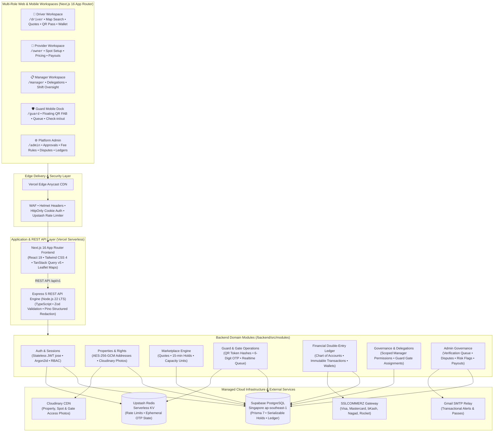
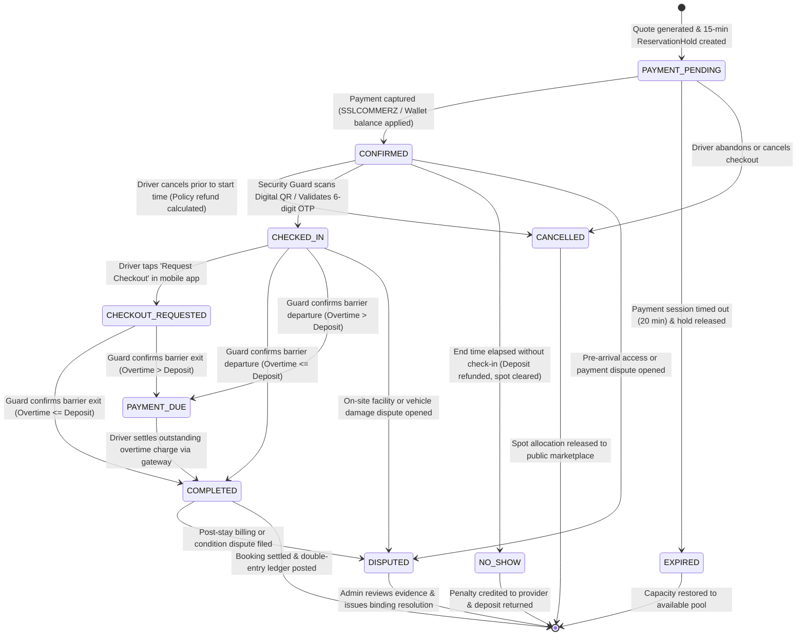
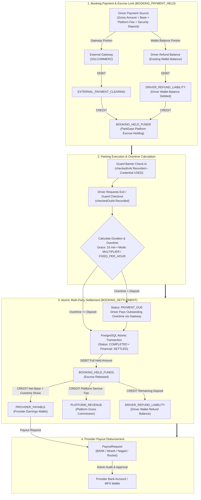
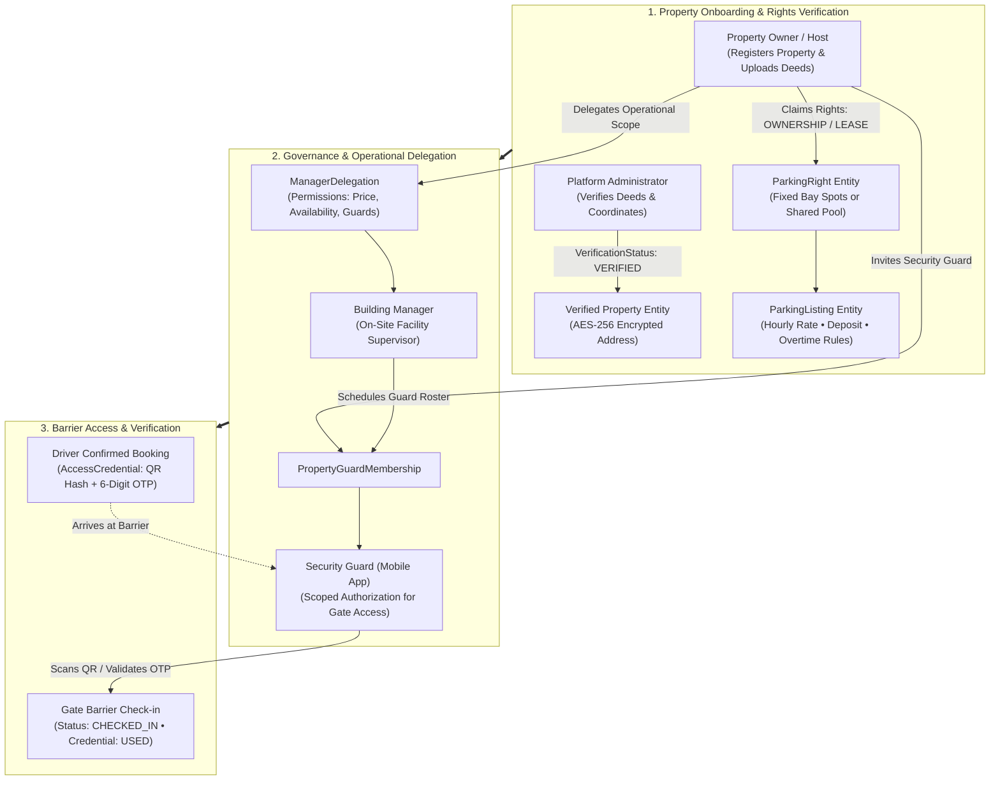

# ParkEase BD

> **A secure, location-aware parking marketplace for discovering, reserving, operating, and settling privately managed parking spaces in Dhaka, Bangladesh.**

[](https://github.com/0xFaysal/se-lab-wake-up-to-reality/actions/workflows/ci.yml)
[](https://github.com/0xFaysal/se-lab-wake-up-to-reality/actions/workflows/uptime-check.yml)
[](https://parkease-bd.vercel.app)
[](https://parkease-api.vercel.app/health/live)
[](https://www.figma.com/design/xpGwQGsxbzN8kQK0IubMPU/ParkEase-BD-%E2%80%94-UI-UX-Design?node-id=0-1&t=wANRYM1Cb6R2qjlc-1)

---

## Quick Links

- **Live Web Application**: [https://parkease-bd.vercel.app](https://parkease-bd.vercel.app)
- **API Liveness Probe**: [https://parkease-api.vercel.app/health/live](https://parkease-api.vercel.app/health/live)
- **API Readiness Probe**: [https://parkease-api.vercel.app/health/ready](https://parkease-api.vercel.app/health/ready)
- **UI/UX Figma Prototype**: [ParkEase BD Figma Board](https://www.figma.com/design/xpGwQGsxbzN8kQK0IubMPU/ParkEase-BD-%E2%80%94-UI-UX-Design?node-id=0-1&t=wANRYM1Cb6R2qjlc-1)
- **Course**: United International University | Software Engineering Lab | Section D | Lab 422 | Summer 2026

---

## Executive Summary

Rapid urbanization in Dhaka has created severe parking congestion: drivers routinely spend 20–40 minutes searching for legal parking near commercial hubs, while thousands of residential garages and commercial building parking bays sit empty during working hours.

**ParkEase BD** bridges this gap through a unified, location-based parking sharing platform. It unlocks residential and commercial supply, allowing property owners to monetize idle capacity while giving drivers guaranteed, prepaid, conflict-safe parking. The platform handles the entire operational lifecycle: **map discovery, dynamic quoting, reservation locks, SSLCOMMERZ payments, guarded entry/exit verification via QR/OTP, overstay penalties, automated double-entry financial settlement, and provider payouts.**

---

## Live Cloud Infrastructure

| Component | Provider & Tier | Region / Host | Purpose |
|---|---|---|---|
| **Web Frontend** | **Vercel** (Edge Network) | Global Anycast | Next.js 16 App Router, React 19, Tailwind CSS 4 |
| **Backend REST API** | **Vercel** (Serverless Node.js 22) | Global Serverless | Express 5 modular API, JWT auth, business logic |
| **Primary Database** | **Supabase PostgreSQL** | Singapore (`ap-southeast-1`) | ACID transactions, double-entry financial ledger, Prisma ORM |
| **Temporary Data & Cache** | **Upstash Redis** | Serverless / Multi-Region | Ephemeral OTP verification, rate limiting, token blacklists |
| **Media & Photos** | **Cloudinary** | Global CDN | Secure MIME-verified property, gate & spot image hosting |
| **Transactional Email** | **Gmail SMTP** | App Password Authentication | Email verification, booking passes, settlement notifications |
| **Payment Gateway** | **SSLCOMMERZ** | Sandbox / Hosted Checkout | Bangladeshi card, mobile banking (bKash/Nagad), and net banking |

---

## System Architecture

ParkEase BD is built as a **cohesive modular monolith** engineered for rapid iteration, strict financial integrity, and zero distributed-transaction complexity. The application cleanly separates presentation workspaces from domain business services while enforcing atomic guarantees in PostgreSQL.



---

## Real Booking & Operational Gate Lifecycle (State Machine)

Every booking strictly adheres to the 10-state deterministic finite state machine defined in [`BookingStatus`](file:///e:/project/se-lab-wake-up-to-reality/backend/prisma/schema.prisma#L131-L144). Race conditions on capacity are eliminated using PostgreSQL serializable transactions and 15-minute reservation holds.



---

## Double-Entry Financial Settlement Flow

To guarantee absolute financial integrity, ParkEase BD utilizes an **immutable double-entry ledger** in Supabase PostgreSQL ([`payment-ledger.service.ts`](file:///e:/project/se-lab-wake-up-to-reality/backend/src/modules/payments/payment-ledger.service.ts)). No wallet balance is ever mutated in place without balanced debit and credit entries.



---

## Multi-Provider Property Governance & Guard Gate Hierarchy

ParkEase BD supports multi-property operational management, allowing property owners to verify deed ownership, configure discrete fixed bays or shared pooled capacity, delegate day-to-day operations to building managers, and assign security guards to specific gate rosters.



---

## Product Capabilities by Role

### 1. Driver Workspace
- **Map & Geo Discovery**: Real-time Leaflet/OpenStreetMap interactive parking map with live radius and bounding-box filters.
- **Dynamic Offer Quoting**: Server-authoritative price quotes factoring base rates, peak surcharges, deposit requirements, and vehicle compatibility (Sedan, SUV, Hatchback, Bike).
- **Digital Access Pass**: Mobile-optimized access screen with high-contrast QR code and offline-safe 6-digit gate OTP.
- **Wallet & History**: Transparent ledger tracking spent funds, refund balances, overtime deductions, and dispute statuses.

### 2. Property Owner & Provider Workspace
- **Multi-Step Listing Wizard**: Register property boundaries, entrance coordinates, clear ceiling heights, and upload Cloudinary-optimized facility photographs.
- **Capacity & Spot Allocation**: Configure dedicated numbered slots (fixed bays) or flexible pooled capacity.
- **Availability Matrix**: Weekly recurring schedules, custom hourly rates, holiday blockout exceptions, and buffer times.
- **Earnings & Payout Dashboard**: Monitor cleared vs. pending earnings and request bank/MFS account withdrawals.

### 3. Building Manager Workspace
- **Delegated Governance**: Building owners can securely delegate operational management to on-site building managers with granular permissions.
- **Shift & Gate Oversight**: Schedule guard rosters and monitor active parking occupancy in real time.

### 4. Security Guard Workspace (Mobile-First)
- **Symmetrical 5-Item Floating Pill Dock**: Clean, ergonomic mobile interface designed for one-handed operation at the gate.
- **Centered Floating QR Scanner FAB**: Elevated camera QR scanner with instant decoding and offline-access fallback.
- **Operational Booking Queue**: Real-time filters for *All Active*, *Expected*, *Parked*, and *Exit Requested* vehicles.
- **Duty & Shift Badging**: Real-time notification badges for incoming property invitations and duty shift assignments.

### 5. Platform Administrator Workspace
- **Property Verification**: Review uploaded ownership evidence, examine gate street coordinates, and approve listings.
- **Marketplace Governance**: Inspect disputes, trigger manual booking cancellations, and adjust platform fee percentages.
- **Financial Audit & Payout Processing**: Review provider withdrawal requests and approve bank disbursements without manual wallet edits.

---

## Technology Stack

```text
Frontend Framework     Next.js 16.2.12 (App Router, Turbopack)
UI Library             React 19.2.4
Styling & Tokens       Tailwind CSS 4, Lucide Icons, Glassmorphism Design Tokens
Client State & Cache   TanStack React Query v5, Zustand 5, React Hook Form, Zod
Maps & Geolocation     Leaflet 1.9, React Leaflet, OpenStreetMap Tiles
Backend Framework      Express 5.2.1, Node.js 22 LTS, TypeScript 7
Database & ORM         PostgreSQL 16+ on Supabase, Prisma ORM 7.10
In-Memory Cache & KV   Upstash Serverless Redis (REST & TCP)
Authentication         Stateless Signed JWT (jose), Rotating Refresh Tokens, Argon2 Password Hashing
Security & Hardening   Helmet, HTTP-Only Cookies, AES-256-GCM Address Encryption, Request IDs
Media Delivery         Cloudinary CDN Image Pipeline
Deployment             Vercel Serverless (Frontend & API)
Continuous Integration GitHub Actions (Automated Lint, Typecheck, 105+ Unit Tests, Uptime Probes)
```

---

## Security & Privacy Engineering

- **AES-256-GCM Address Encryption**: Exact property street addresses, unit numbers, and gate entry instructions are encrypted at rest with authenticated AES-256-GCM. Unauthenticated users only see public district and neighborhood names.
- **HttpOnly Cookie Architecture**: JWT access and refresh tokens are transmitted strictly via secure, `HttpOnly`, `SameSite=Lax` cookies, neutralizing Cross-Site Scripting (XSS) token theft.
- **Argon2 Password Hashing**: Passwords are saved with Argon2id hashing and unique salts. Verification codes and password-reset tokens are hashed prior to database persistence.
- **Distributed Rate Limiting**: Upstash Redis tracks API request bursts per IP to block brute-force attacks on login, registration, and OTP verification endpoints.
- **MIME & Magic-Byte File Validation**: File uploads to Cloudinary are strictly validated against magic-byte file headers, rejecting spoofed extension payloads.
- **Structured Log Redaction**: Pino structured logger automatically redacts sensitive fields (passwords, tokens, cookies, authorization headers) before writing to stdout.

---

## Repository Structure

```text
.
├── .github/
│   └── workflows/
│       ├── ci.yml                 # Comprehensive CI pipeline (Backend & Frontend)
│       ├── uptime-check.yml       # Production 30-min availability probe
│       └── check-pr-source.yml    # Branch policy enforcement (main <-- develop)
├── backend/
│   ├── api/                       # Vercel serverless entry point
│   ├── prisma/                    # Prisma database schema, migrations & seed scripts
│   ├── src/
│   │   ├── common/                # Middleware (auth, encryption, validation, error handling)
│   │   ├── config/                # Validated env configuration & external service clients
│   │   ├── modules/               # Domain modules (auth, properties, bookings, payments, admin)
│   │   └── server.ts              # Express application bootstrap
│   └── tests/                     # 105+ unit and integration test suites
├── frontend/
│   ├── app/                       # Next.js App Router (Driver, Owner, Guard, Admin workspaces)
│   ├── components/                # Modular UI components & design system primitives
│   ├── features/                  # Domain-driven features (guard, bookings, owner, payments)
│   └── lib/                       # API client, TanStack Query keys, security utils
├── docs/                          # Architecture, SRS, API design & deployment specifications
└── UI/                            # High-fidelity design references and screen catalog
```

---

## Getting Started Locally

### Prerequisites

- **Node.js**: `22.x LTS` (verify with `node -v`)
- **npm**: `10.x` or newer
- **Git**
- **Docker Desktop** *(Optional — only if running local PostgreSQL & Redis instead of hosted cloud instances)*

---

### 1. Clone the Repository

```bash
git clone https://github.com/0xFaysal/se-lab-wake-up-to-reality.git
cd se-lab-wake-up-to-reality
```

---

### 2. Configure & Run Backend

1. Navigate to the backend directory and copy the environment template:
   ```bash
   cd backend
   cp .env.example .env
   ```

2. Open `backend/.env` and supply your database connection and secrets:
   ```dotenv
   PORT=4000
   NODE_ENV=development
   DATABASE_URL="postgresql://<user>:<password>@<host>:5432/<dbname>?schema=public&sslmode=require"
   REDIS_URL="redis://<user>:<password>@<host>:6379"
   CORS_ORIGIN="http://localhost:3000"
   API_PUBLIC_URL="http://localhost:4000"
   FRONTEND_BASE_URL="http://localhost:3000"
   DATA_ENCRYPTION_KEY="replace-with-a-unique-64-character-hex-key"
   JWT_ACCESS_SECRET="replace-with-an-access-secret-at-least-32-characters-long"
   JWT_REFRESH_SECRET="replace-with-a-different-refresh-secret-at-least-32-characters"
   ```

3. Install dependencies, generate Prisma client, and start the development server:
   ```bash
   npm ci
   npm exec -- prisma generate
   npm run dev
   ```
   *The backend will boot up at `http://localhost:4000`.*

---

### 3. Configure & Run Frontend

1. Open a new terminal window and navigate to the frontend directory:
   ```bash
   cd frontend
   ```

2. Create a local environment file `frontend/.env.local`:
   ```dotenv
   NEXT_PUBLIC_APP_URL="http://localhost:3000"
   NEXT_PUBLIC_API_BASE_URL="http://localhost:4000/api/v1"
   BACKEND_API_BASE_URL="http://localhost:4000/api/v1"
   ```

3. Install dependencies and start Next.js with Turbopack:
   ```bash
   npm ci
   npm run dev
   ```
   *Open [http://localhost:3000](http://localhost:3000) in your browser.*

---

## Local Verification & Testing

Ensure all quality gates pass locally prior to submitting pull requests:

```bash
# Backend Quality Checks
cd backend
npm run format:check        # Prettier formatting check
npm run typecheck           # TypeScript compiler validation
npm test                    # Runs all 105 unit test suites

# Frontend Quality Checks
cd ../frontend
npm run lint                # ESLint 9 verification
npm run typecheck           # TypeScript compiler validation
npm run build               # Production Turbopack build
```

---

## Live System Availability & Health

The production deployment is actively monitored via automated GitHub Actions uptime and readiness checks:

| Service | Target URL | Health Endpoint | Status Indicator | Target Uptime |
|---|---|---|---|---|
| **Frontend Web App** | [`parkease-bd.vercel.app`](https://parkease-bd.vercel.app) | `/` |  | 99.9% (Vercel Global Edge) |
| **Backend API (Process)** | [`parkease-api.vercel.app`](https://parkease-api.vercel.app) | [`/health/live`](https://parkease-api.vercel.app/health/live) |  | 99.9% (Vercel Serverless) |
| **Database & Cache Readiness** | Supabase & Upstash | [`/health/ready`](https://parkease-api.vercel.app/health/ready) |  | Multi-Region Active |

- **Automated Uptime Monitoring**: Probes production endpoints every 30 minutes via [`.github/workflows/uptime-check.yml`](./.github/workflows/uptime-check.yml).
- **Latest Workflow Run**: View real-time status and probe response latency on [GitHub Actions](https://github.com/0xFaysal/se-lab-wake-up-to-reality/actions/workflows/uptime-check.yml).

---

## Engineering Team

| Name | GitHub | Primary Role |
|---|---|---|
| **Faysal Ahmed Fahim** | [@0xFaysal](https://github.com/0xFaysal) | Backend Architecture, Security, Payments & Cloud DevOps |
| **Md. Minhajul Islam** | [@Minhajh20](https://github.com/Minhajh20) | Frontend Engineering, Component Systems & Client State |
| **Anisa Akter Mahi** | [@0xAnisa](https://github.com/0xAnisa) | UI/UX Design Systems, Wireframing & Product Coordination |
| **Marjia Islam** | [@MarjiaIslam](https://github.com/MarjiaIslam) | Software Quality Assurance (STQA) & System Analysis |

### Faculty Evaluation
- **Course Evaluator**: Rejwan Ahmed ([@rejwanahmed007](https://github.com/rejwanahmed007))
- Individual member contributions are tracked via verified GitHub commit history, pull request reviews, and issue allocations.

---

## License

This repository is developed as an academic capstone project for the United International University Software Engineering Lab. All rights are reserved by the contributors.
