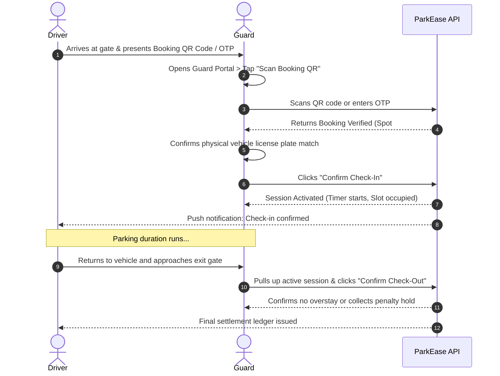

# ParkEase BD — UI/UX Design System & Screen Catalog

[](https://www.figma.com/design/xpGwQGsxbzN8kQK0IubMPU/ParkEase-BD-%E2%80%94-UI-UX-Design?node-id=0-1&t=wANRYM1Cb6R2qjlc-1)
[](../docs/DESIGN.md)
[](#screen-catalog)

Welcome to the **ParkEase BD UI/UX Design System and Screen Catalog**. This documentation establishes the visual design specifications, user journey workflows, screen hierarchies, and handoff contracts between UI/UX design and frontend engineering.

---

## Table of Contents

1. [Design Philosophy & Aesthetic Direction](#design-philosophy--aesthetic-direction)
2. [Design Tokens & Style Guide](#design-tokens--style-guide)
3. [Folder & Asset Architecture](#folder--asset-architecture)
4. [User Journeys & Operational Workflows](#user-journeys--operational-workflows)
5. [Screen Catalog](#screen-catalog)
   - [1. Public & Authentication](#1-public--authentication)
   - [2. Guard Portal & Gate Operations](#2-guard-portal--gate-operations)
   - [3. Property Manager Portal](#3-property-manager-portal)
   - [4. Parking Owner Portal & Listing Wizard](#4-parking-owner-portal--listing-wizard)
6. [Handoff Specifications for Frontend Developers](#handoff-specifications-for-frontend-developers)
7. [Accessibility & Ergonomics](#accessibility--ergonomics)

---

## Design Philosophy & Aesthetic Direction

ParkEase BD addresses high-density urban parking challenges in Dhaka by bridging unused residential parking spaces with drivers needing secure, legal parking.

* **Concept:** *Urban Harmony & Modern Craftsmanship*
* **Tone:** Institutional reliability, calm order, high trust, and clarity.
* **Core Principles:**
  * **Zero Friction at the Gate:** Security guards need oversized touch targets, instantaneous scanning feedback, and high-contrast status badges under harsh outdoor sunlight.
  * **Predictable Handoffs:** Clear visual states for booking holds, active sessions, overstay grace periods, and payment receipts.
  * **Institutional Trust:** Avoiding neon gradients or casual startup tropes; grounding the UI in deep emerald, warm ivory, and refined slate.

---

## Design Tokens & Style Guide

Consistent with [`docs/DESIGN.md`](../docs/DESIGN.md):

### Color System

| Token | Hex | Usage & Semantics |
|---|---|---|
| `primary` | `#064E3B` | Brand identity, primary CTAs, active status, high-priority navigation |
| `primary-container` | `#064E3B` / `#80BEA6` | Active tab pills, highlighted summary containers |
| `background` | `#F9F9FF` / `#FAF9F6` | Warm ivory canvas reducing eye fatigue |
| `surface` | `#FFFFFF` | Container cards, modal drawers, table data panels |
| `neutral-text` | `#141B2B` | Primary headings, body copy, high-legibility data |
| `muted-text` | `#404944` / `#707974` | Secondary labels, timestamp captions, hints |
| `accent-gold` | `#B45309` | Reserved status badges, premium spot badges |
| `error` | `#BA1A1A` | Cancellation, overstay penalties, destructive actions |

### Typography

* **Headings & Data:** `Geist` (Font weights: `500`, `600`) — Geometric precision for prices, counters, spot numbers, and titles.
* **Body & Descriptions:** `Hanken Grotesk` (Font weights: `400`, `500`) — Warm readability for terms, property descriptions, instructions.

### Spacing & Grid System

* **Base Unit:** 8px rhythm (multiples of 8px, 16px, 24px, 32px, 48px, 64px).
* **Container Max Width:** 1280px desktop container with responsive side gutters.
* **Border Radii:** `8px` for inputs/buttons, `16px` for cards/panels, `24px` for hero banners/modals.

---

## Folder & Asset Architecture

All screen mockups are stored as optimized, high-fidelity PNGs categorized by domain role:

```text
UI/
├── README.md                          # UI/UX documentation & catalog (this document)
├── public/                            # Public discovery & authentication
│   ├── landing-page.png
│   ├── sign-in.png
│   └── sign-up.png
├── guard/                             # Guard gate verification & session controls
│   ├── sign-in.png
│   ├── dashboard.png
│   ├── booking-list.png
│   ├── bookings-overview.png
│   ├── booking-details-awaiting-arrival.png
│   ├── booking-details-upcoming.png
│   ├── scan-booking-qr.png
│   ├── booking-verified.png
│   ├── confirm-check-in.png
│   ├── confirm-check-out.png
│   ├── active-parking-session.png
│   └── profile.png
├── manager/                           # Property manager operations & monitoring
│   ├── dashboard-overview.png
│   ├── assigned-properties.png
│   ├── property-details.png
│   ├── parking-spaces.png
│   ├── active-sessions.png
│   ├── bookings.png
│   ├── guards.png
│   ├── reviews.png
│   ├── notifications.png
│   ├── help-and-support.png
│   ├── help-and-support-compact.png
│   ├── profile.png
│   └── profile-compact.png
└── owner/                             # Parking spot owner portal & listing creation
    ├── dashboard-overview.png
    ├── my-listings.png
    ├── listing-details.png
    ├── edit-listing.png
    ├── bookings.png
    ├── booking-details.png
    ├── guards.png
    ├── guards-add-drawer.png
    ├── earnings.png
    ├── payout-history.png
    ├── reviews.png
    ├── support-ticket-details.png
    └── add-parking-space/             # 8-step listing wizard
        ├── 01-property-details.png
        ├── 02-location.png
        ├── 03-parking-spaces.png
        ├── 04-amenities-and-security.png
        ├── 05-availability-and-pricing.png
        ├── 06-photos.png
        ├── 07-review-and-publish.png
        └── 08-published-success.png
```

---

## User Journeys & Operational Workflows

### Guard Gate Check-In & Check-Out Workflow



---

## Screen Catalog

### 1. Public & Authentication

| Screen | File Artifact | Description |
|---|---|---|
| **Landing Page** | [landing-page.png](./public/landing-page.png) | Hero section with value proposition, location search bar, feature highlights, and pricing breakdown. |
| **User Sign In** | [sign-in.png](./public/sign-in.png) | Unified authentication dialog supporting email/password, social login, and role redirection. |
| **User Sign Up** | [sign-up.png](./public/sign-up.png) | User onboarding form with account type selector (Driver vs. Property Owner), phone verification, and T&C. |

---

### 2. Guard Portal & Gate Operations

| Screen | File Artifact | Description |
|---|---|---|
| **Guard Sign In** | [sign-in.png](./guard/sign-in.png) | High-contrast login interface tailored for guard security credentials. |
| **Guard Dashboard** | [dashboard.png](./guard/dashboard.png) | Real-time overview of current occupancy, scheduled arrivals, pending departures, and quick actions. |
| **Booking List** | [booking-list.png](./guard/booking-list.png) | Filterable table of day bookings sorted by arrival window and status. |
| **Bookings Overview** | [bookings-overview.png](./guard/bookings-overview.png) | Detailed list with status tags (Upcoming, Awaiting Arrival, Checked In, Completed, Overstay). |
| **Details — Awaiting Arrival** | [booking-details-awaiting-arrival.png](./guard/booking-details-awaiting-arrival.png) | Pre-arrival manifest displaying scheduled arrival time, driver phone, spot designation, and vehicle license plate. |
| **Details — Upcoming** | [booking-details-upcoming.png](./guard/booking-details-upcoming.png) | Upcoming booking details card for upcoming shifts. |
| **Scan Booking QR** | [scan-booking-qr.png](./guard/scan-booking-qr.png) | Fullscreen camera viewfinder with framing guide, flash toggle, and manual 6-digit OTP fallback. |
| **Booking Verified** | [booking-verified.png](./guard/booking-verified.png) | Positive verification screen displaying driver photo, spot number, and vehicle details. |
| **Confirm Check-In** | [confirm-check-in.png](./guard/confirm-check-in.png) | Action modal prompting guard confirmation to unlock gate and start session timer. |
| **Confirm Check-Out** | [confirm-check-out.png](./guard/confirm-check-out.png) | Exit validation showing elapsed time, overstay calculations, and gate clearance confirmation. |
| **Active Parking Session** | [active-parking-session.png](./guard/active-parking-session.png) | Live session tracker with countdown timer, bay number, and overstay warning triggers. |
| **Guard Profile** | [profile.png](./guard/profile.png) | Assigned gate location, shift timings, security credentials, and contact info. |

---

### 3. Property Manager Portal

| Screen | File Artifact | Description |
|---|---|---|
| **Dashboard Overview** | [dashboard-overview.png](./manager/dashboard-overview.png) | KPI summary of managed buildings, daily turnover, total occupancy rate, and open issues. |
| **Assigned Properties** | [assigned-properties.png](./manager/assigned-properties.png) | Grid view of residential and commercial properties assigned to the manager. |
| **Property Details** | [property-details.png](./manager/property-details.png) | Individual property page with layout specifications, security personnel roster, and gate hours. |
| **Parking Spaces** | [parking-spaces.png](./manager/parking-spaces.png) | Bay inventory breakdown (covered, open, EV charging, disabled) with real-time status. |
| **Active Sessions** | [active-sessions.png](./manager/active-sessions.png) | Live monitoring table of currently parked vehicles across all assigned properties. |
| **Bookings** | [bookings.png](./manager/bookings.png) | Historical and active reservation log with search, filters, and dispute resolution flags. |
| **Guards Management** | [guards.png](./manager/guards.png) | Guard assignment matrix, shift scheduling, and guard performance metrics. |
| **Reviews & Ratings** | [reviews.png](./manager/reviews.png) | Driver feedback and cleanliness/security ratings per building. |
| **Notifications** | [notifications.png](./manager/notifications.png) | Alert feed for overstays, unauthorized entries, and maintenance notices. |
| **Help & Support** | [help-and-support.png](./manager/help-and-support.png) | Ticketing system and emergency escalation channels for building managers. |
| **Help & Support (Compact)** | [help-and-support-compact.png](./manager/help-and-support-compact.png) | Compact quick-access view for help desk and ticket submission. |
| **Manager Profile** | [profile.png](./manager/profile.png) | Manager identity, assigned buildings list, permissions, and security settings. |
| **Manager Profile (Compact)** | [profile-compact.png](./manager/profile-compact.png) | Viewport-optimized manager account summary. |

---

### 4. Parking Owner Portal & Listing Wizard

#### Management Screens

| Screen | File Artifact | Description |
|---|---|---|
| **Dashboard Overview** | [dashboard-overview.png](./owner/dashboard-overview.png) | Monthly earnings graph, occupancy trends, active listings summary, and recent payouts. |
| **My Listings** | [my-listings.png](./owner/my-listings.png) | Card catalog of owner's parking spots with toggleable instant activation/deactivation. |
| **Listing Details** | [listing-details.png](./owner/listing-details.png) | In-depth listing view showing revenue per spot, schedule exceptions, and amenities. |
| **Edit Listing** | [edit-listing.png](./owner/edit-listing.png) | Comprehensive editor for modifying hourly rates, photos, spot rules, and availability windows. |
| **Bookings** | [bookings.png](./owner/bookings.png) | Comprehensive bookings list showing driver identity, vehicle details, revenue, and status. |
| **Booking Details** | [booking-details.png](./owner/booking-details.png) | Detailed breakdown of transaction fee, commission deduction, and net owner payout. |
| **Guards** | [guards.png](./owner/guards.png) | List of security guards assigned to the owner's properties. |
| **Add Guard Drawer** | [guards-add-drawer.png](./owner/guards-add-drawer.png) | Slide-over drawer form to invite and assign a new security guard by phone/email. |
| **Earnings** | [earnings.png](./owner/earnings.png) | Financial analytics with weekly/monthly breakdown, commission deductions, and pending payouts. |
| **Payout History** | [payout-history.png](./owner/payout-history.png) | Ledger of bank transfers, simulated wallet balances, and withdrawal statements. |
| **Reviews** | [reviews.png](./owner/reviews.png) | Aggregate star ratings and written reviews from drivers. |
| **Support Ticket Details** | [support-ticket-details.png](./owner/support-ticket-details.png) | Customer support thread addressing listing verification and payout inquiries. |

#### 8-Step Add Parking Space Wizard

The listing wizard breaks the spot creation process into eight guided, validation-backed steps:

```text
Step 1: Property Details  ──►  Step 2: Location  ──►  Step 3: Parking Spaces  ──►  Step 4: Amenities
           │                                                                               │
Step 8: Published Success ◄──  Step 7: Review & Publish ◄── Step 6: Photos ◄── Step 5: Pricing
```

| Step | Artifact | Description |
|---|---|---|
| **01. Property Details** | [01-property-details.png](./owner/add-parking-space/01-property-details.png) | Building name, property category (Residential Apartment, Commercial, Standalone Plot). |
| **02. Location** | [02-location.png](./owner/add-parking-space/02-location.png) | Interactive map pin picker, Thana/Area selector (e.g. Dhanmondi, Gulshan, Uttara), street address. |
| **03. Parking Spaces** | [03-parking-spaces.png](./owner/add-parking-space/03-parking-spaces.png) | Bay configuration (Spot numbers, covered vs. open, vehicle dimensions: Sedan, SUV, Motorcycle). |
| **04. Amenities & Security** | [04-amenities-and-security.png](./owner/add-parking-space/04-amenities-and-security.png) | Checklist for CCTV surveillance, 24/7 Security Guard, EV Charging, Lighting, Gated Access. |
| **05. Availability & Pricing**| [05-availability-and-pricing.png](./owner/add-parking-space/05-availability-and-pricing.png) | Hourly rates (BDT), daily caps, weekly recurring schedule (e.g., 9 AM - 6 PM Mon-Thu). |
| **06. Photos** | [06-photos.png](./owner/add-parking-space/06-photos.png) | Drag-and-drop photo uploader for entry gate, designated spot, and access driveway. |
| **07. Review & Publish** | [07-review-and-publish.png](./owner/add-parking-space/07-review-and-publish.png) | Complete summary audit card before submitting listing for administrator verification. |
| **08. Published Success** | [08-published-success.png](./owner/add-parking-space/08-published-success.png) | Confirmation banner with listing preview link and instructions on guard assignment. |

---

## Handoff Specifications for Frontend Developers

1. **State Completeness:**
   * Every view must support **Loading** (Shimmer skeleton), **Empty** (custom SVG illustration with call-to-action), **Error** (clear recovery instructions), and **Disabled** states.
2. **Form Validation Ergonomics:**
   * Live inline validation after user blur (`:user-valid` / `:user-invalid`).
   * Currency inputs must explicitly lock to Bangladeshi Taka (`৳` / `BDT`) with minimum hourly constraint checks.
3. **Mobile Responsive Breakpoints:**
   * **Desktop ($\ge$ 1024px):** Fixed navigation sidebar, expansive multi-column data tables, split-screen map layouts.
   * **Mobile ($\le$ 768px):** Bottom navigation bar, floating action buttons (FAB), slide-up drawer sheets for filters and QR verification.

---

## Accessibility & Ergonomics

* **Contrast Ratios:** All primary text on ivory background satisfies WCAG AA (minimum 4.5:1 ratio).
* **Touch Target Size:** Buttons, check-in controls, and camera scan toggles have minimum tap boundaries of $48 \times 48\text{ px}$.
* **Color Independence:** Status badges combine distinct color coding with typographic icons (e.g., checkmark for Verified, warning triangle for Overstay) to accommodate color-blind users.
