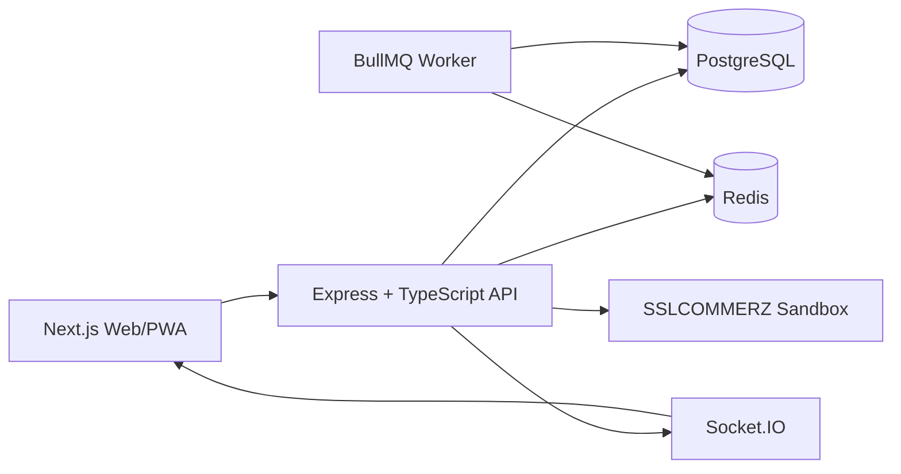
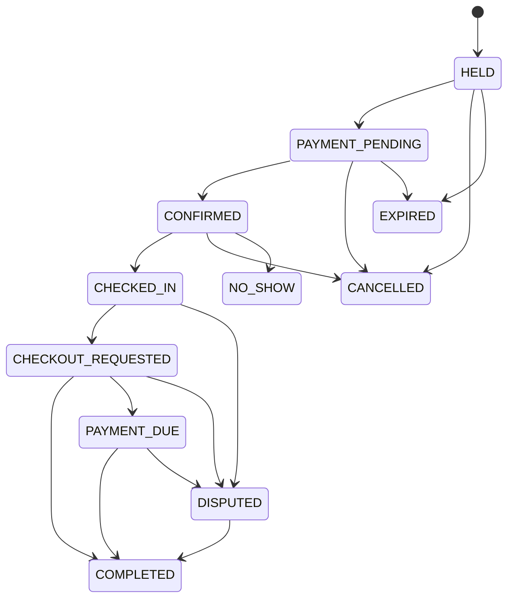

# ParkEase BD — Complete Backend Architecture Blueprint

> **Purpose:** This document is the implementation reference for ParkEase BD. It defines roles, modules, PostgreSQL schema, Redis usage, BullMQ jobs, API contracts, booking/payment state machines, realtime events, security rules, testing, deployment, and implementation order.
> **Alignment Revision:** v2.1 — synchronized with the frontend architecture on 3 August 2026. The API and data contracts in this revision are authoritative.

---

## 1. Product Summary

ParkEase BD is a shared residential parking marketplace for Dhaka. Parking owners list unused parking spots for specific time ranges. Drivers search nearby parking, reserve a slot, pay through the SSLCOMMERZ sandbox, enter through QR/OTP verification, and check out after the session. The platform calculates overtime, refunds unused deposits, records owner earnings, and supports simulated owner payouts.

### Non-negotiable backend goals

1. Prevent double booking under concurrent requests.
2. Keep payment, refund, earning, and payout records auditable.
3. Hide private residential and vehicle information from unauthorized users.
4. Recover safely from duplicate callbacks, server restarts, Redis outages, and delayed jobs.
5. Keep the project implementable by a three-member team.

---

## 2. Final User Roles

### Driver / Vehicle Owner

- Manage vehicles.
- Search and filter nearby parking.
- Request price quotation.
- Hold and pay for a parking slot.
- View confirmed booking and access instructions.
- Use QR/OTP for entry.
- Request extension and checkout.
- View refund/payment status.
- Submit reviews and disputes.

### Parking Owner

- Create and submit property for verification.
- Create individual parking spots.
- Configure weekly availability and exceptions.
- Assign guards.
- Monitor bookings and active sessions.
- View earnings and request payout.
- Respond to complaints and disputes.

### Security Guard

- Access only assigned properties.
- View expected arrivals and active vehicles.
- Verify QR/OTP and vehicle number.
- Confirm check-in and checkout.
- Report incidents.

### Admin

- Verify properties.
- Suspend users/listings.
- Resolve disputes.
- Review payment mismatches.
- Approve simulated payouts.
- Audit sensitive actions.

---

## 3. Architecture



### Source-of-truth rules

| Data | Source of truth |
|---|---|
| Users, vehicles, properties | PostgreSQL |
| Confirmed bookings | PostgreSQL |
| Payments, refunds, ledger | PostgreSQL |
| Owner earnings and payouts | PostgreSQL |
| Temporary cache, rate limits | Redis |
| Delayed/retry jobs | BullMQ on Redis |
| Realtime UI changes | Socket.IO |
| Payment confirmation | SSLCOMMERZ validation + PostgreSQL |

**Redis and Socket.IO are never the final authority for booking availability.**

---

## 4. Technology Stack

- Node.js LTS
- Express.js + TypeScript
- PostgreSQL
- Prisma ORM
- Redis
- BullMQ
- Socket.IO
- Zod
- Argon2id
- JWT access token + rotating refresh token
- Pino logging
- Vitest/Jest + Supertest + Playwright
- Docker and Docker Compose
- SSLCOMMERZ Sandbox

---

## 5. Project Structure

```text
parkease-bd/
├── apps/
│   ├── api/
│   │   └── src/
│   │       ├── app.ts
│   │       ├── server.ts
│   │       ├── config/
│   │       ├── common/
│   │       │   ├── errors/
│   │       │   ├── middleware/
│   │       │   ├── auth/
│   │       │   ├── validation/
│   │       │   ├── idempotency/
│   │       │   ├── crypto/
│   │       │   ├── money/
│   │       │   └── time/
│   │       ├── modules/
│   │       │   ├── auth/
│   │       │   ├── users/
│   │       │   ├── vehicles/
│   │       │   ├── properties/
│   │       │   ├── parking-spots/
│   │       │   ├── availability/
│   │       │   ├── search/
│   │       │   ├── bookings/
│   │       │   ├── payments/
│   │       │   ├── verification/
│   │       │   ├── sessions/
│   │       │   ├── refunds/
│   │       │   ├── earnings/
│   │       │   ├── payouts/
│   │       │   ├── reviews/
│   │       │   ├── disputes/
│   │       │   ├── notifications/
│   │       │   ├── admin/
│   │       │   └── audit/
│   │       ├── realtime/
│   │       └── jobs/
│   ├── worker/
│   └── web/
├── packages/
│   ├── contracts/
│   └── shared/
├── prisma/
│   ├── schema.prisma
│   ├── migrations/
│   ├── seed.ts
│   └── sql/
│       └── exclusion-constraint.sql
├── docker-compose.yml
└── .env.example
```

### Standard module

```text
modules/bookings/
├── booking.routes.ts
├── booking.controller.ts
├── booking.service.ts
├── booking.repository.ts
├── booking.schema.ts
├── booking.policy.ts
├── booking.mapper.ts
├── booking.events.ts
├── booking.errors.ts
└── booking.types.ts
```

- Route: endpoint and middleware.
- Controller: HTTP input/output only.
- Service: business logic and transaction orchestration.
- Repository: database access.
- Policy: role and ownership authorization.
- Schema: Zod validation.
- Mapper: public DTO.
- Events: realtime/domain events.

---

## 6. API Conventions

### Base path

```text
/api/v1
```

### Success response

```json
{
  "success": true,
  "data": {},
  "meta": {
    "requestId": "req_01J...",
    "timestamp": "2026-07-29T08:30:00.000Z"
  }
}
```

### Error response

```json
{
  "success": false,
  "error": {
    "code": "BOOKING_SLOT_UNAVAILABLE",
    "message": "The selected parking time is no longer available.",
    "details": {}
  },
  "meta": {
    "requestId": "req_01J..."
  }
}
```

### Money

Store BDT as integer paisa, never floating point.

```text
৳125.50 = 12550 paisa
```

### Time

- Store `timestamptz`.
- Send ISO 8601 UTC through API.
- Display in `Asia/Dhaka`.
- Use full timestamps, not only time-of-day.

### Public identifiers

Use UUID/ULID strings such as:

```text
usr_...
prp_...
psp_...
bkg_...
pay_...
```

---

## 7. PostgreSQL Database Design

### Authentication

#### users

```text
id
full_name
email NULLABLE UNIQUE
phone NULLABLE UNIQUE
password_hash
status: PENDING | ACTIVE | SUSPENDED | BLOCKED
must_change_password BOOLEAN DEFAULT false
account_origin: SELF_REGISTERED | OWNER_CREATED_GUARD | ADMIN_CREATED_GUARD
created_by_user_id NULLABLE
email_verified_at
phone_verified_at
last_login_at
created_at
updated_at
deleted_at
```

Rules:

- Public self-registration requires both email and phone.
- Controlled guard creation requires at least one of email or phone.
- Login accepts one normalized `identifier` containing either email or phone.
- `must_change_password` blocks all protected application routes except initial-password change, assignment acceptance, account recovery, and logout.
- Owners never receive password hashes and never regain access to a guard's password after onboarding.
- `created_by_user_id` is audit metadata, not ownership of the guard identity.

#### user_roles

```text
user_id
role: DRIVER | PARKING_OWNER | GUARD | ADMIN
UNIQUE(user_id, role)
```

#### refresh_sessions

```text
id
user_id
token_hash
user_agent
ip_hash
expires_at
revoked_at
replaced_by_session_id
created_at
```

### Vehicles

#### vehicles

```text
id
owner_user_id
vehicle_type: MOTORCYCLE | SEDAN | SUV | MICROBUS
registration_number UNIQUE
brand
model
color
height_cm
width_cm
length_cm
verification_status
created_at
updated_at
```

### Properties and guards

#### properties

```text
id
owner_user_id
name
description
public_area
approximate_address
exact_address_encrypted
latitude
longitude
entrance_latitude
entrance_longitude
access_instructions_encrypted
verification_status: DRAFT | PENDING | VERIFIED | REJECTED | SUSPENDED
status: ACTIVE | TEMPORARILY_CLOSED | INACTIVE
verified_by_admin_id
verified_at
created_at
updated_at
```

#### property_images

```text
id
property_id
storage_key
image_type
sort_order
created_at
```

#### property_guard_assignments

```text
id
property_id
guard_user_id
created_by_user_id
status: PENDING_ACCEPTANCE | ACTIVE | SUSPENDED | ENDED | CANCELLED
shift_start
shift_end
invited_at
accepted_at
assigned_at
ended_at
created_at
updated_at
```

Constraints and privacy rules:

- A property/guard pair may have only one non-terminal assignment at a time.
- Owners may list only assignments for their own properties.
- Owners cannot browse or search the global guard directory.
- When a submitted email or phone already belongs to an account, the API returns a generic conflict and may offer a privacy-preserving assignment invitation; it must not disclose the account holder's profile.
- An existing guard becomes visible to a new owner only after the guard accepts that property's assignment.
- Owners may suspend or end an assignment, but only Admin may suspend the global user account.

### Parking inventory

#### parking_spots

```text
id
property_id
spot_code
supported_vehicle_type
hourly_rate_paisa
minimum_booking_minutes
maximum_booking_minutes
booking_buffer_minutes
grace_period_minutes
overtime_multiplier_basis_points
minimum_deposit_paisa
status: ACTIVE | BLOCKED | MAINTENANCE | INACTIVE
is_covered
has_cctv
has_guard
max_height_cm
max_width_cm
max_length_cm
created_at
updated_at
UNIQUE(property_id, spot_code)
```

Each physical parking space is one row. Do not use only a generic capacity count for the MVP.

### Availability

#### availability_rules

```text
id
parking_spot_id
day_of_week
start_local_time
end_local_time
valid_from
valid_until
is_active
created_at
```

#### availability_exceptions

```text
id
parking_spot_id
starts_at
ends_at
exception_type: BLOCKED | SPECIAL_AVAILABLE
reason
created_by_user_id
created_at
```

### Booking quotations

#### booking_quotes

```text
id
driver_user_id
vehicle_id
parking_spot_id
start_at
end_at
hourly_rate_snapshot_paisa
base_amount_paisa
platform_fee_paisa
security_deposit_paisa
discount_paisa
total_initial_payment_paisa
pricing_snapshot JSONB
expires_at
used_at
created_at
```

A hold request must reference an unexpired, unused quotation owned by the same Driver. The hold transaction revalidates spot status, vehicle compatibility, availability, and price-policy version before creating the booking. A quotation is never trusted from frontend-calculated values.

### Bookings

#### bookings

```text
id
booking_code UNIQUE
driver_user_id
vehicle_id
parking_spot_id
start_at
end_at
effective_end_at
hold_expires_at
status
payment_status
hourly_rate_snapshot_paisa
base_amount_paisa
platform_fee_paisa
security_deposit_paisa
discount_paisa
extension_amount_paisa
overstay_amount_paisa
refund_amount_paisa
outstanding_amount_paisa
total_initial_payment_paisa
cancellation_policy_snapshot JSONB
pricing_snapshot JSONB
version
confirmed_at
checked_in_at
completed_at
cancelled_at
no_show_at
created_at
updated_at
```

Booking status:

```text
HELD
PAYMENT_PENDING
CONFIRMED
CHECKED_IN
CHECKOUT_REQUESTED
PAYMENT_DUE
COMPLETED
CANCELLED
EXPIRED
NO_SHOW
DISPUTED
```

Payment status:

```text
UNPAID
PENDING
PAID
PARTIALLY_REFUNDED
REFUNDED
FAILED
PAYMENT_DUE
```

#### booking_status_history

```text
id
booking_id
from_status
to_status
actor_user_id
actor_type
reason
metadata JSONB
created_at
```

Every state transition creates history.

---

## 8. Preventing Double Booking

### Overlap formula

```text
existing.start_at < requested.end_at
AND
existing.effective_end_at > requested.start_at
```

### Database constraint

```sql
CREATE EXTENSION IF NOT EXISTS btree_gist;

ALTER TABLE bookings
ADD CONSTRAINT bookings_no_overlapping_active_intervals
EXCLUDE USING gist (
  parking_spot_id WITH =,
  tstzrange(start_at, effective_end_at, '[)') WITH &&
)
WHERE (
  status IN (
    'HELD',
    'PAYMENT_PENDING',
    'CONFIRMED',
    'CHECKED_IN',
    'CHECKOUT_REQUESTED',
    'PAYMENT_DUE',
    'DISPUTED'
  )
);
```

`[)` allows adjacent bookings such as 10:00–11:00 and 11:00–12:00.

### Booking hold transaction

1. Load the quotation by `quoteId`; verify ownership, expiry, unused status, and request idempotency.
2. Validate Driver, vehicle, parking spot, property, vehicle compatibility, and current policy version.
3. Revalidate weekly availability, exceptions, booking buffer, and overlap.
4. Create the `HELD` booking with five-minute expiry.
5. Mark the quotation used.
6. Create the initial payment intent record without contacting the gateway.
7. Create state-history and idempotency records.
8. Commit.
9. Add the hold-expiry BullMQ job.
10. Emit realtime events after commit.
11. Only when the Driver presses **Pay Now**, call the payment-session endpoint; that external SSLCOMMERZ call happens outside a database transaction.

Never call SSLCOMMERZ inside an open database transaction. Hold creation and payment-session creation are separate user intents and use separate idempotency keys.

---

## 9. Booking State Machine



Cancellation from `PAYMENT_PENDING` is allowed only when the gateway payment has not validated. Callback/cancellation races are serialized inside the transition service. Extension updates `effective_end_at` without changing the main booking status and emits a `booking.extended` event after the conflict-safe transaction commits.

Implement one controlled transition service. Invalid transitions return `409 BOOKING_INVALID_STATE`.

---

## 10. Pricing and Deposit

Initial payment:

```text
base parking amount
+ platform fee
+ refundable security deposit
- discount
= total initial payment
```

Recommended deposit:

```text
maximum of:
- configured minimum deposit
- one-hour parking rate
- 30% of base amount
```

Overtime:

```text
actual checkout
- effective booking end
- grace period
= chargeable overtime
```

Overtime is deducted from the deposit first. Remaining deposit is refunded. If the deposit is insufficient, booking becomes `PAYMENT_DUE`.

---

## 11. Payment, Refund, Ledger, and Earnings Tables

#### payments

```text
id
booking_id
payer_user_id
purpose: INITIAL_BOOKING | EXTENSION | OVERSTAY
gateway: SSLCOMMERZ
merchant_transaction_id UNIQUE
validation_id
bank_transaction_id
amount_paisa
currency: BDT
status: INITIATED | PENDING | VALIDATED | FAILED | CANCELLED
gateway_status
risk_level
raw_response_encrypted
initiated_at
validated_at
created_at
```

#### refunds

```text
id
booking_id
payment_id
amount_paisa
reason
status: REQUESTED | PROCESSING | REFUNDED | FAILED | MANUAL_REVIEW
gateway_refund_reference
attempt_count
requested_at
completed_at
failed_at
```

#### ledger_entries

```text
id
booking_id
account_type
account_id
entry_type
debit_paisa
credit_paisa
reference_type
reference_id
created_at
```

Never delete or edit settled ledger rows. Corrections use compensating entries.

#### owner_earnings

```text
id
booking_id UNIQUE
owner_user_id
gross_parking_amount_paisa
owner_share_paisa
platform_commission_paisa
refund_adjustment_paisa
penalty_adjustment_paisa
net_owner_amount_paisa
status: PENDING | ON_HOLD | AVAILABLE | PAYOUT_REQUESTED | PAID | REVERSED
available_at
created_at
updated_at
```

#### payout_accounts

```text
id
owner_user_id
method: BANK | BKASH | NAGAD
account_name
account_number_encrypted
bank_name
branch
status: PENDING_VERIFICATION | ACTIVE | REJECTED | DISABLED
verified_by_admin_id
verified_at
created_at
updated_at
```

Only an `ACTIVE` payout account may be used for a payout request. Owners may disable an account but cannot read its full number after creation. Admin verification is simulated and audited for the semester build.

#### payout_requests

```text
id
owner_user_id
payout_account_id
amount_paisa
status: REQUESTED | APPROVED | PROCESSING | PAID | REJECTED
approved_by_admin_id
external_reference
rejection_reason
requested_at
approved_at
processed_at
paid_at
created_at
updated_at
```

Semester payout is simulated through admin approval.

---

## 12. SSLCOMMERZ Sandbox Flow

### Payment initiation

1. Backend reloads booking and calculates amount.
2. Backend creates unique merchant transaction ID.
3. Store `INITIATED` payment.
4. Call SSLCOMMERZ session API.
5. Return gateway URL.

### IPN/callback validation

Never confirm from browser success URL alone.

1. Find payment using merchant transaction ID.
2. If already validated, return idempotent success.
3. Call gateway validation API.
4. Verify transaction ID, exact amount, currency, and status.
5. Inside a transaction:
   - mark payment validated;
   - confirm booking;
   - create ledger entries;
   - create status history;
   - create notifications.
6. Commit.
7. Add reminder/no-show jobs.
8. Emit Socket.IO event.

### Late payment after hold expiry

- Check slot availability.
- If still available, recover confirmation in a controlled transaction.
- If unavailable, mark payment for refund and notify user/admin.
- Never silently double-book.

---

## 13. Entry, Exit, and Parking Sessions

#### access_tokens

```text
id
booking_id
token_type: ENTRY_QR | ENTRY_OTP | EXIT_QR | EXIT_OTP
token_hash
expires_at
used_at
attempt_count
locked_at
created_at
```

Credential rules:

- Entry credentials are available only to the booking Driver after payment-confirmed state.
- A checkout request creates short-lived exit QR and OTP credentials.
- Guard verification specifies `purpose: ENTRY | EXIT`.
- The raw credential is never stored in plaintext, never emitted through Socket.IO, and never written to logs.
- The final check-in/check-out endpoint revalidates and consumes the credential atomically; a prior “resolve” response is informational and does not authorize the transition by itself.

#### parking_sessions

```text
id
booking_id UNIQUE
checked_in_at
checked_in_by_guard_id
checked_out_at
checked_out_by_guard_id
entry_vehicle_number_snapshot
exit_vehicle_number_snapshot
actual_duration_minutes
overstay_minutes
status: ACTIVE | CHECKOUT_PENDING | COMPLETED | DISPUTED
created_at
updated_at
```

### Check-in requirements

- Booking is confirmed.
- Guard is assigned to property.
- Entry is within allowed time window.
- QR/OTP is valid, unused, and not expired.
- Vehicle number matches booking.

### Checkout requirements

- Active session exists.
- Driver requests checkout.
- Backend issues short-lived exit QR/OTP credentials.
- Assigned Guard resolves an exit credential and physically verifies the vehicle, registration, cleared spot, incident status, and actual exit time.
- The check-out transaction atomically consumes the exit credential, records Guard confirmation, and calculates overtime and deposit adjustment.
- If outstanding is zero, complete.
- Otherwise set `PAYMENT_DUE`.
- A Driver checkout request alone never completes the booking.

---

## 14. Reviews, Disputes, Notifications, Audit

#### reviews

```text
id
booking_id UNIQUE
driver_user_id
property_id
overall_rating
security_rating
location_accuracy_rating
cleanliness_rating
comment
status
created_at
```

Only completed bookings may be reviewed.

#### disputes

```text
id
booking_id
opened_by_user_id
category
description
requested_resolution
status: OPEN | UNDER_REVIEW | WAITING_EVIDENCE | RESOLVED | REJECTED
resolution
resolved_by_admin_id
created_at
resolved_at
```

#### dispute_evidence

```text
id
dispute_id
uploaded_by_user_id
storage_key
mime_type
size_bytes
created_at
```

#### dispute_responses

```text
id
dispute_id
author_user_id
author_role
message
created_at
```

Open dispute puts owner earning on hold. Drivers and affected owners may view only their related dispute and submit responses/evidence. Admin sees the complete case.

#### incident_reports

```text
id
booking_id
property_id
reported_by_guard_id
category
description
vehicle_mismatch
access_issue
property_issue
immediate_action
status: OPEN | REVIEWED | LINKED_TO_DISPUTE | CLOSED
created_at
updated_at
```

#### incident_evidence

```text
id
incident_report_id
storage_key
mime_type
size_bytes
created_at
```

#### notifications

```text
id
user_id
type
title
message
payload JSONB
read_at
created_at
```

#### audit_logs

```text
id
actor_user_id
actor_role
action
resource_type
resource_id
before_data JSONB
after_data JSONB
request_id
ip_hash
user_agent
created_at
```

#### platform_settings

```text
key UNIQUE
value JSONB
version
updated_by_admin_id
updated_at
```

Only allowlisted non-secret settings may be edited, such as hold duration, entry window, default dispute window, platform-fee policy, and upload limits. Pricing/cancellation settings that affect a booking are copied into the quotation and booking snapshots.

Audit property verification, guard lifecycle actions, booking override, refund override, payout-account verification, payout approval, suspension, policy changes, job retry, and dispute resolution.

---

## 15. Redis Design

Key format:

```text
parkease:{environment}:{domain}:{identifier}
```

### Store in Redis

#### Rate limits

```text
rate:login:{ipHash}                 TTL 15m
rate:otp:{bookingId}:{userId}       TTL 10m
rate:payment:{userId}               TTL 1m
rate:search:{userOrIp}              TTL 1m
```

#### OTP hash and attempts

```text
otp:{bookingId}                     TTL 10m
otp-attempts:{bookingId}:{userId}   TTL 10m
```

#### Search cache

```text
search:{normalizedHash}             TTL 15–30s
```

#### Public parking detail cache

```text
parking-public:{spotId}             TTL 5m
```

#### Short idempotency cache

```text
idempotency:{userId}:{key}          TTL 24h
```

#### BullMQ data

Delayed jobs, retries, worker locks, and job state.

### Never store only in Redis

- Confirmed bookings
- Payments/refunds
- Owner earnings
- Payout requests
- Ledger
- Verification/audit records

Redis may fail; PostgreSQL must preserve business truth.

---

## 16. BullMQ Queues

Queue names:

```text
booking-lifecycle
notifications
payments
refunds
earnings
maintenance
```

Jobs:

- `expire-booking-hold`
- `booking-start-reminder`
- `booking-end-warning`
- `mark-no-show`
- `overstay-check`
- `reconcile-payment`
- `retry-refund`
- `check-refund-status`
- `release-owner-earning`

Rules:

- Every job is idempotent.
- Every worker reloads PostgreSQL state.
- Use deterministic job ID, e.g. `mark-no-show:{bookingId}`.
- Use finite retries with exponential backoff.
- Failed jobs are visible to admin/operations.

---

## 17. Socket.IO Realtime Design

Rooms:

```text
user:{userId}
property:{propertyId}
parking:{parkingSpotId}
booking:{bookingId}
admin
```

Events:

```text
parking.availability.changed
parking.status.changed
property.verification.updated
guard.assignment.updated
booking.held
booking.confirmed
booking.cancelled
booking.extended
booking.checked_in
booking.checkout_requested
booking.completed
booking.no_show
booking.payment_due
payment.validated
payment.failed
refund.updated
owner.earning.updated
payout.updated
notification.created
dispute.updated
```

Socket connections authenticate with the current session and room joins are authorized server-side. A client may never choose an arbitrary user, property, parking, booking, or admin room.

Event envelope:

```json
{
  "eventId": "evt_01J...",
  "eventType": "booking.confirmed",
  "version": 4,
  "occurredAt": "2026-07-29T08:40:00.000Z",
  "data": {
    "bookingId": "bkg_01J...",
    "parkingSpotId": "psp_01J..."
  }
}
```

REST loads the current state. Socket.IO sends later changes. After reconnect, the frontend fetches the latest REST state again.

---

## 18. Complete Route Map

All protected routes require authenticated cookies, CSRF protection on browser mutations, role policy, ownership/assignment policy, and DTO masking. Gateway callback routes use gateway validation instead of browser CSRF.

### Health

```text
GET /health/live
GET /health/ready
```

### Auth and account

```text
GET    /api/v1/auth/csrf
POST   /api/v1/auth/register
POST   /api/v1/auth/login
POST   /api/v1/auth/refresh
POST   /api/v1/auth/logout
POST   /api/v1/auth/logout-all
GET    /api/v1/auth/me
POST   /api/v1/auth/change-initial-password
POST   /api/v1/auth/request-password-reset
POST   /api/v1/auth/reset-password
POST   /api/v1/auth/email-verification/request
POST   /api/v1/auth/email-verification/confirm
POST   /api/v1/auth/phone-verification/request
POST   /api/v1/auth/phone-verification/confirm

PATCH  /api/v1/users/me
POST   /api/v1/users/me/change-password
GET    /api/v1/users/me/sessions
DELETE /api/v1/users/me/sessions/:sessionId
POST   /api/v1/users/me/roles
```

`POST /users/me/roles` may self-enable only `DRIVER` or `PARKING_OWNER`. `GUARD` and `ADMIN` are controlled roles.

### Notifications

```text
GET   /api/v1/notifications
GET   /api/v1/notifications/unread-count
PATCH /api/v1/notifications/:notificationId/read
POST  /api/v1/notifications/mark-all-read
```

### Vehicles

```text
POST   /api/v1/vehicles
GET    /api/v1/vehicles
GET    /api/v1/vehicles/:vehicleId
PATCH  /api/v1/vehicles/:vehicleId
DELETE /api/v1/vehicles/:vehicleId
```

### Owner dashboard, properties, and images

```text
GET    /api/v1/owner/dashboard/summary
POST   /api/v1/owner/properties
GET    /api/v1/owner/properties
GET    /api/v1/owner/properties/:propertyId
PATCH  /api/v1/owner/properties/:propertyId
POST   /api/v1/owner/properties/:propertyId/submit-verification
POST   /api/v1/owner/properties/:propertyId/close
POST   /api/v1/owner/properties/:propertyId/reopen
GET    /api/v1/owner/properties/:propertyId/activity

GET    /api/v1/owner/properties/:propertyId/images
POST   /api/v1/owner/properties/:propertyId/images
PATCH  /api/v1/owner/properties/:propertyId/images/:imageId
DELETE /api/v1/owner/properties/:propertyId/images/:imageId
```

Property edits are unrestricted only in `DRAFT` and `REJECTED`. Sensitive edits to a verified property create a new review requirement; a pending property permits only explicitly safe fields.

### Controlled guard lifecycle

```text
GET    /api/v1/owner/guards
POST   /api/v1/owner/guards
POST   /api/v1/owner/properties/:propertyId/guard-invitations
PATCH  /api/v1/owner/guard-assignments/:assignmentId
DELETE /api/v1/owner/guard-assignments/:assignmentId
POST   /api/v1/owner/guards/:guardId/reset-initial-password

GET    /api/v1/guard/assignments
POST   /api/v1/guard/assignments/:assignmentId/accept
POST   /api/v1/guard/assignments/:assignmentId/reject
```

`POST /owner/guards` creates a new guard identity only when the contact is unused and creates a pending property assignment. If the contact already exists, the API returns `GUARD_CONTACT_ALREADY_REGISTERED` without profile disclosure; the owner may send a privacy-preserving invitation. Resetting an initial password is allowed only before the guard completes first-login password change and only for an account created by that owner. Owners cannot reset established passwords or suspend the global guard account.

### Parking spots and availability

```text
POST   /api/v1/owner/properties/:propertyId/spots
GET    /api/v1/owner/properties/:propertyId/spots
GET    /api/v1/owner/spots/:spotId
PATCH  /api/v1/owner/spots/:spotId
POST   /api/v1/owner/spots/:spotId/block
POST   /api/v1/owner/spots/:spotId/unblock

POST   /api/v1/owner/spots/:spotId/availability-rules
GET    /api/v1/owner/spots/:spotId/availability-rules
PATCH  /api/v1/owner/availability-rules/:ruleId
DELETE /api/v1/owner/availability-rules/:ruleId

POST   /api/v1/owner/spots/:spotId/availability-exceptions
GET    /api/v1/owner/spots/:spotId/availability-exceptions
DELETE /api/v1/owner/availability-exceptions/:exceptionId
```

### Public parking and search

```text
GET  /api/v1/parking/search
GET  /api/v1/parking/:spotId
GET  /api/v1/parking/:spotId/availability
POST /api/v1/parking/:spotId/quote
GET  /api/v1/properties/:propertyId/reviews
```

Search supports `lat`, `lng`, `radiusKm`, `startAt`, `endAt`, `vehicleType`, `minPricePaisa`, `maxPricePaisa`, `isCovered`, `hasCctv`, `hasGuard`, `sort`, `page`, and `limit`. Public DTOs contain approximate coordinates only and include rating/review aggregates when available.

### Driver bookings and access

```text
POST /api/v1/bookings/hold
GET  /api/v1/bookings
GET  /api/v1/bookings/:bookingId
POST /api/v1/bookings/:bookingId/cancel
POST /api/v1/bookings/:bookingId/extend/quote
POST /api/v1/bookings/:bookingId/extend/payments/session
POST /api/v1/bookings/:bookingId/checkout-request
GET  /api/v1/bookings/:bookingId/access
POST /api/v1/bookings/:bookingId/access/refresh
```

`GET /bookings/:bookingId/access` returns entry credentials in `CONFIRMED` state and exit credentials after `CHECKOUT_REQUESTED`. It never returns a raw database token record.

### Payments and refunds

```text
POST /api/v1/bookings/:bookingId/payments/session
POST /api/v1/bookings/:bookingId/outstanding/payments/session
GET  /api/v1/payments
GET  /api/v1/payments/:paymentId
GET  /api/v1/bookings/:bookingId/payments
GET  /api/v1/refunds
GET  /api/v1/refunds/:refundId

POST /api/v1/payments/sslcommerz/ipn
POST /api/v1/payments/sslcommerz/success
POST /api/v1/payments/sslcommerz/fail
POST /api/v1/payments/sslcommerz/cancel
```

The browser success/fail/cancel pages display status only. Confirmation comes from validated backend state.

### Guard operations

```text
GET  /api/v1/guard/properties
GET  /api/v1/guard/properties/:propertyId/arrivals
GET  /api/v1/guard/properties/:propertyId/active-sessions
GET  /api/v1/guard/bookings/:bookingId
POST /api/v1/guard/verification/resolve
POST /api/v1/guard/bookings/:bookingId/check-in
POST /api/v1/guard/bookings/:bookingId/check-out
POST /api/v1/guard/bookings/:bookingId/incident
GET  /api/v1/guard/incidents
```

Check-in and check-out require the raw credential again or an equivalent backend-issued one-time verification proof, plus physical verification confirmations. The transition transaction consumes the credential.

### Owner operational and financial views

```text
GET  /api/v1/owner/bookings
GET  /api/v1/owner/bookings/:bookingId
GET  /api/v1/owner/sessions

GET  /api/v1/owner/earnings/summary
GET  /api/v1/owner/earnings
GET  /api/v1/owner/payout-accounts
POST /api/v1/owner/payout-accounts
PATCH /api/v1/owner/payout-accounts/:accountId
POST /api/v1/owner/payout-requests
GET  /api/v1/owner/payout-requests

GET  /api/v1/owner/disputes
GET  /api/v1/owner/disputes/:disputeId
POST /api/v1/owner/disputes/:disputeId/respond
POST /api/v1/owner/disputes/:disputeId/evidence
```

### Reviews and Driver disputes

```text
POST /api/v1/bookings/:bookingId/review
POST /api/v1/bookings/:bookingId/disputes
GET  /api/v1/disputes
GET  /api/v1/disputes/:disputeId
POST /api/v1/disputes/:disputeId/evidence
```

The generic dispute routes return only cases visible to the authenticated user.

### Admin

```text
GET  /api/v1/admin/dashboard/summary

GET  /api/v1/admin/properties/pending
GET  /api/v1/admin/properties/:propertyId
POST /api/v1/admin/properties/:propertyId/approve
POST /api/v1/admin/properties/:propertyId/reject
POST /api/v1/admin/properties/:propertyId/suspend

GET  /api/v1/admin/users
GET  /api/v1/admin/users/:userId
POST /api/v1/admin/users/:userId/suspend
POST /api/v1/admin/users/:userId/restore
POST /api/v1/admin/users/:userId/block

GET  /api/v1/admin/guards
GET  /api/v1/admin/guards/:guardId
POST /api/v1/admin/guards
POST /api/v1/admin/guards/:guardId/assignments
PATCH /api/v1/admin/guard-assignments/:assignmentId
POST /api/v1/admin/guards/:guardId/temporary-password

GET  /api/v1/admin/bookings
GET  /api/v1/admin/bookings/:bookingId
POST /api/v1/admin/bookings/:bookingId/override

GET  /api/v1/admin/disputes
GET  /api/v1/admin/disputes/:disputeId
POST /api/v1/admin/disputes/:disputeId/resolve

GET  /api/v1/admin/payout-accounts
POST /api/v1/admin/payout-accounts/:accountId/verify
POST /api/v1/admin/payout-accounts/:accountId/reject
GET  /api/v1/admin/payout-requests
GET  /api/v1/admin/payout-requests/:requestId
POST /api/v1/admin/payout-requests/:requestId/approve
POST /api/v1/admin/payout-requests/:requestId/mark-paid
POST /api/v1/admin/payout-requests/:requestId/reject

GET  /api/v1/admin/payment-reconciliation
GET  /api/v1/admin/payment-reconciliation/:paymentId
POST /api/v1/admin/payment-reconciliation/:paymentId/reconcile

GET  /api/v1/admin/audit-logs
GET  /api/v1/admin/audit-logs/:auditLogId
GET  /api/v1/admin/settings
PATCH /api/v1/admin/settings
GET  /api/v1/admin/jobs/failed
POST /api/v1/admin/jobs/:jobId/retry
```

Every Admin mutation requires a reason where applicable and creates an audit record. Admin settings expose only allowlisted operational values; payment secrets, encryption keys, and infrastructure credentials are never readable or editable through the UI.
## 19. Important API Contracts

### Login

```json
{
  "identifier": "017XXXXXXXX or user@example.com",
  "password": "user-entered-password",
  "rememberDevice": true
}
```

Response:

```json
{
  "success": true,
  "data": {
    "user": {
      "id": "usr_01J...",
      "fullName": "Example User",
      "roles": ["GUARD"],
      "status": "ACTIVE",
      "mustChangePassword": true
    },
    "nextAction": "CHANGE_INITIAL_PASSWORD"
  },
  "meta": {
    "requestId": "req_01J...",
    "timestamp": "2026-08-03T15:00:00.000Z"
  }
}
```

The frontend must obey `nextAction` before role routing.

### Create a new Guard account

```http
POST /api/v1/owner/guards
Idempotency-Key: client-generated-uuid
```

```json
{
  "propertyId": "prp_01J...",
  "fullName": "Rahim Uddin",
  "email": null,
  "phone": "017XXXXXXXX",
  "initialPassword": "temporary-password",
  "shiftStart": "08:00",
  "shiftEnd": "20:00"
}
```

Response never echoes the password:

```json
{
  "success": true,
  "data": {
    "guardId": "usr_01J...",
    "assignmentId": "gpa_01J...",
    "assignmentStatus": "PENDING_ACCEPTANCE",
    "mustChangePassword": true,
    "loginIdentifierMasked": "017*****123"
  }
}
```

The frontend may show the owner-entered temporary password once from in-memory form state after success; it must not store it.

When the contact already exists:

```json
{
  "success": false,
  "error": {
    "code": "GUARD_CONTACT_ALREADY_REGISTERED",
    "message": "This contact is already registered. You may send a property assignment invitation.",
    "details": {
      "canInvite": true
    }
  }
}
```

No existing user name, roles, properties, or unmasked contact is returned.

### Search

```http
GET /api/v1/parking/search?lat=23.7465&lng=90.3762&radiusKm=3&startAt=2026-08-05T04:00:00.000Z&endAt=2026-08-05T06:00:00.000Z&vehicleType=SEDAN&hasCctv=true&sort=distance&page=1&limit=20
```

Response:

```json
{
  "success": true,
  "data": {
    "spots": [
      {
        "id": "psp_01J...",
        "propertyName": "Rahman Residence",
        "publicArea": "Dhanmondi",
        "approximateLatitude": 23.7465,
        "approximateLongitude": 90.3762,
        "hourlyRatePaisa": 6000,
        "estimatedTotalPaisa": 13200,
        "distanceKm": 0.4,
        "availability": "AVAILABLE",
        "facilities": ["CCTV", "GUARD"],
        "averageRating": 4.6,
        "reviewCount": 18
      }
    ],
    "pagination": {
      "page": 1,
      "limit": 20,
      "total": 1,
      "totalPages": 1
    }
  }
}
```

### Quote request

```json
{
  "vehicleId": "veh_01J...",
  "startAt": "2026-08-05T04:00:00.000Z",
  "endAt": "2026-08-05T06:00:00.000Z"
}
```

The `parkingSpotId` comes from the route.

Quote response:

```json
{
  "success": true,
  "data": {
    "quoteId": "quo_01J...",
    "expiresAt": "2026-08-03T15:05:00.000Z",
    "pricing": {
      "baseAmountPaisa": 12000,
      "platformFeePaisa": 1200,
      "securityDepositPaisa": 10000,
      "discountPaisa": 0,
      "totalInitialPaymentPaisa": 23200,
      "currency": "BDT"
    },
    "rules": {
      "minimumBookingMinutes": 60,
      "maximumBookingMinutes": 720,
      "gracePeriodMinutes": 10,
      "cancellationSummary": "Backend-provided policy text"
    }
  }
}
```

### Hold request

```json
{
  "quoteId": "quo_01J..."
}
```

Send an `Idempotency-Key` header.

Response:

```json
{
  "success": true,
  "data": {
    "bookingId": "bkg_01J...",
    "bookingCode": "BKG-20260803-001",
    "status": "HELD",
    "holdExpiresAt": "2026-08-03T15:10:00.000Z",
    "paymentRequiredPaisa": 23200
  }
}
```

### Payment session

```http
POST /api/v1/bookings/bkg_01J.../payments/session
Idempotency-Key: client-generated-uuid
```

Response:

```json
{
  "success": true,
  "data": {
    "paymentId": "pay_01J...",
    "bookingStatus": "PAYMENT_PENDING",
    "gatewayUrl": "https://sandbox.sslcommerz.example/...",
    "holdExpiresAt": "2026-08-03T15:10:00.000Z"
  }
}
```

The session does not imply payment success and does not independently extend the hold.

### Booking access credential

```http
GET /api/v1/bookings/bkg_01J.../access
```

Response:

```json
{
  "success": true,
  "data": {
    "purpose": "ENTRY",
    "qrPayload": "opaque-random-value",
    "otp": "5821",
    "expiresAt": "2026-08-05T04:20:00.000Z",
    "spotCode": "A-01"
  }
}
```

For `CHECKOUT_REQUESTED`, `purpose` is `EXIT`. Access responses use `Cache-Control: no-store`.

### Guard verification

```json
{
  "propertyId": "prp_01J...",
  "purpose": "ENTRY",
  "credentialType": "OTP",
  "credential": "5821"
}
```

Response masks sensitive data:

```json
{
  "success": true,
  "data": {
    "bookingId": "bkg_01J...",
    "bookingCode": "BKG-20260803-001",
    "vehicle": {
      "registrationNumber": "DHAKA-METRO-GA-**-3456",
      "type": "SEDAN",
      "color": "White"
    },
    "spotCode": "A-01",
    "purpose": "ENTRY",
    "canProceed": true
  }
}
```

The Guard confirmation endpoint receives the credential again and consumes it inside the check-in/check-out transaction.

### Error contract

Field errors use stable paths:

```json
{
  "success": false,
  "error": {
    "code": "VALIDATION_ERROR",
    "message": "Some fields are invalid.",
    "details": {
      "fieldErrors": {
        "startAt": ["Start time must be in the future."]
      }
    }
  },
  "meta": {
    "requestId": "req_01J..."
  }
}
```
## 20. Idempotency

Mandatory for:

- booking hold;
- payment session;
- cancellation;
- check-in;
- checkout;
- payout request;
- refund request.

Header:

```http
Idempotency-Key: client-generated-uuid
```

#### idempotency_records

```text
id
user_id
key
endpoint
request_hash
response_status
response_body JSONB
resource_id
expires_at
created_at
UNIQUE(user_id, key, endpoint)
```

If the same key is used with a different body, return `409 IDEMPOTENCY_KEY_REUSED`.

---

## 21. Security Rules

- Zod validates body, params, query, environment, and gateway fields.
- Use Argon2id password hashing.
- Use HttpOnly, Secure, SameSite cookies.
- Add CSRF protection for cookie-authenticated mutations.
- Helmet and strict CORS allowlist.
- Rate-limit authentication, OTP, booking, and payment.
- Check resource ownership on every request.
- Never expose exact address before confirmation.
- Encrypt payout account and exact access information.
- Hash QR/OTP tokens.
- Never trust frontend price or payment status.
- Redact secrets, tokens, OTP, account numbers, and exact addresses from logs.
- Admin override always requires a reason and audit entry.
- Owners cannot enumerate global guard accounts or infer another owner's guard relationships.
- Owner-created Guard passwords are temporary, hashed immediately with Argon2id, never returned by the API, and force first-login change.
- Owners can manage only property assignments; only Admin can suspend or restore a global Guard user account.
- Existing Guard assignments require Guard acceptance before another owner receives operational profile visibility.
- Access credential responses use `Cache-Control: no-store`; raw QR/OTP values are excluded from logs, analytics, Socket.IO, localStorage, and persistent frontend state.
- Public location DTOs use approximate coordinates; exact coordinates, exact address, and encrypted access instructions are returned only to an authorized owner, assigned operational Guard, Admin, or the Driver of a confirmed booking.
- Upload endpoints validate MIME type, extension, size, image decoding, count, ownership, and storage key; executable content is rejected.
- Admin settings APIs expose allowlisted operational policy values only and never expose secrets.

Suggested limits:

| Action | Limit |
|---|---|
| Login | 5 / 15 min |
| OTP | 5 / 10 min / booking |
| Booking hold | 10 / min / user |
| Payment session | 3 / min / booking |
| Search | 60 / min |
| Password reset | 3 / hour |

---

## 22. Failure Recovery

### PostgreSQL down

- Return 503.
- Disable booking/payment writes.
- Never use Redis as substitute storage.

### Redis down

- Core database reads work.
- Skip cache.
- Delay jobs and some rate limiting are unavailable.
- Booking hold still exists in PostgreSQL.

### Socket.IO down

- REST continues.
- Frontend polls every 15–30 seconds.

### Gateway down

- Keep booking in hold/payment pending until controlled expiry.
- Allow retry.
- Never confirm.

### Duplicate IPN/job

- Unique transaction IDs.
- Idempotent handlers.
- State checks inside transaction.

### Worker delay

- Worker always reloads current PostgreSQL state.
- Periodic reconciliation detects missed transitions.

---

## 23. Domain Error Codes

```text
VALIDATION_ERROR
AUTH_INVALID_CREDENTIALS
AUTH_ACCOUNT_SUSPENDED
AUTH_ACCOUNT_BLOCKED
AUTH_FORBIDDEN
AUTH_INITIAL_PASSWORD_CHANGE_REQUIRED
AUTH_CONTACT_NOT_VERIFIED
ROLE_NOT_ALLOWED
VEHICLE_NOT_VERIFIED
VEHICLE_NOT_COMPATIBLE
PROPERTY_NOT_VERIFIED
PROPERTY_EDIT_REQUIRES_REVIEW
PARKING_SPOT_INACTIVE
PARKING_OUTSIDE_AVAILABILITY
PARKING_BLOCKED_BY_EXCEPTION
QUOTE_EXPIRED
QUOTE_ALREADY_USED
BOOKING_SLOT_UNAVAILABLE
BOOKING_HOLD_EXPIRED
BOOKING_INVALID_STATE
BOOKING_EXTENSION_UNAVAILABLE
PAYMENT_AMOUNT_MISMATCH
PAYMENT_VALIDATION_FAILED
PAYMENT_ALREADY_VALIDATED
PAYMENT_REQUIRED
GUARD_CONTACT_ALREADY_REGISTERED
GUARD_ASSIGNMENT_PENDING
GUARD_ASSIGNMENT_NOT_ACTIVE
GUARD_NOT_ASSIGNED
GUARD_GLOBAL_ACCOUNT_ACTION_FORBIDDEN
ACCESS_TOKEN_INVALID
ACCESS_TOKEN_EXPIRED
ACCESS_TOKEN_ALREADY_USED
ACCESS_PURPOSE_MISMATCH
VEHICLE_MISMATCH
PAYOUT_ACCOUNT_NOT_VERIFIED
PAYOUT_INSUFFICIENT_BALANCE
DISPUTE_BLOCKS_SETTLEMENT
IDEMPOTENCY_KEY_REUSED
RATE_LIMIT_EXCEEDED
```

---

## 24. Transaction Boundaries

Use database transactions for:

### Hold creation

- booking;
- status history;
- payment intent;
- idempotency resource reference.

### Payment validation

- payment status;
- booking confirmation;
- ledger entries;
- status history;
- notifications.

### Check-in

- consume access token;
- session creation;
- booking transition;
- status history.

### Checkout

- update session;
- calculate final amount;
- refund request;
- owner earning;
- ledger;
- booking transition.

### Payout request

- lock available earnings;
- create payout request;
- update earning status.

Never perform external network calls inside a database transaction.

---

## 25. Testing Strategy

### Unit

- Pricing
- Deposit
- Cancellation refund
- Overtime
- State transition
- Authorization
- Availability
- Data masking

### Integration

- Registration/login
- Guard creation, initial-password change, invitation acceptance, and privacy
- Property verification
- Search
- Hold
- Payment validation
- Check-in/out
- Refund
- Owner earning

### Mandatory concurrency tests

1. 20 requests for same spot/time → exactly one succeeds.
2. Adjacent bookings → both succeed.
3. Extension and new booking conflict → one succeeds.
4. Duplicate IPN → one ledger effect.
5. Duplicate checkout → one settlement.
6. Two payout requests → available balance spent once.

### Security

- IDOR
- Role escalation
- Forged payment callback
- Tampered amount
- OTP brute force
- Entry credential replayed as exit and exit replayed as entry
- Guard assignment/privacy enumeration
- Owner attempts global Guard suspension or established-password reset
- Invalid token
- Upload abuse
- Rate limiting

---

## 26. Deployment

Semester-friendly:

- Frontend: Vercel
- API: Render/Railway
- Worker: separate Node process
- PostgreSQL: managed database
- Redis: managed Redis
- Image storage: Cloudinary
- Payment: SSLCOMMERZ Sandbox

Docker Compose locally runs PostgreSQL, Redis, API, and worker.

---

## 27. Implementation Order

### Phase 1 — Foundation

- Monorepo
- Docker
- PostgreSQL
- Redis
- Prisma
- Logging
- Error format

### Phase 2 — Auth and roles

- Registration/login
- Refresh rotation
- RBAC
- Ownership policies
- Audit foundation

### Phase 3 — Property and parking

- Property
- Spot
- Guard assignment
- Admin verification
- Availability rules/exceptions

### Phase 4 — Search and map API

- Location filter
- Availability filter
- Price estimate
- Private address protection

### Phase 5 — Booking consistency

- Quote
- Hold
- Exclusion constraint
- Idempotency
- Concurrency tests

**Do not continue until double-booking tests pass.**

### Phase 6 — SSLCOMMERZ

- Session
- IPN validation
- Duplicate handling
- Ledger
- Late-payment refund

### Phase 7 — Guard operations

- QR/OTP
- Check-in
- Session
- Checkout
- Overtime

### Phase 8 — Refund, earnings, payout

- Deposit settlement
- Owner earning
- Dispute hold
- Simulated payout

### Phase 9 — Redis/BullMQ

- Rate limits
- OTP TTL
- Search cache
- Hold expiry
- Reminders
- No-show
- Overstay
- Refund retry

### Phase 10 — Realtime

- Socket auth
- Rooms
- Events
- Reconnect synchronization

### Phase 11 — Security and project show

- Security tests
- Reconciliation
- Seed data
- Multi-browser demo
- Documentation

---

## 28. First Milestone

Implement this before payment:

```text
Owner creates verified spot
→ defines availability
→ driver searches
→ driver requests quote
→ driver creates five-minute hold
→ second overlapping driver is rejected
→ hold expires
→ spot becomes available again
```

Acceptance criteria:

- PostgreSQL exclusion constraint installed.
- 20 concurrent attempts tested.
- Exactly one overlapping hold succeeds.
- Adjacent booking succeeds.
- Expired hold releases capacity.
- Status history and audit data exist.
- Second browser updates through Socket.IO or polling.

---

## 29. Final Decisions

1. Four roles only.
2. PostgreSQL is the source of truth.
3. Individual physical parking spots are modeled separately.
4. Exclusion constraints prevent overlapping bookings.
5. Redis stores temporary/cache/rate-limit/job data only.
6. BullMQ handles delayed and retryable work.
7. Socket.IO is for realtime UI, not booking correctness.
8. Driver pays booking amount, fee, and refundable deposit before confirmation.
9. SSLCOMMERZ IPN and validation confirm payment.
10. Overstay is deducted from deposit first.
11. Owner earning is pending until booking completion and dispute-window expiry.
12. Payout is simulated during the semester.
13. Exact residential address appears only after confirmation and only through authorized DTOs.
14. Every critical state change and financial operation is auditable.
15. A Guard cannot self-register; Owner/Admin creation is controlled and forces first-login password change.
16. Guard identity is global but never globally browsable by owners; cross-owner assignment requires Guard acceptance.
17. Owners manage property assignments, not the Guard's global account.
18. Entry and exit both use purpose-bound QR/OTP verification plus physical Guard confirmation.
19. Hold creation and payment-session creation are separate idempotent actions.
20. Frontend routes are considered supported only when an explicit backend route and DTO contract exists.

---

## 30. Frontend–Backend Alignment Contract

The following frontend capabilities are now explicitly backed:

| Frontend capability | Authoritative backend support |
|---|---|
| Email-or-phone login | `POST /auth/login` with `identifier` |
| Forced Guard password change | `must_change_password` + `POST /auth/change-initial-password` |
| Account profile/security/sessions | `/users/me`, change-password, session list/revoke |
| Account verification page | email/phone verification request and confirm routes |
| Role switcher | `/users/me/roles`; controlled roles excluded |
| Owner Guard creation | `/owner/guards`, creator audit, temporary password policy |
| Existing Guard assignment | privacy-preserving invitation + Guard acceptance |
| Guard assignment management | assignment-scoped PATCH/DELETE; no owner global suspension |
| Driver payment/refund lists | `GET /payments`, `GET /refunds` |
| Booking QR/OTP screen | `GET /bookings/:bookingId/access` |
| Guard entry and exit verification | resolve + atomic check-in/check-out with purpose-bound credentials |
| Owner bookings/sessions | dedicated owner operational routes |
| Owner dispute response | owner dispute list/detail/respond/evidence routes |
| Property image manager | list/create/update/delete image routes |
| Spot detail page | `GET /owner/spots/:spotId` |
| Admin users/bookings/guards/detail pages | list/detail/action routes |
| Admin payment reconciliation action | reconciliation detail and reconcile routes |
| Admin settings | allowlisted settings routes and versioned storage |
| Admin failed-job operations | failed-job list and audited retry |
| Frontend notifications | list, unread count, read actions |
| Search filters and pagination | complete query contract and paginated response |
| Payment return pages | gateway return handlers plus backend-state polling |
| Socket reconnect synchronization | authenticated rooms plus REST refetch |

### Contract ownership

- Shared enums, Zod schemas, error codes, event envelopes, and DTO types belong in `packages/contracts`.
- Backend DTO mappers are authoritative for data visibility and masking.
- Frontend may derive display models but must not redefine financial, status-transition, permission, or masking rules.
- Any new frontend mutation is incomplete until a matching backend route, policy, idempotency decision, audit decision, and test are documented.
- Any backend response shape change requires contract tests and frontend type regeneration or compilation checks.

---

## 31. Official References

- PostgreSQL constraints: https://www.postgresql.org/docs/current/ddl-constraints.html
- PostgreSQL range types: https://www.postgresql.org/docs/current/rangetypes.html
- Prisma transactions: https://www.prisma.io/docs/orm/prisma-client/queries/transactions
- Redis: https://redis.io/docs/latest/
- BullMQ: https://docs.bullmq.io/
- Socket.IO: https://socket.io/docs/v4/
- SSLCOMMERZ: https://developer.sslcommerz.com/
- OWASP API Security: https://owasp.org/www-project-api-security/