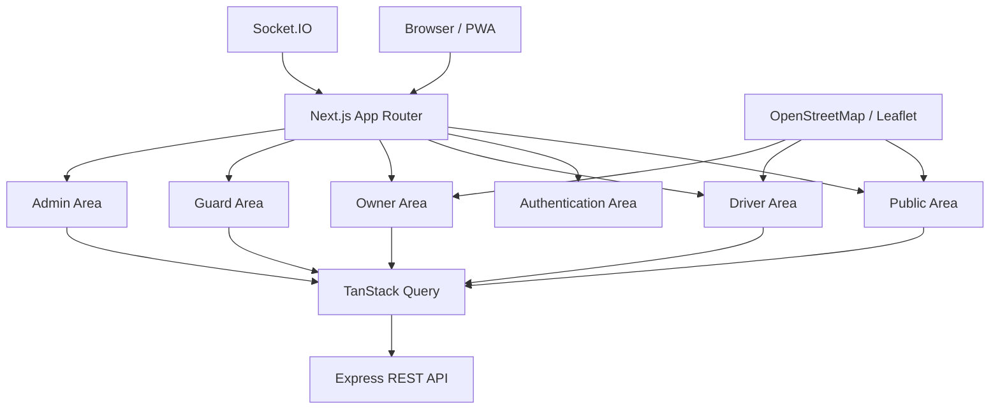

# ParkEase BD — Complete Frontend Architecture & UX Specification

> **Document Type:** Frontend Architecture, Route Map, UI/UX Specification, Form Contract, Component Plan, and Implementation Blueprint  
> **Project:** ParkEase BD  
> **Frontend Stack:** Next.js App Router, React, TypeScript, Tailwind CSS, shadcn/ui (Base UI + Nova preset), TanStack Query, React Hook Form, Zod, Zustand, React Leaflet, Socket.IO Client  
> **Audience:** Frontend developers, backend developers, project supervisors, designers, QA engineers, and semester-project evaluators  
> **Purpose:** This document defines how the complete ParkEase BD frontend should look, behave, organize code, protect routes, communicate with the backend, and support Driver, Parking Owner, Security Guard, and Admin workflows.
> **Alignment Revision:** v2.1 — synchronized with the backend architecture on 3 August 2026. Where an older statement conflicts with an explicit v2.1 contract, the v2.1 contract is authoritative.

---

## 1. Executive Summary

ParkEase BD is a location-based shared parking platform designed for Dhaka. It connects drivers looking for temporary parking with residential property owners or building managers who have unused parking spaces during specific time periods.

The frontend will be a single Next.js application with four role-based application areas:

```text
/driver
/owner
/guard
/admin
```

The same frontend domain will contain:

- public marketing pages;
- parking search and map pages;
- authentication pages;
- Driver dashboard and booking experience;
- Parking Owner dashboard and listing-management experience;
- Security Guard verification and session-management experience;
- Admin verification, dispute, payout, reconciliation, and audit interfaces.

The frontend must never be treated as the final authority for:

- booking availability;
- booking conflicts;
- final price;
- payment validation;
- refund calculation;
- owner earnings;
- role authorization.

Those decisions remain under the backend. The frontend is responsible for presenting data, collecting valid input, providing safe user interactions, and synchronizing the interface with backend state.

---

# Part I — Product and Experience Model

## 2. Product Goals

The frontend should help users complete the following goals with minimum confusion.

### Driver goals

- Find nearby parking.
- Compare parking options.
- Check vehicle compatibility.
- View approximate location before booking.
- Select a date and time.
- Get a backend-calculated quotation.
- Hold a parking slot.
- Complete payment.
- View confirmed booking details.
- Show QR or OTP at entry.
- Request checkout.
- View refund, overtime, and payment status.
- Submit a review or dispute.

### Parking Owner goals

- Create a property.
- Upload property and parking images.
- Submit the property for verification.
- Add individual parking spots.
- Define weekly availability.
- Add temporary blocks or special availability.
- Assign guards.
- Monitor upcoming bookings and active sessions.
- View earnings and transaction history.
- Create payout accounts.
- Request payouts.

### Security Guard goals

- See only assigned properties.
- View expected arrivals.
- Verify OTP or QR.
- Match vehicle information.
- Confirm entry.
- View active vehicles.
- Confirm physical exit.
- Report incidents.

### Admin goals

- Review pending properties.
- Approve, reject, or suspend properties.
- Suspend users or listings.
- Review disputes.
- Approve simulated payouts.
- Inspect payment mismatches.
- Review audit logs.
- Perform controlled booking overrides.

---

## 3. Frontend Design Principles

### 3.1 Clear role separation

Every role receives a role-specific dashboard, navigation system, permissions, and workflow.

### 3.2 One task per screen

Complex processes such as property creation and booking should use step-based forms instead of a single long page.

### 3.3 Mobile-first for Driver and Guard

Drivers will often use the application while traveling. Guards will often use phones at entry points. Their interfaces must prioritize touch targets, simple actions, and fast loading.

### 3.4 Desktop-friendly for Owner and Admin

Owner and Admin dashboards should provide tables, filters, charts, detail panels, and management tools suitable for larger screens.

### 3.5 Backend-driven truth

The interface may show optimistic loading feedback, but it must not invent successful states before the backend confirms them.

### 3.6 Privacy by design

Exact residential addresses and private access instructions must not be shown to unauthorized users.

### 3.7 Consistent system status

Every booking, property, payment, refund, payout, and dispute state should use standardized labels, colors, icons, and descriptions.

### 3.8 Accessible and understandable

Forms must include visible labels, error messages, keyboard support, readable contrast, and meaningful empty states.

---

## 4. Visual Identity Direction

### 4.1 Design style

The interface should feel:

- modern;
- secure;
- urban;
- clean;
- practical;
- trustworthy;
- locally relevant.

### 4.2 shadcn/ui configuration

```text
Component Library: Base UI
Preset: Nova
Icon Set: Lucide
Font: Geist
```

### 4.3 Suggested color tokens

Use semantic design tokens rather than hardcoding colors inside components.

```text
Primary             Emerald / green
Primary foreground  White
Background          White
Muted background    Light neutral gray
Card                 White
Border               Neutral gray
Information          Blue
Success              Green
Warning              Amber
Danger               Red
Pending               Amber
Completed             Green
Disabled              Gray
```

### 4.4 Status colors

| Status | Color meaning |
|---|---|
| DRAFT | Gray |
| PENDING | Amber |
| VERIFIED | Green |
| ACTIVE | Green |
| HELD | Amber |
| PAYMENT_PENDING | Amber |
| CONFIRMED | Blue |
| CHECKED_IN | Green |
| CHECKOUT_REQUESTED | Violet |
| PAYMENT_DUE | Red |
| COMPLETED | Green |
| CANCELLED | Gray |
| EXPIRED | Gray |
| NO_SHOW | Orange |
| DISPUTED | Red |
| SUSPENDED | Red |

### 4.5 Typography hierarchy

```text
Page title         text-3xl / font-semibold
Section title      text-xl / font-semibold
Card title         text-base / font-medium
Body               text-sm or text-base
Metadata           text-sm / muted foreground
Table text         text-sm
Action label       text-sm / font-medium
```

---

# Part II — Technical Stack

## 5. Final Frontend Technology Stack

| Concern | Technology | Responsibility |
|---|---|---|
| Framework | Next.js App Router | Routing, layouts, rendering, metadata, loading and error boundaries |
| UI library | React | Component model |
| Language | TypeScript | Type safety |
| Styling | Tailwind CSS | Utility-first styling |
| Components | shadcn/ui with Base UI | Accessible reusable interface components |
| Preset | Nova | Visual component preset |
| Server state | TanStack Query | API caching, fetching, mutations, retries, invalidation |
| Forms | React Hook Form | Form state and submission |
| Validation | Zod | Client-side input schemas and shared contracts |
| HTTP | Axios | API client, interceptors, credentials, error normalization |
| Client UI state | Zustand | Temporary UI state only |
| Maps | React Leaflet + Leaflet | Map display and marker interactions |
| Realtime | Socket.IO Client | Realtime booking, payment, availability, and notification updates |
| Date/time | date-fns | Formatting, duration, date utilities |
| Icons | Lucide React | Consistent icons |
| Toasts | Sonner | Action feedback |
| Charts | Recharts | Owner and Admin analytics |
| QR display | react-qr-code | Driver booking QR rendering |
| QR scanning | html5-qrcode | Guard QR scanning |
| Testing | Vitest, React Testing Library, Playwright | Unit, integration, and end-to-end tests |

---

## 6. Package Installation Plan

```bash
npm install \
  @tanstack/react-query \
  @tanstack/react-query-devtools \
  axios \
  react-hook-form \
  @hookform/resolvers \
  zod \
  zustand \
  socket.io-client \
  leaflet \
  react-leaflet \
  date-fns \
  clsx \
  tailwind-merge \
  lucide-react \
  sonner \
  recharts \
  react-qr-code \
  html5-qrcode

npm install -D \
  @types/leaflet \
  vitest \
  @testing-library/react \
  @testing-library/jest-dom \
  @testing-library/user-event
```

Recommended shadcn/ui components:

```bash
npx shadcn@latest add \
  accordion \
  alert \
  alert-dialog \
  avatar \
  badge \
  breadcrumb \
  button \
  calendar \
  card \
  checkbox \
  command \
  dialog \
  drawer \
  dropdown-menu \
  form \
  input \
  input-otp \
  label \
  navigation-menu \
  pagination \
  popover \
  progress \
  radio-group \
  scroll-area \
  select \
  separator \
  sheet \
  sidebar \
  skeleton \
  sonner \
  switch \
  table \
  tabs \
  textarea \
  tooltip
```

---

# Part III — Application Architecture

## 7. High-Level Frontend Architecture



---

## 8. Rendering Strategy

### Server Components should be used for

- public page shell;
- static marketing content;
- metadata generation;
- server-readable route parameters;
- layouts that do not require browser APIs;
- initial protected-layout composition where practical.

### Client Components should be used for

- interactive forms;
- TanStack Query hooks;
- maps;
- geolocation;
- Socket.IO;
- countdown timers;
- QR scanner;
- dialogs, drawers, and filters;
- browser-only APIs.

### Important rule

Do not mark entire route trees with `"use client"`. Keep client boundaries small.

---

## 9. State Management Strategy

### 9.1 Server state — TanStack Query

Store API-controlled state here:

- current user;
- roles;
- vehicles;
- parking search results;
- parking details;
- availability;
- quotes;
- bookings;
- payments;
- refunds;
- properties;
- parking spots;
- guard assignments;
- earnings;
- payouts;
- disputes;
- notifications;
- admin records.

### 9.2 Form state — React Hook Form

Use for:

- login;
- registration;
- password reset;
- vehicle creation;
- property creation;
- parking spot creation;
- availability rules;
- booking time selection;
- review;
- dispute;
- payout account;
- incident reports.

### 9.3 Client UI state — Zustand

Only use Zustand for temporary interface state:

- map/list view selection;
- selected map marker;
- unsaved booking draft;
- search filters before submission;
- sidebar collapsed state;
- owner property wizard progress;
- mobile drawer state.

### 9.4 URL state

Store shareable filters in the URL:

```text
lat
lng
radiusKm
startAt
endAt
vehicleType
minPrice
maxPrice
facilities
sort
page
```

This allows refresh, sharing, and browser navigation without losing search context.

---

# Part IV — Route and Access Architecture

## 10. Route Groups

Recommended route groups:

```text
src/app/
├── (marketing)/
├── (auth)/
├── (public-app)/
├── driver/
├── owner/
├── guard/
├── admin/
└── api-health/
```

Route groups do not appear in the browser URL. They organize layouts and behavior.

---

## 11. Route Access Types

### Public routes

Accessible without login.

### Guest-only routes

Accessible only while logged out. Logged-in users should be redirected to their dashboard.

### Authenticated shared routes

Accessible to any logged-in user.

### Role-protected routes

Accessible only when the required role exists.

### Ownership-protected screens

The route may be available to a role, but the backend must verify whether the user owns or is assigned to the requested resource.

### Admin-only routes

Accessible only to Admin.

---

## 12. Complete Route Matrix

| Route | Access | Role | Purpose |
|---|---|---|---|
| `/` | Public | All | Landing page |
| `/about` | Public | All | Product background and mission |
| `/how-it-works` | Public | All | Explain Driver and Owner flows |
| `/safety` | Public | All | Safety, privacy, and verification information |
| `/contact` | Public | All | Contact and support information |
| `/terms` | Public | All | Terms and conditions |
| `/privacy` | Public | All | Privacy policy |
| `/parking` | Public | All | Search parking list and map |
| `/parking/[spotId]` | Public | All | Public parking detail |
| `/login` | Guest-only | Logged-out users | Email-or-phone login |
| `/register` | Guest-only | Logged-out users | Driver or Parking Owner registration |
| `/forgot-password` | Guest-only | Logged-out users | Password-reset request |
| `/reset-password` | Guest-only | Logged-out users | Password-reset completion |
| `/verify-account` | Shared | Authenticated or token holder | Email/phone verification |
| `/payment/sslcommerz/success` | Shared | Payment return | Display backend-validated payment status |
| `/payment/sslcommerz/fail` | Shared | Payment return | Display failed-payment state |
| `/payment/sslcommerz/cancel` | Shared | Payment return | Display cancelled-payment state |
| `/unauthorized` | Public | All | Access-denied information |
| `/account` | Private | Any authenticated user | General account settings |
| `/account/security` | Private | Any authenticated user | Password and security |
| `/account/security/change-initial-password` | Private restricted | `mustChangePassword=true` | Mandatory temporary-password replacement |
| `/account/sessions` | Private | Any authenticated user | Session list and revoke |
| `/notifications` | Private | Any authenticated user | Notification center |
| `/driver` | Private | DRIVER | Driver dashboard redirect |
| `/driver/dashboard` | Private | DRIVER | Driver overview |
| `/driver/search` | Private | DRIVER | Authenticated parking search |
| `/driver/vehicles` | Private | DRIVER | Vehicle list |
| `/driver/vehicles/new` | Private | DRIVER | Add vehicle |
| `/driver/vehicles/[vehicleId]/edit` | Private | DRIVER | Edit vehicle |
| `/driver/bookings` | Private | DRIVER | Booking list |
| `/driver/bookings/[bookingId]` | Private | DRIVER | Booking detail |
| `/driver/bookings/[bookingId]/payment` | Private | DRIVER | Initial/extension/outstanding payment initiation |
| `/driver/bookings/[bookingId]/access` | Private | DRIVER | Purpose-aware entry or exit QR/OTP |
| `/driver/bookings/[bookingId]/review` | Private | DRIVER | Submit review |
| `/driver/bookings/[bookingId]/dispute` | Private | DRIVER | Open dispute |
| `/driver/payments` | Private | DRIVER | Payment history |
| `/driver/refunds` | Private | DRIVER | Refund history |
| `/driver/profile` | Private | DRIVER | Driver profile |
| `/owner` | Private | PARKING_OWNER | Owner dashboard redirect |
| `/owner/dashboard` | Private | PARKING_OWNER | Owner overview |
| `/owner/properties` | Private | PARKING_OWNER | Property list |
| `/owner/properties/new` | Private | PARKING_OWNER | Property wizard |
| `/owner/properties/[propertyId]` | Private | PARKING_OWNER | Property overview |
| `/owner/properties/[propertyId]/edit` | Private | PARKING_OWNER | Edit according to verification state |
| `/owner/properties/[propertyId]/images` | Private | PARKING_OWNER | Image management |
| `/owner/properties/[propertyId]/spots` | Private | PARKING_OWNER | Spot management |
| `/owner/properties/[propertyId]/spots/new` | Private | PARKING_OWNER | Create spot |
| `/owner/spots/[spotId]` | Private | PARKING_OWNER | Spot detail |
| `/owner/spots/[spotId]/edit` | Private | PARKING_OWNER | Edit spot |
| `/owner/spots/[spotId]/availability` | Private | PARKING_OWNER | Weekly availability |
| `/owner/spots/[spotId]/exceptions` | Private | PARKING_OWNER | Availability exceptions |
| `/owner/guards` | Private | PARKING_OWNER | Guard accounts, invitations, and assignments |
| `/owner/guards/new` | Private | PARKING_OWNER | Create a new Guard account |
| `/owner/bookings` | Private | PARKING_OWNER | Property booking list |
| `/owner/bookings/[bookingId]` | Private | PARKING_OWNER | Owner booking view |
| `/owner/sessions` | Private | PARKING_OWNER | Active parking sessions |
| `/owner/disputes` | Private | PARKING_OWNER | Related dispute list |
| `/owner/disputes/[disputeId]` | Private | PARKING_OWNER | Respond and submit evidence |
| `/owner/earnings` | Private | PARKING_OWNER | Earnings summary |
| `/owner/earnings/transactions` | Private | PARKING_OWNER | Earnings ledger view |
| `/owner/payout-accounts` | Private | PARKING_OWNER | Payout-account management |
| `/owner/payouts` | Private | PARKING_OWNER | Payout-request history |
| `/owner/profile` | Private | PARKING_OWNER | Owner profile |
| `/guard` | Private | GUARD | Guard redirect |
| `/guard/assignments` | Private | GUARD | Accept/reject pending property assignments |
| `/guard/dashboard` | Private | GUARD | Guard overview |
| `/guard/properties` | Private | GUARD | Active assigned properties |
| `/guard/properties/[propertyId]/arrivals` | Private | GUARD | Expected arrivals |
| `/guard/properties/[propertyId]/active` | Private | GUARD | Active sessions |
| `/guard/verify` | Private | GUARD | Purpose-aware entry/exit QR or OTP verification |
| `/guard/bookings/[bookingId]` | Private | GUARD | Verification result and operation |
| `/guard/bookings/[bookingId]/incident` | Private | GUARD | Incident report |
| `/guard/profile` | Private | GUARD | Guard profile |
| `/admin` | Private | ADMIN | Admin dashboard redirect |
| `/admin/dashboard` | Private | ADMIN | System overview |
| `/admin/properties/pending` | Private | ADMIN | Pending verification queue |
| `/admin/properties/[propertyId]` | Private | ADMIN | Property review |
| `/admin/users` | Private | ADMIN | User management |
| `/admin/users/[userId]` | Private | ADMIN | User detail |
| `/admin/guards` | Private | ADMIN | Guard accounts and assignments |
| `/admin/guards/[guardId]` | Private | ADMIN | Guard detail, account actions, assignments |
| `/admin/bookings` | Private | ADMIN | Booking management |
| `/admin/bookings/[bookingId]` | Private | ADMIN | Booking audit and override |
| `/admin/disputes` | Private | ADMIN | Dispute queue |
| `/admin/disputes/[disputeId]` | Private | ADMIN | Dispute resolution |
| `/admin/payout-accounts` | Private | ADMIN | Payout-account verification |
| `/admin/payouts` | Private | ADMIN | Payout queue |
| `/admin/payouts/[requestId]` | Private | ADMIN | Payout review |
| `/admin/payments/reconciliation` | Private | ADMIN | Payment mismatch review |
| `/admin/audit-logs` | Private | ADMIN | Audit-log explorer |
| `/admin/jobs` | Private | ADMIN | Failed-job review and retry |
| `/admin/settings` | Private | ADMIN | Allowlisted operational settings |

### Mandatory first-login route guard

When `/auth/login` or `/auth/me` returns `mustChangePassword: true`, middleware/layout guards must allow only:

```text
/account/security/change-initial-password
/account/sessions
/logout
```

For a new Guard, after password change the next route is `/guard/assignments` until at least one assignment becomes `ACTIVE`.

---
## 13. Route Protection Strategy

### Middleware responsibility

Middleware may perform lightweight checks:

- read presence of authentication cookie;
- redirect guests from private areas;
- redirect authenticated users from guest-only routes;
- redirect obvious role mismatches.

### Backend responsibility

The backend remains responsible for real authorization:

- validating token/session;
- checking role;
- checking ownership;
- checking guard assignment;
- checking admin privileges;
- rejecting unauthorized resource access.

### Suggested protection flow

```text
Request private route
→ Middleware checks session cookie exists
→ Layout loads current user
→ Role guard checks required role
→ Page fetches resource
→ Backend checks authorization and ownership
```

### Unauthorized behavior

- Not logged in → redirect to `/login?redirect=<original-url>`.
- Logged in but missing role → redirect to `/unauthorized`.
- Resource not owned or assigned → show 403 error state.
- Resource not found → show 404 page.

---

# Part V — Folder Structure

## 14. Complete Recommended Folder Structure

```text
apps/web/
├── public/
│   ├── brand/
│   │   ├── logo.svg
│   │   ├── logo-mark.svg
│   │   └── og-image.png
│   ├── images/
│   │   ├── hero/
│   │   ├── parking/
│   │   ├── placeholders/
│   │   └── onboarding/
│   ├── icons/
│   └── manifest.webmanifest
│
├── src/
│   ├── app/
│   │   ├── layout.tsx
│   │   ├── globals.css
│   │   ├── loading.tsx
│   │   ├── error.tsx
│   │   ├── global-error.tsx
│   │   ├── not-found.tsx
│   │   ├── robots.ts
│   │   ├── sitemap.ts
│   │   │
│   │   ├── (marketing)/
│   │   │   ├── layout.tsx
│   │   │   ├── page.tsx
│   │   │   ├── about/page.tsx
│   │   │   ├── how-it-works/page.tsx
│   │   │   ├── safety/page.tsx
│   │   │   ├── contact/page.tsx
│   │   │   ├── terms/page.tsx
│   │   │   └── privacy/page.tsx
│   │   │
│   │   ├── (public-app)/
│   │   │   ├── layout.tsx
│   │   │   └── parking/
│   │   │       ├── page.tsx
│   │   │       ├── loading.tsx
│   │   │       └── [spotId]/
│   │   │           ├── page.tsx
│   │   │           ├── loading.tsx
│   │   │           └── not-found.tsx
│   │   │
│   │   ├── (auth)/
│   │   │   ├── layout.tsx
│   │   │   ├── login/page.tsx
│   │   │   ├── register/page.tsx
│   │   │   ├── forgot-password/page.tsx
│   │   │   ├── reset-password/page.tsx
│   │   │   └── verify-account/page.tsx
│   │   │
│   │   ├── account/
│   │   │   ├── layout.tsx
│   │   │   ├── page.tsx
│   │   │   ├── security/
│   │   │   │   ├── page.tsx
│   │   │   │   └── change-initial-password/page.tsx
│   │   │   └── sessions/page.tsx
│   │   │
│   │   ├── payment/sslcommerz/
│   │   │   ├── success/page.tsx
│   │   │   ├── fail/page.tsx
│   │   │   └── cancel/page.tsx
│   │   ├── notifications/page.tsx
│   │   ├── unauthorized/page.tsx
│   │   │
│   │   ├── driver/
│   │   │   ├── layout.tsx
│   │   │   ├── page.tsx
│   │   │   ├── dashboard/page.tsx
│   │   │   ├── search/page.tsx
│   │   │   ├── vehicles/
│   │   │   │   ├── page.tsx
│   │   │   │   ├── new/page.tsx
│   │   │   │   └── [vehicleId]/edit/page.tsx
│   │   │   ├── bookings/
│   │   │   │   ├── page.tsx
│   │   │   │   └── [bookingId]/
│   │   │   │       ├── page.tsx
│   │   │   │       ├── payment/page.tsx
│   │   │   │       ├── access/page.tsx
│   │   │   │       ├── review/page.tsx
│   │   │   │       └── dispute/page.tsx
│   │   │   ├── payments/page.tsx
│   │   │   ├── refunds/page.tsx
│   │   │   └── profile/page.tsx
│   │   │
│   │   ├── owner/
│   │   │   ├── layout.tsx
│   │   │   ├── page.tsx
│   │   │   ├── dashboard/page.tsx
│   │   │   ├── properties/
│   │   │   │   ├── page.tsx
│   │   │   │   ├── new/page.tsx
│   │   │   │   └── [propertyId]/
│   │   │   │       ├── page.tsx
│   │   │   │       ├── edit/page.tsx
│   │   │   │       ├── images/page.tsx
│   │   │   │       └── spots/
│   │   │   │           ├── page.tsx
│   │   │   │           └── new/page.tsx
│   │   │   ├── spots/
│   │   │   │   └── [spotId]/
│   │   │   │       ├── page.tsx
│   │   │   │       ├── edit/page.tsx
│   │   │   │       ├── availability/page.tsx
│   │   │   │       └── exceptions/page.tsx
│   │   │   ├── guards/
│   │   │   │   ├── page.tsx
│   │   │   │   └── new/page.tsx
│   │   │   ├── bookings/
│   │   │   │   ├── page.tsx
│   │   │   │   └── [bookingId]/page.tsx
│   │   │   ├── sessions/page.tsx
│   │   │   ├── disputes/
│   │   │   │   ├── page.tsx
│   │   │   │   └── [disputeId]/page.tsx
│   │   │   ├── earnings/
│   │   │   │   ├── page.tsx
│   │   │   │   └── transactions/page.tsx
│   │   │   ├── payout-accounts/page.tsx
│   │   │   ├── payouts/page.tsx
│   │   │   └── profile/page.tsx
│   │   │
│   │   ├── guard/
│   │   │   ├── layout.tsx
│   │   │   ├── page.tsx
│   │   │   ├── assignments/page.tsx
│   │   │   ├── dashboard/page.tsx
│   │   │   ├── properties/page.tsx
│   │   │   ├── properties/[propertyId]/arrivals/page.tsx
│   │   │   ├── properties/[propertyId]/active/page.tsx
│   │   │   ├── verify/page.tsx
│   │   │   ├── bookings/[bookingId]/page.tsx
│   │   │   ├── bookings/[bookingId]/incident/page.tsx
│   │   │   └── profile/page.tsx
│   │   │
│   │   └── admin/
│   │       ├── layout.tsx
│   │       ├── page.tsx
│   │       ├── dashboard/page.tsx
│   │       ├── properties/
│   │       │   ├── pending/page.tsx
│   │       │   └── [propertyId]/page.tsx
│   │       ├── users/
│   │       │   ├── page.tsx
│   │       │   └── [userId]/page.tsx
│   │       ├── guards/
│   │       │   ├── page.tsx
│   │       │   └── [guardId]/page.tsx
│   │       ├── bookings/
│   │       │   ├── page.tsx
│   │       │   └── [bookingId]/page.tsx
│   │       ├── disputes/
│   │       │   ├── page.tsx
│   │       │   └── [disputeId]/page.tsx
│   │       ├── payout-accounts/page.tsx
│   │       ├── payouts/
│   │       │   ├── page.tsx
│   │       │   └── [requestId]/page.tsx
│   │       ├── payments/reconciliation/page.tsx
│   │       ├── audit-logs/page.tsx
│   │       ├── jobs/page.tsx
│   │       └── settings/page.tsx
│   │
│   ├── components/
│   │   ├── ui/
│   │   ├── common/
│   │   │   ├── app-logo.tsx
│   │   │   ├── page-header.tsx
│   │   │   ├── status-badge.tsx
│   │   │   ├── money.tsx
│   │   │   ├── date-time.tsx
│   │   │   ├── data-table.tsx
│   │   │   ├── empty-state.tsx
│   │   │   ├── error-state.tsx
│   │   │   ├── loading-card.tsx
│   │   │   ├── confirm-dialog.tsx
│   │   │   └── permission-denied.tsx
│   │   ├── layout/
│   │   │   ├── marketing-header.tsx
│   │   │   ├── marketing-footer.tsx
│   │   │   ├── dashboard-sidebar.tsx
│   │   │   ├── dashboard-header.tsx
│   │   │   ├── mobile-bottom-nav.tsx
│   │   │   ├── role-switcher.tsx
│   │   │   └── user-menu.tsx
│   │   ├── auth/
│   │   ├── parking/
│   │   ├── maps/
│   │   ├── booking/
│   │   ├── vehicle/
│   │   ├── property/
│   │   ├── availability/
│   │   ├── guard/
│   │   ├── payments/
│   │   ├── earnings/
│   │   ├── disputes/
│   │   ├── notifications/
│   │   └── admin/
│   │
│   ├── features/
│   │   ├── auth/
│   │   │   ├── api/
│   │   │   ├── components/
│   │   │   ├── hooks/
│   │   │   ├── schemas/
│   │   │   ├── types/
│   │   │   └── constants.ts
│   │   ├── vehicles/
│   │   ├── parking-search/
│   │   ├── parking-details/
│   │   ├── bookings/
│   │   ├── payments/
│   │   ├── properties/
│   │   ├── parking-spots/
│   │   ├── availability/
│   │   ├── guards/
│   │   ├── sessions/
│   │   ├── earnings/
│   │   ├── payouts/
│   │   ├── reviews/
│   │   ├── disputes/
│   │   ├── notifications/
│   │   └── admin/
│   │
│   ├── lib/
│   │   ├── api/
│   │   │   ├── client.ts
│   │   │   ├── server-client.ts
│   │   │   ├── endpoints.ts
│   │   │   ├── api-error.ts
│   │   │   ├── normalize-error.ts
│   │   │   └── refresh-session.ts
│   │   ├── auth/
│   │   │   ├── roles.ts
│   │   │   ├── permissions.ts
│   │   │   ├── role-routes.ts
│   │   │   └── require-role.ts
│   │   ├── query/
│   │   │   ├── query-client.ts
│   │   │   └── query-keys.ts
│   │   ├── socket/
│   │   │   ├── client.ts
│   │   │   ├── events.ts
│   │   │   └── rooms.ts
│   │   ├── maps/
│   │   │   ├── leaflet-icon.ts
│   │   │   ├── coordinates.ts
│   │   │   └── map-config.ts
│   │   ├── formatting/
│   │   │   ├── money.ts
│   │   │   ├── date-time.ts
│   │   │   ├── duration.ts
│   │   │   ├── vehicle.ts
│   │   │   └── address.ts
│   │   ├── validation/
│   │   ├── constants/
│   │   ├── env.ts
│   │   └── utils.ts
│   │
│   ├── providers/
│   │   ├── app-providers.tsx
│   │   ├── query-provider.tsx
│   │   ├── auth-provider.tsx
│   │   ├── socket-provider.tsx
│   │   └── theme-provider.tsx
│   │
│   ├── hooks/
│   │   ├── use-current-user.ts
│   │   ├── use-current-role.ts
│   │   ├── use-current-location.ts
│   │   ├── use-debounce.ts
│   │   ├── use-countdown.ts
│   │   ├── use-media-query.ts
│   │   └── use-permission.ts
│   │
│   ├── stores/
│   │   ├── booking-draft.store.ts
│   │   ├── parking-search.store.ts
│   │   ├── map.store.ts
│   │   └── dashboard-ui.store.ts
│   │
│   ├── config/
│   │   ├── navigation.ts
│   │   ├── site.ts
│   │   ├── feature-flags.ts
│   │   └── dashboard.ts
│   │
│   ├── types/
│   │   ├── api.ts
│   │   ├── auth.ts
│   │   ├── common.ts
│   │   └── navigation.ts
│   │
│   └── middleware.ts
│
├── tests/
│   ├── unit/
│   ├── integration/
│   └── e2e/
│
├── .env.local
├── .env.example
├── components.json
├── next.config.ts
├── package.json
├── playwright.config.ts
├── postcss.config.mjs
├── tailwind.config.ts
├── tsconfig.json
└── vitest.config.ts
```

---

## 15. Feature Folder Standard

Every feature should follow a consistent structure.

```text
features/bookings/
├── api/
│   ├── booking.api.ts
│   └── booking.keys.ts
├── components/
│   ├── booking-card.tsx
│   ├── booking-status.tsx
│   ├── booking-timeline.tsx
│   ├── booking-actions.tsx
│   └── hold-countdown.tsx
├── hooks/
│   ├── use-bookings.ts
│   ├── use-booking.ts
│   ├── use-create-hold.ts
│   └── use-cancel-booking.ts
├── schemas/
│   ├── booking.schema.ts
│   └── cancellation.schema.ts
├── types/
│   └── booking.types.ts
├── constants.ts
├── mappers.ts
└── utils.ts
```

### Rules

- API functions must not render UI.
- Components must not contain raw API endpoint strings.
- Forms must import schemas from the feature or shared contracts.
- Query keys must be centralized.
- Backend DTOs may be mapped to UI-friendly models.
- Route pages should compose feature components rather than contain all logic.

---

# Part VI — Navigation and Layout Design

## 16. Public Navigation

### Desktop header

Left:

- ParkEase BD logo.

Center:

- Find Parking.
- How It Works.
- For Property Owners.
- Safety.
- About.

Right:

- Log In.
- Get Started.

### Mobile header

- Logo.
- Search icon.
- Menu button.
- Drawer with navigation links.

---

## 17. Dashboard Navigation

### Shared dashboard header

Contains:

- mobile menu button;
- role-aware page title;
- notification bell;
- role switcher when user has multiple roles;
- user avatar menu.

### Driver navigation

```text
Dashboard
Find Parking
My Vehicles
My Bookings
Payments
Refunds
Notifications
Profile
```

### Owner navigation

```text
Dashboard
Properties
Parking Spots
Bookings
Active Sessions
Guards
Disputes
Earnings
Payouts
Notifications
Profile
```

### Guard navigation

```text
Dashboard
Assignment Invitations
Assigned Properties
Expected Arrivals
Active Vehicles
Verify Entry / Exit
Notifications
Profile
```

### Admin navigation

```text
Dashboard
Property Verification
Users
Guards
Bookings
Disputes
Payout Accounts
Payouts
Payment Reconciliation
Audit Logs
Failed Jobs
Settings
```

### Mobile bottom navigation

#### Driver

```text
Home
Search
Bookings
Notifications
Profile
```

#### Guard

```text
Home
Arrivals
Verify
Active
Profile
```

Owner and Admin can use a responsive sidebar with a mobile drawer.

---

# Part VII — Public Page Specifications

## 18. Landing Page `/`

### Goal

Explain the problem, build trust, and direct users to search or register.

### Page structure

#### Header

- logo;
- navigation;
- login button;
- primary “Find Parking” button.

#### Hero section

Left side:

- headline: “Find secure parking near your destination.”
- supporting text focused on Dhaka.
- location search input.
- date/time selectors.
- vehicle-type selector.
- search button.

Right side:

- parking/map illustration or product mockup.

#### Trust strip

- hourly booking;
- verified parking;
- QR/OTP entry;
- transparent pricing.

#### How it works

Three Driver steps:

1. Search nearby parking.
2. Reserve a time slot.
3. Verify and park.

Three Owner steps:

1. Add property and parking spots.
2. Set availability.
3. Earn from completed bookings.

#### Featured areas

Cards for areas such as:

- Dhanmondi;
- Gulshan;
- Banani;
- Uttara;
- Mirpur;
- Mohammadpur.

These should be demonstration categories and not claim guaranteed availability.

#### Benefits section

- less time searching;
- secure reservation;
- owner income;
- reduced roadside parking.

#### Safety section

- verified property process;
- vehicle information matching;
- QR/OTP entry;
- guard confirmation.

#### Call to action

Two cards:

- “I need parking.”
- “I have parking space.”

#### Footer

- product links;
- legal links;
- contact information;
- social links if used.

### Landing-page search form

Fields:

| Field | Type | Required | Notes |
|---|---|---:|---|
| Destination or area | text/autocomplete | Yes | May resolve to coordinates |
| Start date | date | Yes | Cannot be in the past |
| Start time | time | Yes | Local Asia/Dhaka display |
| End date | date | Yes | Must be after start |
| End time | time | Yes | Must be after start |
| Vehicle type | select | Yes | MOTORCYCLE, SEDAN, SUV, MICROBUS |

Submission redirects to `/parking` with URL query parameters.

---

## 19. Public Parking Search `/parking`

### Layout

Desktop:

```text
---------------------------------------------------------
Search filters
---------------------------------------------------------
List panel                         Map panel
Parking cards                      Markers
Parking cards                      Selected marker popup
Pagination / load more
---------------------------------------------------------
```

Mobile:

- filter summary bar;
- toggle between List and Map;
- filter drawer;
- sticky “Search this area” button after map movement.

### Search filters

| Filter | Input |
|---|---|
| Destination | address/location text |
| Current location | geolocation action |
| Start date/time | datetime controls |
| End date/time | datetime controls |
| Vehicle type | select |
| Radius | 1 km, 3 km, 5 km, 10 km |
| Minimum price | number or range |
| Maximum price | number or range |
| Covered parking | checkbox |
| CCTV | checkbox |
| Guard | checkbox |
| Availability | available only |
| Sort | distance, price low-high, rating |

### Parking card content

- property name;
- public area;
- approximate distance;
- image;
- supported vehicle type;
- hourly rate;
- estimated total price;
- facility badges;
- rating and review count when available;
- availability label;
- “View details” button.

### Information not shown publicly

- exact residential address;
- exact entrance coordinates;
- private access instructions;
- owner personal contact;
- guard personal information.

### Empty state

Text:

```text
No parking was found for this time and vehicle type.
Try increasing the search radius, changing the time, or removing a filter.
```

Actions:

- Change time.
- Increase radius.
- Clear filters.

---

## 20. Public Parking Detail `/parking/[spotId]`

### Header area

- image gallery;
- property name;
- public area;
- approximate map;
- verification badge;
- supported vehicle type;
- facilities.

### Main content

Left column:

- description;
- parking dimensions;
- covered/CCTV/guard status;
- minimum booking duration;
- maximum booking duration;
- operating information;
- public cancellation summary;
- reviews.

Right sticky booking card:

- hourly rate;
- date/time inputs;
- vehicle selector for logged-in Driver;
- estimated duration;
- “Get quote” button.

### Logged-out behavior

A logged-out user may search and view details. When attempting to get a quote or book:

```text
Redirect to /login?redirect=/parking/<spotId>
```

### Logged-in non-Driver behavior

Show an option to enable or use the Driver role if the account supports role switching. The backend remains responsible for allowed role assignment.

---

# Part VIII — Authentication and Account Pages

## 21. Login Page `/login`

The login form uses one **Email or phone** identifier field. Submit `{ identifier, password, rememberDevice }`; never guess identifier type on the server beyond normalized email/phone parsing.

After success, route from backend state in this order:

```text
mustChangePassword
→ pending Guard assignment acceptance
→ requested redirect when authorized
→ selected/last active role dashboard
```

For Owner/Admin-created Guard accounts, the temporary password is replaced before dashboard access.


### Layout

Desktop split screen:

- left: brand illustration or parking image;
- right: login card.

Mobile:

- centered card;
- no heavy illustration.

### Inputs

| Field | Type | Required |
|---|---|---:|
| Email or phone | text | Yes |
| Password | password | Yes |
| Remember this device | checkbox | Optional |

### Actions

- Log In.
- Forgot password.
- Create account.

### Validation

- required fields;
- normalized email or phone;
- password not empty;
- backend handles credential validity.

### Error states

- invalid credentials;
- suspended account;
- blocked account;
- network error;
- rate limit exceeded.

---

## 22. Registration Page `/register`

### Public registration strategy

Use a short multi-step form.

### Step 1 — Account details

| Field | Type | Required |
|---|---|---:|
| Full name | text | Yes |
| Email | email | Yes |
| Phone | tel | Yes |
| Password | password | Yes |
| Confirm password | password | Yes |

### Step 2 — Initial role

Options:

- Driver / Vehicle Owner.
- Parking Owner.

The public page never offers `GUARD` or `ADMIN`.

### Step 3 — Terms

- accept terms;
- accept privacy policy.

### Success screen

- account created;
- email/phone verification status;
- next-action button from backend state.

### Controlled Guard account model

A Security Guard cannot self-register. Guard identity and property assignment are separate concepts:

```text
User account + GUARD role
        ↓
One or more property assignments
        ↓
Each assignment has its own status and shift
```

A Guard account may eventually serve multiple properties, including properties of different owners, but owners cannot browse a global Guard directory. A cross-owner assignment becomes visible and operational only after the Guard accepts the invitation.

#### New Guard created by an Owner

1. The active Parking Owner opens `/owner/guards/new`.
2. The Owner selects one verified, eligible property owned by that Owner.
3. The Owner enters full name, at least one login contact, temporary initial password, and optional shift.
4. The frontend sends `POST /api/v1/owner/guards` with an idempotency key.
5. The backend verifies property ownership, contact uniqueness, password policy, rate limits, and authorization.
6. The backend transaction creates the user, grants `GUARD`, sets `mustChangePassword: true`, records `accountOrigin`, and creates a `PENDING_ACCEPTANCE` assignment.
7. The API never returns the password. After success, the frontend may display the Owner-entered temporary password once from in-memory form state only.
8. The Guard logs in with email or phone plus the temporary password.
9. The Guard must change the initial password.
10. The Guard reviews and accepts the property assignment at `/guard/assignments`.
11. Only an `ACTIVE` assignment grants access to property operations.

#### Existing registered contact

If the email or phone is already registered:

- the backend returns `GUARD_CONTACT_ALREADY_REGISTERED`;
- the response does not reveal the account holder's name, roles, properties, or unmasked contact;
- the Owner may send a privacy-preserving assignment invitation;
- the existing Guard must accept before the Owner can see assignment-level operational profile data;
- the Owner cannot set or reset the existing user's password.

#### Admin-created Guard

Admin may create a Guard, assign eligible properties, issue an audited temporary password, suspend/restore the global account, and manage assignments. Admin still cannot view any password after submission.

### First-login password change

Route:

```text
/account/security/change-initial-password
```

When `mustChangePassword: true` is returned after login or `/auth/me`, block all application dashboards.

| Field | Type | Required |
|---|---|---:|
| Current temporary password | password | Yes |
| New password | password | Yes |
| Confirm new password | password | Yes |

After success:

- clear `mustChangePassword` from refreshed backend state;
- revoke other sessions according to backend policy;
- clear the password fields and any onboarding state;
- redirect a Guard with pending assignments to `/guard/assignments`;
- never store the temporary password in localStorage, sessionStorage, URL, analytics, logs, or query cache.

### Role activation

An authenticated user may self-enable only `DRIVER` or `PARKING_OWNER` through the backend role endpoint. `GUARD` and `ADMIN` are never granted by frontend state or a public role selector.

---
## 23. Forgot Password `/forgot-password`

Fields:

- email or phone.

Screen states:

- initial form;
- request submitted;
- rate-limited;
- error.

---

## 24. Reset Password `/reset-password`

Fields:

- reset token from URL;
- new password;
- confirm password.

Validation:

- minimum backend-approved length;
- password match;
- expired token handling.

---

## 25. Shared Account Settings `/account`

Tabs:

- Profile.
- Security.
- Sessions.

### Profile fields

- full name;
- email;
- phone;
- avatar;
- verification status.

### Security actions

- change password;
- logout all sessions;
- view recent sessions.

---

# Part IX — Driver Experience

## 26. Driver Dashboard `/driver/dashboard`

### Purpose

Show the next important action immediately.

### Desktop layout

Top summary cards:

- upcoming booking;
- active booking;
- saved vehicles;
- pending refund or payment due.

Main area:

- next booking card;
- quick parking search;
- recent booking history;
- recent notifications.

### Mobile layout

Order:

1. Search parking button.
2. Active/upcoming booking card.
3. Payment-due warning if any.
4. Vehicles.
5. Recent bookings.

### Next booking card

Display:

- booking code;
- property name;
- public or confirmed address according to status;
- booking time;
- vehicle;
- current status;
- countdown until start;
- View Booking button.

---

## 27. Driver Search `/driver/search`

Same search experience as public search, with these additions:

- saved vehicle selector;
- recently used locations;
- booking history shortcuts;
- ability to continue directly to quote.

---

## 28. Vehicle List `/driver/vehicles`

### Page content

- page title;
- Add Vehicle button;
- vehicle cards or table;
- verification badges;
- edit and delete actions.

### Vehicle card fields

- registration number;
- type;
- brand/model;
- color;
- dimensions where provided;
- verification status.

### Empty state

```text
Add a vehicle before making your first booking.
```

---

## 29. Add/Edit Vehicle Form

Routes:

```text
/driver/vehicles/new
/driver/vehicles/[vehicleId]/edit
```

### Inputs

| Field | Type | Required | Notes |
|---|---|---:|---|
| Vehicle type | select | Yes | MOTORCYCLE, SEDAN, SUV, MICROBUS |
| Registration number | text | Yes | Normalize spacing and casing |
| Brand | text | Optional | Example: Toyota |
| Model | text | Optional | Example: Premio |
| Color | text/select | Yes | Used by guard |
| Height in cm | number | Optional | Compatibility check |
| Width in cm | number | Optional | Compatibility check |
| Length in cm | number | Optional | Compatibility check |

### Actions

- Save vehicle.
- Cancel.
- Delete on edit screen with confirmation.

### Validation

- positive dimensions;
- registration format length;
- no duplicate registration according to backend;
- required type and color.

---

## 30. Quote and Booking Flow

### Step 1 — Select booking details

Inputs:

- parking spot;
- vehicle;
- start date/time;
- end date/time.

### Step 2 — Request quote

The frontend sends the selected information to the backend.

### Quote display

```text
Parking amount
Platform fee
Refundable security deposit
Discount, if any
--------------------------------
Total initial payment
```

Also show:

- quote expiry time;
- cancellation summary;
- grace period;
- overtime rule summary.

### Step 3 — Create hold

The frontend sends the quote ID with a client-generated idempotency key.

### Hold screen

Display:

- “Your slot is held for 5 minutes.”
- countdown timer;
- payment amount;
- booking code;
- cancel or return warning;
- pay now button.

### Hold expiry behavior

When the timer reaches zero:

- disable payment action;
- refetch booking state;
- show “Hold expired”;
- offer search again.

### Double-booking error

For `BOOKING_SLOT_UNAVAILABLE`:

- show a clear alert;
- refetch availability;
- preserve search filters;
- suggest another time or spot.

---

## 31. Driver Booking List `/driver/bookings`

### Tabs

- Upcoming.
- Active.
- Completed.
- Cancelled/Expired.
- Disputed.

### Filters

- status;
- date range;
- property area;
- vehicle;
- booking code.

### Booking card/table fields

- booking code;
- property;
- area;
- date/time;
- vehicle;
- amount;
- status;
- payment status;
- action.

---

## 32. Driver Booking Detail `/driver/bookings/[bookingId]`

### Top status section

- booking status badge;
- payment status badge;
- booking code;
- main next action.

### Information sections

#### Parking information

- property name;
- public area;
- exact address only after confirmation;
- entrance map only when authorized;
- access instructions only when authorized;
- spot code.

#### Booking information

- start time;
- end time;
- effective end time;
- duration;
- vehicle;
- hold expiry when relevant.

#### Pricing information

- base amount;
- fee;
- deposit;
- extension amount;
- overtime;
- refund;
- outstanding amount;
- total.

#### Timeline

Example:

```text
Held
Payment initiated
Payment validated
Booking confirmed
Checked in
Checkout requested
Completed
Refund processed
```

#### Actions by status

| Booking status | Allowed UI actions |
|---|---|
| HELD | Pay; cancel/release hold |
| PAYMENT_PENDING | Return to gateway when valid; check backend payment state; cancel only when backend permits |
| CONFIRMED | View entry code; extend; cancel when policy allows |
| CHECKED_IN | Request extension; request checkout |
| CHECKOUT_REQUESTED | View exit code; wait for Guard confirmation |
| PAYMENT_DUE | Pay outstanding amount; view settlement |
| COMPLETED | Review; dispute within allowed period |
| CANCELLED | View cancellation and refund status |
| EXPIRED | Search again; view payment/refund review if a late payment exists |
| NO_SHOW | View no-show charge/refund result; dispute within allowed period |
| DISPUTED | View dispute status and evidence timeline |

---

## 33. Booking Access Screen `/driver/bookings/[bookingId]/access`

### Purpose

Provide the current purpose-bound access credential without exposing it elsewhere.

### Credential modes by booking state

| Booking/session state | Credential purpose |
|---|---|
| `CONFIRMED` before check-in | `ENTRY` |
| `CHECKED_IN` | No active credential |
| `CHECKOUT_REQUESTED` | `EXIT` |
| Completed/cancelled/expired | No active credential |

### Display

- purpose banner: **Entry Code** or **Exit Code**;
- QR code;
- OTP;
- credential expiry;
- property and spot code;
- vehicle summary;
- backend-provided instructions;
- warning not to share.

### Security behavior

- fetch from `GET /api/v1/bookings/:bookingId/access`;
- use `Cache-Control: no-store`;
- never put raw credentials in URL, localStorage, sessionStorage, Zustand persistence, analytics, logs, or TanStack Query persistence;
- keep raw values only in memory;
- clear on expiry, unmount, logout, role change, or completion;
- hide the code after expiry and allow a rate-limited refresh only when backend policy permits;
- refetch booking before deciding which purpose to show;
- never promise screenshot prevention because browsers cannot guarantee it.

---
## 34. Driver Checkout Flow

### Request checkout

Display:

- booking end time;
- current time;
- possible overtime warning;
- reminder that Guard physical confirmation is mandatory;
- **Request checkout** button.

After the backend accepts the request:

- status becomes `CHECKOUT_REQUESTED`;
- backend creates short-lived exit QR and OTP credentials;
- show **View Exit Code** linking to `/driver/bookings/[bookingId]/access`;
- show “Present the exit code to the assigned Guard. The booking is not complete yet.”

### Guard confirmation

The assigned Guard must:

- resolve the credential with purpose `EXIT`;
- confirm vehicle is physically leaving;
- confirm registration;
- confirm the spot is cleared;
- record incident/damage status;
- confirm actual exit time;
- submit **Confirm Exit & Checkout**.

### Final settlement

After backend check-out succeeds, refetch:

- booking detail;
- parking session;
- refund;
- outstanding payment;
- owner earning;
- notifications.

Display:

- completed or payment-due status;
- actual exit time;
- overtime;
- deposit deduction;
- refund amount;
- outstanding amount and Pay action where applicable.

The Driver action alone never completes a booking.

---
## 35. Review Form

Route:

```text
/driver/bookings/[bookingId]/review
```

Fields:

| Field | Type | Required |
|---|---|---:|
| Overall rating | 1–5 | Yes |
| Security rating | 1–5 | Yes |
| Location accuracy | 1–5 | Yes |
| Cleanliness rating | 1–5 | Yes |
| Comment | textarea | Optional |

Rules:

- only completed bookings;
- one review per booking;
- display backend validation errors.

---

## 36. Dispute Form

Route:

```text
/driver/bookings/[bookingId]/dispute
```

Fields:

| Field | Type | Required |
|---|---|---:|
| Category | select | Yes |
| Description | textarea | Yes |
| Evidence files | upload | Optional |
| Requested resolution | select/text | Optional |

Suggested categories:

- incorrect overtime;
- access denied;
- parking unavailable;
- vehicle or property mismatch;
- refund issue;
- safety issue;
- other.

---

## 37. Driver Payments `/driver/payments`

### Table fields

- payment ID;
- booking code;
- purpose;
- amount;
- status;
- initiated time;
- validated time;
- action.

### Filters

- payment status;
- purpose;
- date range.

---

## 38. Driver Refunds `/driver/refunds`

Display:

- booking code;
- refund amount;
- reason;
- status;
- request date;
- completion date;
- support action when manual review is required.

---

# Part X — Parking Owner Experience

## 39. Owner Dashboard `/owner/dashboard`

### Summary cards

- verified properties;
- active parking spots;
- today’s bookings;
- active sessions;
- available earnings;
- pending payout.

### Charts

- earnings over time;
- occupied hours by week;
- booking status distribution.

### Operational panels

- pending property verification;
- upcoming arrivals;
- active sessions;
- recent earning activity;
- alerts for blocked or inactive spots.

---

## 40. Owner Property List `/owner/properties`

### Page content

- Add Property button;
- status filters;
- search by property name or area;
- property cards/table.

### Property card fields

- cover image;
- property name;
- public area;
- verification status;
- operational status;
- number of spots;
- active bookings;
- actions.

### Actions

- View.
- Edit when allowed.
- Manage images.
- Manage spots.
- Submit for verification.
- Temporarily close.

---

## 41. Create Property Wizard `/owner/properties/new`

Use a stepper with draft persistence.

### Step 1 — Basic information

| Field | Type | Required |
|---|---|---:|
| Property name | text | Yes |
| Description | textarea | Yes |
| Public area | text/select | Yes |
| Approximate address | text | Yes |

### Step 2 — Location

| Field | Type | Required |
|---|---|---:|
| Latitude | map-selected | Yes |
| Longitude | map-selected | Yes |
| Entrance latitude | map-selected | Optional/Recommended |
| Entrance longitude | map-selected | Optional/Recommended |
| Exact address | textarea | Yes |
| Access instructions | textarea | Yes |

UX:

- searchable map;
- draggable marker;
- “Use current location” button;
- separate entrance marker when needed;
- privacy notice explaining exact address visibility.

### Step 3 — Images

Inputs:

- property exterior image;
- entrance image;
- parking-area image;
- access-path image;
- additional images.

For each image:

- preview;
- image type;
- sort order;
- remove action.

### Step 4 — Review

Show:

- all entered information;
- missing requirements;
- privacy explanation;
- Save Draft;
- Submit for Verification.

### Wizard behavior

- save after each step;
- allow resume from property list;
- prevent final submission when required data is missing;
- display backend field errors.

---

## 42. Property Detail `/owner/properties/[propertyId]`

### Header

- property name;
- status badges;
- public area;
- actions dropdown.

### Tabs

- Overview.
- Images.
- Parking Spots.
- Guards.
- Bookings.
- Activity.

### Overview content

- verification status and reason;
- operational status;
- approximate and exact address for owner;
- location map;
- access instructions;
- spot summary;
- booking summary;
- recent audit/activity summary when available.

---

## 43. Parking Spot List

Route:

```text
/owner/properties/[propertyId]/spots
```

Display each physical spot separately.

### Spot card fields

- spot code;
- supported vehicle type;
- hourly rate;
- status;
- facilities;
- weekly availability summary;
- next booking;
- actions.

### Actions

- View.
- Edit.
- Manage availability.
- Add exception.
- Block.
- Unblock.
- Set maintenance.

---

## 44. Create/Edit Parking Spot Form

### Basic fields

| Field | Type | Required |
|---|---|---:|
| Spot code | text | Yes |
| Supported vehicle type | select | Yes |
| Hourly rate in BDT | currency input | Yes |
| Minimum booking minutes | number/select | Yes |
| Maximum booking minutes | number/select | Yes |
| Booking buffer minutes | number/select | Yes |
| Grace period minutes | number/select | Yes |
| Overtime multiplier | number/select | Yes |
| Minimum deposit in BDT | currency | Yes |

### Facility fields

| Field | Type |
|---|---|
| Covered | switch |
| CCTV | switch |
| Guard available | switch |

### Dimension fields

| Field | Type |
|---|---|
| Maximum height cm | number |
| Maximum width cm | number |
| Maximum length cm | number |

### Operational field

- status: ACTIVE, BLOCKED, MAINTENANCE, INACTIVE.

### Validation

- rate greater than zero;
- minimum duration smaller than maximum;
- dimensions positive;
- overtime multiplier within backend-approved range;
- spot code unique inside property.

---

## 45. Weekly Availability `/owner/spots/[spotId]/availability`

### Page design

Display seven day cards or a weekly table.

For each day:

- enabled switch;
- start time;
- end time;
- Add another interval.

Example:

```text
Monday
[Enabled]
09:00 AM — 05:00 PM
+ Add interval
```

### Optional date validity

- valid from;
- valid until.

### Validation

- end after start;
- no overlapping intervals on same day;
- timezone displayed as Asia/Dhaka;
- save backend-ready local times.

---

## 46. Availability Exceptions `/owner/spots/[spotId]/exceptions`

### Use cases

- block the space for personal use;
- mark maintenance;
- create special availability outside normal hours.

### Form fields

| Field | Type | Required |
|---|---|---:|
| Exception type | BLOCKED or SPECIAL_AVAILABLE | Yes |
| Start date/time | datetime | Yes |
| End date/time | datetime | Yes |
| Reason | textarea | Yes |

### List display

- type;
- start/end;
- reason;
- creator;
- delete action when allowed.

---

## 47. Guard Accounts and Assignments `/owner/guards`

### Page structure

- property selector;
- assigned Guard list;
- pending invitations/acceptance;
- **Create New Guard Account** button;
- **Invite Existing Guard** action;
- assignment-scoped suspend/end actions.

### Important separation

```text
Global Guard account status
Managed only by Admin

Property assignment status
Managed by authorized Owner/Admin and accepted by Guard
```

An Owner must never see controls that suspend, block, restore, or change the password of an established global Guard account.

### Create New Guard Account form

| Field | Type | Required | Notes |
|---|---|---:|---|
| Guard full name | text | Yes | Used in permitted operational views and audit logs |
| Email | email | Required when phone absent | Normalized by backend |
| Phone number | tel | Required when email absent | Normalized by backend |
| Temporary initial password | password | Yes | Owner-entered; API never echoes it |
| Confirm initial password | password | Yes | Must match |
| Property | select | Yes | Only owned verified/eligible properties |
| Shift start | time | Optional | Assignment-level |
| Shift end | time | Optional | Assignment-level |

Removed from the Owner form:

- global account status;
- “force password change” toggle, because it is mandatory;
- direct established-password reset;
- global Guard suspension.

### Submission behavior

Before submission:

- require at least one contact;
- validate password strength and match;
- require a valid property;
- generate one idempotency key for the creation intent;
- show a confirmation explaining that a login-enabled account and pending assignment will be created.

On success:

- show the masked login identifier;
- show the Owner-entered temporary password once from component memory;
- clearly state that the Guard must change it and accept the assignment;
- purge the password from form state when leaving the success screen;
- invalidate Owner Guard lists and property assignment queries.

### Existing contact and privacy

When backend returns `GUARD_CONTACT_ALREADY_REGISTERED`:

- do not show a matched name or any profile;
- offer **Send Assignment Invitation**;
- submit the property, entered identifier, and shift;
- show only the invitation record for this Owner/property;
- wait for Guard acceptance;
- do not expose other owners, other properties, other roles, or the existing password.

### Assignment statuses

```text
PENDING_ACCEPTANCE
ACTIVE
SUSPENDED
ENDED
CANCELLED
```

- `PENDING_ACCEPTANCE`: Guard has not accepted; no operational access.
- `ACTIVE`: Guard can access the assigned property.
- `SUSPENDED`: temporarily blocked for this property only.
- `ENDED` / `CANCELLED`: terminal; hidden from active operations.

### Assignment card

- Guard name only after visibility is authorized;
- masked contact;
- property;
- shift;
- assignment status;
- invited/accepted date;
- suspend/resume assignment when backend policy permits;
- end assignment.

### Initial-password reset

The Owner may reset only an unused temporary password for a Guard account created by that Owner while `mustChangePassword` is still true. After first-login change, password recovery belongs to the Guard through the normal forgot-password flow; Admin may issue an audited temporary password when necessary.

### Guard assignment acceptance `/guard/assignments`

Each invitation shows:

- property name and public area;
- inviting Owner/property organization label;
- shift;
- privacy/safety notice;
- Accept;
- Reject.

The Guard sees no operational booking/property data until acceptance succeeds.

---
## 48. Owner Booking List `/owner/bookings`

### Filters

- property;
- spot;
- status;
- date range;
- booking code;
- vehicle type.

### Table columns

- booking code;
- property;
- spot;
- scheduled time;
- vehicle type;
- masked registration;
- booking status;
- payment status;
- amount;
- action.

Sensitive driver information should be masked except where operationally necessary.

---

## 49. Owner Booking Detail

Display:

- booking code;
- property and spot;
- scheduled time;
- masked driver information;
- vehicle information needed for operation;
- timeline;
- payment summary without exposing restricted gateway data;
- session status;
- dispute status;
- owner earning status.

Owner actions should remain limited. Owner must not manually force sensitive booking transitions unless explicitly supported by backend policy.

---

## 50. Active Sessions `/owner/sessions`

### Cards/table

- booking code;
- property;
- spot;
- vehicle;
- checked-in time;
- planned end;
- overtime indicator;
- guard;
- session status.

### Realtime behavior

Update on:

- booking checked in;
- checkout requested;
- booking completed;
- payment due;
- dispute opened.

---

## 51. Owner Earnings `/owner/earnings`

### Summary cards

- pending earnings;
- on-hold earnings;
- available earnings;
- paid earnings;
- total platform commission;
- refund/penalty adjustments.

### Chart

- daily, weekly, or monthly earnings.

### Table

- booking code;
- completion date;
- gross parking amount;
- platform commission;
- adjustments;
- net owner amount;
- status.

### Important wording

Do not label pending or on-hold earnings as withdrawable.

---

## 52. Payout Accounts `/owner/payout-accounts`

### List

- method;
- masked account number;
- account name;
- verification status;
- active status.

### Add payout account form

| Field | Type | Required |
|---|---|---:|
| Method | BANK, BKASH, NAGAD | Yes |
| Account name | text | Yes |
| Account number | text | Yes |
| Bank name | text | Conditional for bank |
| Branch | text | Optional/Conditional |

### Security

- mask after saving;
- do not store in browser storage;
- never log account data;
- backend encrypts sensitive data.

---

## 53. Payout Requests `/owner/payouts`

### Request form

- available balance;
- payout account;
- requested amount;
- confirmation checkbox.

### History table

- request ID;
- amount;
- account method;
- status;
- requested date;
- processed date;
- rejection reason.

---

# Part XI — Security Guard Experience

## 54. Guard Dashboard `/guard/dashboard`

### Design goal

Fast operation with large touch-friendly actions.

### Top content

- current shift/property;
- current date and time;
- connectivity indicator;
- prominent Verify Entry/Exit button.

### Summary cards

- expected arrivals today;
- vehicles currently inside;
- checkout requests;
- incidents reported.

### Main lists

- next arrivals;
- overdue vehicles;
- recent completed exits.

---

## 55. Assigned Properties `/guard/properties`

Display:

- property name;
- public area;
- shift time;
- assignment status;
- expected arrivals;
- active vehicles;
- open property operations button.

Guard can only access assigned properties.

---

## 56. Expected Arrivals

Route:

```text
/guard/properties/[propertyId]/arrivals
```

### Arrival card

- expected time;
- booking code;
- spot code;
- vehicle type;
- masked registration;
- color;
- status;
- verify action.

### Filters

- now;
- next hour;
- today;
- booking code;
- registration search.

---

## 57. Verification Screen `/guard/verify`

### Verification purpose

The first control is:

```text
ENTRY | EXIT
```

- `ENTRY` is available for confirmed arrivals.
- `EXIT` is available only after the Driver requests checkout and the backend issues exit credentials.

### Credential modes

Tabs:

- Scan QR.
- Enter OTP.

### QR mode

- camera preview;
- permission guidance;
- switch camera;
- retry;
- manual OTP fallback.

### OTP mode

| Field | Type | Required |
|---|---|---:|
| Property | select | Yes when Guard has multiple active assignments |
| Purpose | ENTRY or EXIT | Yes |
| OTP | input-otp | Yes |

### Resolve response

Display only backend-masked, operation-relevant information:

- booking code;
- purpose;
- spot code;
- vehicle type;
- color;
- masked registration;
- scheduled time;
- whether the action can proceed;
- mismatch/expiry warning.

The resolve call does not complete check-in or check-out.

### Entry action

After vehicle-match confirmations, submit the credential again to the check-in endpoint. The backend atomically revalidates and consumes it.

### Exit action

After physical-exit confirmations, submit the exit credential again to the check-out endpoint. The backend atomically revalidates/consumes it and returns final settlement state.

### Error handling

| Backend code | UI |
|---|---|
| `GUARD_ASSIGNMENT_PENDING` | Explain that assignment is not active |
| `GUARD_NOT_ASSIGNED` | Block operation |
| `ACCESS_TOKEN_INVALID` | Clear credential and retry |
| `ACCESS_TOKEN_EXPIRED` | Ask Driver to refresh access credential |
| `ACCESS_TOKEN_ALREADY_USED` | Refetch booking/session state |
| `ACCESS_PURPOSE_MISMATCH` | Switch to correct entry/exit purpose |
| `VEHICLE_MISMATCH` | Block transition and offer incident report |

Raw credentials remain in short-lived component memory only and are cleared after completion, cancellation, timeout, route change, or error requiring a new scan.

---
## 58. Guard Booking Detail `/guard/bookings/[bookingId]`

### Sections

- verification result;
- vehicle match checklist;
- booking time window;
- spot code;
- access credential status;
- current booking/session status.

### Check-in confirmation

Require confirmation checkboxes:

- vehicle number matches;
- vehicle type/color matches;
- vehicle is physically present.

Then enable Confirm Check-in.

### Checkout and exit confirmation

The Driver may request checkout, but the booking must not be completed from the Driver action alone. The assigned Guard must physically verify the vehicle's exit and explicitly confirm the exit.

Require the Guard to confirm:

- vehicle is physically leaving the property;
- exit registration matches the booked vehicle;
- parking spot has been cleared;
- incident or damage status has been checked;
- actual exit time is correct.

Then enable **Confirm Exit & Checkout**.

After Guard confirmation, the frontend submits the checkout action to the backend, displays the final session result, and refreshes the booking, active-session, overtime, refund, and owner-earning queries. Until this confirmation succeeds, the session remains active or checkout-pending.

---

## 59. Active Vehicles

Route:

```text
/guard/properties/[propertyId]/active
```

Display:

- vehicle;
- spot;
- check-in time;
- planned end;
- remaining time or overtime;
- checkout requested badge;
- action.

Sort priority:

1. checkout requested;
2. overdue;
3. ending soon;
4. others.

---

## 60. Incident Report Form

Route:

```text
/guard/bookings/[bookingId]/incident
```

Fields:

| Field | Type | Required |
|---|---|---:|
| Incident category | select | Yes |
| Description | textarea | Yes |
| Vehicle mismatch | checkbox | Optional |
| Access issue | checkbox | Optional |
| Property issue | checkbox | Optional |
| Evidence image | upload | Optional |
| Immediate action taken | textarea | Optional |

---

# Part XII — Admin Experience

## 61. Admin Dashboard `/admin/dashboard`

### Summary cards

- pending property verifications;
- active bookings;
- payment mismatches;
- open disputes;
- pending payouts;
- suspended users/listings;
- failed jobs if exposed by backend operations.

### Charts

- bookings over time;
- payment status distribution;
- dispute volume;
- owner payout volume.

### Priority queues

- properties awaiting review;
- payment reconciliation alerts;
- urgent disputes;
- payout requests awaiting approval.

---

## 62. Pending Property Verification

Route:

```text
/admin/properties/pending
```

### Table columns

- property name;
- owner;
- public area;
- submitted date;
- image completeness;
- spot count;
- review status;
- action.

### Filters

- area;
- submission date;
- owner;
- completeness;
- review status.

---

## 63. Admin Property Review `/admin/properties/[propertyId]`

### Review layout

Left/main:

- property information;
- exact address;
- map and entrance location;
- image gallery;
- access instructions;
- parking spots;
- owner history.

Right review panel:

- checklist;
- internal notes;
- approve button;
- reject button;
- suspend button when already verified.

### Review checklist

- address appears valid;
- entrance location is clear;
- images are sufficient;
- access instructions are safe and understandable;
- parking spot dimensions are reasonable;
- owner information is acceptable;
- no duplicate or suspicious listing detected.

### Reject form

- reason category;
- detailed reason;
- changes required;
- confirm rejection.

### Approve form

- confirmation;
- internal note optional.

Every sensitive action should require a reason when the backend expects one.

---

## 64. Admin User Management

Routes:

```text
/admin/users
/admin/users/[userId]
```

### User list columns

- user ID;
- name;
- masked email/phone;
- roles;
- status;
- verification status;
- created date;
- action.

### User detail

- profile;
- roles;
- vehicles/properties summary;
- booking summary;
- disputes;
- account status;
- audit activity.

### Admin actions

- suspend user;
- restore user when supported;
- block user;
- view reason history.

Actions require confirmation and reason.

---

## 65. Admin Booking Management

### List filters

- booking status;
- payment status;
- property;
- date range;
- booking code;
- user;
- dispute status.

### Booking detail

Display:

- complete booking state;
- status history;
- payment records;
- refund records;
- ledger summary;
- session details;
- access-token metadata without showing raw secrets;
- realtime events when available;
- related dispute;
- audit log entries.

### Override form

Fields:

- target action;
- reason;
- acknowledgement checkbox;
- confirmation.

Never make override a single-click action.

---

## 66. Dispute Management

Routes:

```text
/admin/disputes
/admin/disputes/[disputeId]
```

### Dispute list

- dispute ID;
- booking code;
- opened by;
- category;
- status;
- created date;
- owner earning hold status;
- priority.

### Detail screen

- dispute description;
- booking timeline;
- payment and refund summary;
- evidence;
- responses;
- internal notes;
- resolution actions.

### Resolution form

- resolution type;
- resolution details;
- refund adjustment if backend supports it;
- earning adjustment if backend supports it;
- final status;
- required reason.

---

## 67. Payout Management

Routes:

```text
/admin/payouts
/admin/payouts/[requestId]
```

### List columns

- payout request ID;
- owner;
- amount;
- payout method;
- masked account;
- status;
- requested date;
- action.

### Detail

- owner balance summary;
- earnings included;
- account verification;
- request history;
- approve;
- reject;
- mark paid.

All actions require confirmation and should produce audit logs.

---

## 68. Payment Reconciliation

Route:

```text
/admin/payments/reconciliation
```

### Table fields

- merchant transaction ID;
- booking ID;
- expected amount;
- gateway amount;
- local status;
- gateway status;
- mismatch type;
- last checked time;
- action.

### Filters

- mismatch type;
- date;
- validation status;
- manual-review status.

### Detail drawer

- payment metadata;
- callback history;
- validation response summary;
- booking state;
- ledger effect;
- reconciliation action.

Never expose gateway secrets or full encrypted raw responses in the UI.

---

## 69. Audit Logs `/admin/audit-logs`

### Filters

- actor;
- role;
- action;
- resource type;
- resource ID;
- date range;
- request ID.

### Columns

- timestamp;
- actor;
- role;
- action;
- resource;
- request ID;
- result.

### Detail drawer

- before data;
- after data;
- metadata;
- IP hash;
- user agent;
- related resource link.

Sensitive values must remain redacted.

---


## 69.1 Admin Operational Settings and Failed Jobs

### Settings `/admin/settings`

The screen edits only allowlisted, non-secret values returned by the backend, such as:

- hold duration;
- entry window;
- default dispute window;
- platform-fee policy;
- cancellation-policy version;
- upload size/count limits.

Each save must include:

- current settings version;
- changed values only;
- reason;
- confirmation.

Handle optimistic-concurrency conflict by refetching and showing what changed. Never display or accept payment credentials, JWT secrets, encryption keys, database URLs, Redis URLs, Cloudinary secrets, or SSLCOMMERZ store passwords.

### Failed jobs `/admin/jobs`

Display:

- queue;
- safe job type;
- resource ID;
- attempt count;
- last error summary;
- next retry;
- failed time.

Retry requires confirmation and reason. Do not display serialized payload fields that contain personal, payment, address, or credential data.

---

# Part XIII — Form and Input Standards

## 70. Common Form Rules

Every form must include:

- visible label;
- helper text when needed;
- required indicator;
- inline validation error;
- disabled state while submitting;
- server error summary;
- success feedback;
- cancel/back action;
- unsaved-changes warning for long forms.

### Input normalization

- trim strings;
- normalize email casing;
- normalize phone formatting;
- normalize vehicle registration casing and spacing;
- convert BDT display value to paisa before backend contract when required;
- send timestamps in ISO 8601 UTC;
- display times in Asia/Dhaka.

### Never trust frontend validation

Frontend validation is for user experience only. Backend validation is mandatory.

---

## 71. File Upload Standards

Used for:

- property images;
- dispute evidence;
- incident evidence;
- avatar where supported.

### UI requirements

- drag and drop;
- file picker;
- preview;
- file type display;
- upload progress;
- retry;
- remove;
- server validation error.

### Frontend checks

- accepted MIME type;
- maximum size from configuration;
- maximum count;
- duplicate prevention where practical.

The backend remains responsible for final validation and secure storage.

---

## 72. Date and Time Standards

### Storage and transmission

- API timestamps use ISO 8601 UTC.
- UI displays Asia/Dhaka.

### Display examples

```text
3 Aug 2026, 4:30 PM
Today, 7:15 PM
2 hr 30 min
```

### Booking form behavior

- prevent end before start;
- prevent past start time;
- respect minimum and maximum booking duration returned by backend;
- warn when crossing midnight;
- show timezone label.

---

## 73. Money Standards

Backend stores integer paisa. Frontend displays BDT.

Example:

```text
12550 paisa → ৳125.50
```

Create one formatting utility:

```ts
formatBDT(amountPaisa: number): string
```

Do not calculate final payable amount from displayed text.

---

# Part XIV — Component System

## 74. Shared Reusable Components

### Layout components

- `MarketingHeader`
- `MarketingFooter`
- `DashboardSidebar`
- `DashboardHeader`
- `MobileBottomNav`
- `RoleSwitcher`
- `UserMenu`

### Data display components

- `StatusBadge`
- `MoneyDisplay`
- `DateTimeDisplay`
- `DurationDisplay`
- `DataTable`
- `PaginationControls`
- `FilterBar`
- `SearchInput`
- `MetricCard`
- `Timeline`

### Feedback components

- `EmptyState`
- `ErrorState`
- `LoadingSkeleton`
- `InlineAlert`
- `ConfirmDialog`
- `FormErrorSummary`
- `PermissionDenied`

### Parking components

- `ParkingCard`
- `ParkingImageGallery`
- `ParkingFacilityBadges`
- `ParkingDimensions`
- `ParkingMap`
- `ParkingMarker`
- `ParkingSearchFilters`
- `ParkingSortSelect`

### Booking components

- `BookingCard`
- `BookingStatusBadge`
- `PaymentStatusBadge`
- `BookingTimeline`
- `PriceBreakdown`
- `HoldCountdown`
- `BookingActions`
- `BookingAccessCard`
- `OvertimeSummary`

### Owner components

- `PropertyCard`
- `PropertyStatusBanner`
- `ParkingSpotCard`
- `AvailabilityWeekEditor`
- `AvailabilityExceptionList`
- `GuardAssignmentCard`
- `EarningsChart`
- `PayoutSummary`

### Guard components

- `ArrivalCard`
- `VehicleMatchChecklist`
- `OtpVerificationForm`
- `QrScanner`
- `CheckInConfirmation`
- `CheckoutConfirmation`
- `ActiveVehicleCard`

### Admin components

- `VerificationChecklist`
- `AdminActionPanel`
- `AuditLogTable`
- `DisputeResolutionPanel`
- `PaymentMismatchCard`
- `PayoutReviewPanel`

---

## 75. Data Table Standard

All management tables should support appropriate combinations of:

- server-side pagination;
- sorting;
- filtering;
- search;
- column visibility;
- loading skeleton;
- empty state;
- retry state;
- row actions;
- detail drawer or detail route.

Do not load unlimited records into the browser.

---

# Part XV — API Integration Architecture

## 76. API Client

### Base configuration

```ts
const apiClient = axios.create({
  baseURL: process.env.NEXT_PUBLIC_API_URL,
  withCredentials: true,
  headers: {
    "Content-Type": "application/json",
  },
});
```

### Responsibilities

- send cookies;
- include CSRF token when required;
- normalize API errors;
- trigger controlled refresh flow on expired access session;
- attach request ID where useful;
- avoid infinite refresh loops.

### Environment variables

```env
NEXT_PUBLIC_APP_URL=http://localhost:3000
NEXT_PUBLIC_API_URL=http://localhost:5000/api/v1
NEXT_PUBLIC_SOCKET_URL=http://localhost:5000
NEXT_PUBLIC_MAP_TILE_URL=https://{s}.tile.openstreetmap.org/{z}/{x}/{y}.png
```

Never place secrets in `NEXT_PUBLIC_*` variables.

---

## 77. API Response Types

### Success

```ts
type ApiSuccess<T> = {
  success: true;
  data: T;
  meta: {
    requestId: string;
    timestamp: string;
  };
};
```

### Error

```ts
type ApiFailure = {
  success: false;
  error: {
    code: string;
    message: string;
    details?: Record<string, unknown>;
  };
  meta?: {
    requestId?: string;
  };
};
```

### Frontend error handling

Map domain codes to clear user messages.

Examples:

| Backend code | UI behavior |
|---|---|
| `AUTH_INVALID_CREDENTIALS` | Login form error |
| `AUTH_ACCOUNT_SUSPENDED` / `AUTH_ACCOUNT_BLOCKED` | Blocking account alert |
| `AUTH_INITIAL_PASSWORD_CHANGE_REQUIRED` | Redirect to mandatory initial-password page |
| `GUARD_CONTACT_ALREADY_REGISTERED` | Offer privacy-preserving assignment invitation; reveal no profile |
| `GUARD_ASSIGNMENT_PENDING` | Send Guard to assignment acceptance |
| `GUARD_ASSIGNMENT_NOT_ACTIVE` / `GUARD_NOT_ASSIGNED` | Block property operation |
| `QUOTE_EXPIRED` / `QUOTE_ALREADY_USED` | Request a new quote |
| `BOOKING_SLOT_UNAVAILABLE` | Refetch availability and show alternative action |
| `BOOKING_HOLD_EXPIRED` | Disable payment and return to search |
| `BOOKING_INVALID_STATE` | Refetch booking and show current status |
| `PAYMENT_AMOUNT_MISMATCH` | Show support/manual-review message |
| `ACCESS_TOKEN_EXPIRED` | Ask Driver to refresh access credential |
| `ACCESS_TOKEN_ALREADY_USED` | Refetch booking/session |
| `ACCESS_PURPOSE_MISMATCH` | Correct Entry/Exit mode |
| `VEHICLE_MISMATCH` | Guard warning and incident option |
| `PAYOUT_ACCOUNT_NOT_VERIFIED` | Select or verify another account |
| `RATE_LIMIT_EXCEEDED` | Countdown before retry |

---


## 77.1 Synchronized API Coverage

Frontend feature modules must use the following backend contracts. Endpoint strings belong in `lib/api/endpoints.ts`; pages/components must not build them manually.

| Frontend feature | Backend endpoint group |
|---|---|
| CSRF/session bootstrap | `/auth/csrf`, `/auth/me`, `/auth/refresh` |
| Login | `/auth/login` with `{ identifier, password, rememberDevice }` |
| Mandatory initial-password change | `/auth/change-initial-password` |
| Account verification | email/phone verification request and confirm |
| Profile/password/sessions | `/users/me`, `/users/me/change-password`, `/users/me/sessions` |
| Role switcher | `/users/me/roles`, only DRIVER/PARKING_OWNER self-enable |
| Notifications | `/notifications`, unread-count, read, mark-all-read |
| Owner Guard management | `/owner/guards`, guard-invitations, guard-assignments |
| Guard invitation acceptance | `/guard/assignments` |
| Property images | list/create/update/delete image endpoints |
| Spot detail | `/owner/spots/:spotId` |
| Driver payment/refund history | `/payments`, `/refunds` |
| Initial payment | `/bookings/:bookingId/payments/session` |
| Extension payment | `/bookings/:bookingId/extend/payments/session` |
| Outstanding payment | `/bookings/:bookingId/outstanding/payments/session` |
| Entry/exit credential | `/bookings/:bookingId/access` |
| Guard booking detail | `/guard/bookings/:bookingId` |
| Guard entry/exit | verification resolve + check-in/check-out |
| Owner bookings/sessions | `/owner/bookings`, `/owner/sessions` |
| Owner disputes | `/owner/disputes` |
| Admin users/guards/bookings | explicit list, detail, and action endpoints |
| Payout-account verification | `/admin/payout-accounts` |
| Reconciliation | list, detail, reconcile endpoints |
| Failed jobs | `/admin/jobs/failed`, retry |
| Operational settings | `/admin/settings` |

### Payment route rule

Do not call the removed ambiguous endpoint:

```text
POST /bookings/:bookingId/pay
```

Use the purpose-specific payment-session routes. Hold creation never redirects automatically. The UI redirects to SSLCOMMERZ only after the payment-session response returns `gatewayUrl`.

### Payment return pages

The three return pages:

```text
/payment/sslcommerz/success
/payment/sslcommerz/fail
/payment/sslcommerz/cancel
```

must:

1. treat query parameters as untrusted display hints;
2. read the booking/payment identifier from a backend-safe correlation value;
3. poll/refetch backend state;
4. show `CONFIRMED` only after backend validation;
5. handle late-payment refund/manual-review states;
6. never mutate payment status from the browser.

### Public/private DTO rule

Use separate types:

```ts
PublicParkingSpotDto
AuthorizedBookingParkingDto
OwnerPropertyDto
GuardOperationalBookingDto
AdminPropertyReviewDto
```

Do not make exact address fields optional members of one universal public type. Separate DTOs make accidental privacy leaks harder.

### Query persistence exclusions

Never persist or dehydrate:

- raw QR/OTP;
- initial/temporary password;
- exact payout account number;
- CSRF token;
- refresh/access token;
- raw gateway response;
- decrypted exact access instructions beyond authorized route rendering.

---

## 78. TanStack Query Key Strategy

Centralize query keys.

```ts
export const queryKeys = {
  auth: {
    me: ["auth", "me"] as const,
  },
  parking: {
    all: ["parking"] as const,
    search: (filters: ParkingSearchParams) => ["parking", "search", filters] as const,
    detail: (spotId: string) => ["parking", "detail", spotId] as const,
    availability: (spotId: string, range: string) =>
      ["parking", "availability", spotId, range] as const,
  },
  bookings: {
    all: ["bookings"] as const,
    list: (filters: BookingFilters) => ["bookings", "list", filters] as const,
    detail: (bookingId: string) => ["bookings", "detail", bookingId] as const,
  },
};
```

### Invalidation examples

After vehicle creation:

```text
invalidate vehicles list
```

After booking hold:

```text
invalidate booking detail
invalidate parking availability
```

After payment validation event:

```text
invalidate booking detail
invalidate payment list
invalidate notifications
```

After check-in:

```text
invalidate booking detail
invalidate guard arrivals
invalidate active sessions
invalidate owner sessions
```

---

## 79. Idempotency in Frontend

Required for critical mutations:

- booking hold;
- payment session;
- cancellation;
- check-in;
- checkout;
- payout request;
- refund request when exposed.

### Rule

Generate one idempotency key per user intent, not per network retry.

Correct:

```text
User clicks Hold
→ generate key
→ mutation retries with same key
```

Incorrect:

```text
Every retry generates a new key
```

Store the key in mutation state or a temporary ref until the action succeeds or is intentionally reset.

---

# Part XVI — Realtime Architecture

## 80. Socket.IO Responsibilities

Realtime updates improve the interface but do not replace REST.

### Relevant events

```text
parking.availability.changed
parking.status.changed
property.verification.updated
guard.assignment.updated
booking.held
booking.confirmed
booking.cancelled
booking.extended
booking.checked_in
booking.checkout_requested
booking.completed
booking.no_show
booking.payment_due
payment.validated
payment.failed
refund.updated
owner.earning.updated
payout.updated
notification.created
dispute.updated
```

### Room model

```text
user:{userId}
property:{propertyId}
parking:{parkingSpotId}
booking:{bookingId}
admin
```

The frontend never sends an arbitrary room name. It requests subscriptions through authenticated Socket.IO connection state, while the server authorizes every room join from current user roles, ownership, assignment, or booking relationship.

### Reconnect rule

When socket reconnects:

- refetch current user notifications;
- refetch visible booking;
- refetch visible property/session data;
- refetch active search availability when relevant.

### Fallback

When realtime is unavailable:

- show non-blocking connection warning;
- poll critical screens every 15–30 seconds;
- keep REST actions functional.

---

# Part XVII — Security and Privacy

## 81. Frontend Security Rules

- Use HttpOnly cookies for auth tokens where backend design supports it.
- Do not store access or refresh tokens in localStorage.
- Send `withCredentials: true`.
- Include CSRF token for cookie-authenticated mutations.
- Never expose secret environment variables.
- Never trust role information from client state alone.
- Never show exact property address before confirmation.
- Never show raw payout account information after save.
- Never show raw QR/OTP token outside the authorized screen.
- Never log passwords, OTPs, tokens, exact addresses, or account numbers.
- Sanitize file names and rich text display.
- Avoid rendering arbitrary HTML from API content.
- Use backend-provided masked data.
- Disable destructive actions during mutation.
- Require confirmation for suspension, deletion, cancellation, rejection, and override actions.
- Refetch current state after critical mutations.

---

## 82. Role and Permission Model

### Roles

```ts
type Role = "DRIVER" | "PARKING_OWNER" | "GUARD" | "ADMIN";
```

### Example permissions

```text
DRIVER
- search parking
- manage own vehicles
- manage own bookings
- view own payments/refunds
- submit own reviews/disputes

PARKING_OWNER
- manage own properties and spots
- manage own availability
- assign guards to own properties
- view operational bookings for own properties
- view own earnings and payouts

GUARD
- view assigned properties
- verify assigned-property bookings
- check in/out authorized vehicles
- report incidents

ADMIN
- verify/suspend properties
- manage users
- resolve disputes
- manage payouts
- inspect reconciliation
- inspect audit logs
```

Frontend permissions determine visibility. Backend permissions determine authorization.

---

# Part XVIII — Responsive Design

## 83. Breakpoint Behavior

### Mobile

- one-column layouts;
- bottom navigation for Driver and Guard;
- filter drawers;
- cards instead of wide tables;
- sticky primary actions;
- large touch targets;
- map/list toggle.

### Tablet

- two-column cards;
- collapsible sidebar;
- split map/list when space allows.

### Desktop

- persistent sidebar;
- multi-column dashboard;
- tables;
- sticky detail panels;
- list/map split view.

### Wide desktop

- maximum content width;
- avoid excessive stretching;
- use readable table widths and side panels.

---

## 84. Mobile-First Critical Screens

Highest priority mobile screens:

1. Driver search.
2. Parking detail.
3. Booking hold/payment.
4. Booking QR/OTP.
5. Guard verification.
6. Guard arrivals.
7. Guard checkout.
8. Notifications.

---

# Part XIX — Loading, Empty, Error, and Offline States

## 85. Loading States

Use skeletons matching final layout.

Examples:

- parking-card skeleton;
- map placeholder;
- dashboard metric skeleton;
- table-row skeleton;
- booking-detail skeleton.

Avoid full-page spinners for long operations when content structure is known.

---

## 86. Empty States

Each empty state must explain what happened and provide the next action.

Examples:

### No vehicles

```text
You have not added a vehicle yet.
Add a vehicle to make a parking reservation.
```

### No properties

```text
Create your first property and submit it for verification.
```

### No bookings

```text
No bookings match these filters.
```

### No guard arrivals

```text
There are no expected arrivals for this period.
```

---

## 87. Error States

### Types

- validation error;
- authentication error;
- permission error;
- not found;
- conflict;
- network error;
- server unavailable;
- rate limit;
- payment mismatch;
- stale state.

### Stale-state behavior

For `409 BOOKING_INVALID_STATE` or similar:

- refetch resource;
- explain that the state changed;
- update available actions.

---

## 88. Offline and Weak Connection

For Driver and Guard:

- show connection indicator;
- preserve unsent form data temporarily when safe;
- do not falsely confirm check-in/out while offline;
- allow retry;
- show last refreshed time;
- avoid claiming offline booking support.

---

# Part XX — Accessibility

## 89. Accessibility Requirements

- Every input has a visible label.
- Error messages are associated with fields.
- Buttons use descriptive text.
- Icon-only buttons include accessible names.
- Keyboard focus is visible.
- Dialog focus is trapped correctly.
- Status must not rely on color alone.
- Tables have headers.
- Form submission errors are announced.
- Map-only information must also appear in a list.
- QR verification has OTP fallback.
- Touch targets should be at least comfortably tappable.
- Images include useful alt text.
- Motion should be limited and non-essential.

---

# Part XXI — Performance

## 90. Performance Strategy

- Use Server Components where possible.
- Dynamically import Leaflet map and QR scanner.
- Optimize images with Next.js Image where compatible.
- Paginate large lists.
- Debounce location and search inputs.
- Cache stable public parking details.
- Use short stale times for availability.
- Avoid unnecessary global state.
- Memoize expensive map marker transformations when needed.
- Load charts only on dashboard routes.
- Keep client bundles role-specific through route-based code splitting.

### Suggested query freshness

| Data | Suggested stale time |
|---|---:|
| Current user | 1–5 min |
| Public parking detail | 2–5 min |
| Search results | 15–30 sec |
| Availability | 10–20 sec |
| Active booking | 5–15 sec |
| Earnings summary | 30–60 sec |
| Audit logs | 30–60 sec |

Realtime events should invalidate relevant queries.

---

# Part XXII — Testing Strategy

## 91. Unit Tests

Test:

- money formatting;
- date/time formatting;
- duration formatting;
- validation schemas;
- permission helpers;
- status mapping;
- booking action availability;
- idempotency-key preservation;
- masked-data rendering.

---

## 92. Component Tests

Test:

- login form;
- vehicle form;
- property wizard step validation;
- parking search filters;
- price breakdown;
- hold countdown;
- status badge;
- guard verification result;
- payout request form;
- admin confirmation dialogs.

---

## 93. Integration Tests

Test feature flows with mocked API:

- login and role redirect;
- vehicle creation;
- parking search;
- quote request;
- booking hold;
- hold expiry;
- payment status update;
- property draft and submission;
- guard check-in;
- owner earnings update;
- admin property approval.

---

## 94. End-to-End Tests

Critical Playwright scenarios:

### Driver booking

```text
Register/login
→ add vehicle
→ search parking
→ open detail
→ request quote
→ create hold
→ initiate payment
→ see confirmed booking
```

### Double-booking UI

```text
Browser A creates hold
→ Browser B attempts same time
→ Browser B receives slot unavailable
→ Browser B updates availability
```

### Hold expiry

```text
Create hold
→ wait or simulate expiry
→ payment disabled
→ slot shown available again
```

### Owner listing

```text
Owner creates property draft
→ uploads images
→ creates spot
→ defines availability
→ submits verification
```

### Guard flow

```text
Owner creates or invites Guard
→ Guard changes temporary password when required
→ Guard accepts assignment
→ resolves ENTRY OTP/QR
→ confirms vehicle
→ checks in
→ Driver requests checkout
→ Guard resolves EXIT OTP/QR
→ physically confirms exit
→ checks out
→ final settlement appears
```

### Admin verification

```text
Admin reviews property
→ approves or rejects with reason
→ owner sees updated status
```

---

# Part XXIII — Analytics and Observability

## 95. Frontend Event Tracking

For project demonstration, optional analytics events may include:

- parking_search_submitted;
- parking_result_opened;
- quote_requested;
- booking_hold_created;
- payment_started;
- booking_confirmed;
- property_draft_created;
- property_submitted;
- guard_verification_started;
- check_in_completed;
- checkout_completed.

Do not track sensitive values such as exact address, OTP, payment credentials, or vehicle registration.

---

## 96. Error Observability

Capture:

- route;
- error code;
- request ID;
- browser information;
- user role;
- safe contextual metadata.

Do not capture:

- passwords;
- tokens;
- OTP;
- exact address;
- payout account number;
- raw payment response.

---

# Part XXIV — Implementation Roadmap

## 97. Phase 1 — Foundation

Deliverables:

- Next.js project;
- TypeScript strict mode;
- Tailwind CSS;
- shadcn/ui Base UI Nova setup;
- root providers;
- API client;
- TanStack Query;
- route groups;
- base layouts;
- error and loading pages;
- common component foundation.

Acceptance:

- app starts successfully;
- public and dashboard shells render;
- environment validation works;
- API errors normalize correctly.

---

## 98. Phase 2 — Authentication, Account Security, and Role Shells

Deliverables:

- CSRF bootstrap;
- email-or-phone login;
- public Driver/Owner registration;
- controlled Guard creation API integration;
- mandatory initial-password change;
- account verification;
- profile, change-password, session list/revoke;
- logout/logout-all;
- current-user query;
- role-based redirects;
- pending Guard assignment acceptance;
- private layouts;
- role switcher for allowed roles;
- unauthorized page.

Acceptance:

- guests cannot open private dashboards;
- role mismatch is blocked;
- `mustChangePassword` blocks every dashboard;
- a pending Guard assignment grants no property access;
- an Owner cannot enumerate existing Guard identities;
- only backend role data controls navigation;
- refresh preserves login through cookies;
- CSRF is present on protected mutations;
- logout clears protected access.

---
## 99. Phase 3 — Owner Property and Spot Management

Deliverables:

- property list;
- property wizard;
- image upload;
- spot creation;
- weekly availability;
- exceptions;
- submit for verification.

Acceptance:

- owner can complete a valid draft;
- draft can resume;
- spot and availability render correctly;
- submission status updates.

---

## 100. Phase 4 — Driver Search and Maps

Deliverables:

- public search;
- authenticated search;
- URL filters;
- map/list view;
- public parking detail;
- current location;
- facility and price filters.

Acceptance:

- filters survive refresh;
- map and list stay synchronized;
- exact address remains hidden before confirmation.

---

## 101. Phase 5 — First Critical Booking Milestone

Deliverables:

```text
Owner creates verified spot
→ defines availability
→ Driver searches
→ Driver requests quote
→ Driver creates five-minute hold
→ overlapping Driver receives unavailable error
→ hold expires
→ spot becomes available again
```

Frontend acceptance:

- quote shows backend-calculated price;
- hold countdown works;
- idempotency key is preserved;
- conflict error is clear;
- state refetch occurs after expiry;
- map/list availability updates through Socket.IO or polling.

Do not continue to payment UI until this flow is stable.

---

## 102. Phase 6 — Payment and Booking Confirmation

Deliverables:

- payment-session initiation;
- gateway redirect;
- success/fail/cancel return pages;
- payment-status polling;
- booking confirmation;
- access screen.

Acceptance:

- browser success URL alone never marks booking confirmed;
- frontend waits for backend validation;
- duplicate callbacks do not create duplicate UI effects;
- late-payment scenarios display controlled status.

---

## 103. Phase 7 — Guard Operations

Deliverables:

- assignment invitation acceptance;
- assigned properties;
- expected arrivals;
- purpose-aware entry/exit OTP verification;
- purpose-aware QR scanner;
- atomic check-in;
- active sessions;
- Driver checkout request and exit credential;
- Guard physical exit confirmation;
- atomic check-out and settlement result;
- incidents and evidence.

Acceptance:

- only `ACTIVE` assignments grant property data;
- Guard sees only assigned-property data;
- vehicle information is masked appropriately;
- entry credential cannot be used for exit or vice versa;
- resolve alone never changes booking/session state;
- duplicate check-in/out shows current backend state;
- Driver checkout request alone does not complete the booking;
- weak connectivity does not produce false success.

---
## 104. Phase 8 — Earnings, Refunds, Payouts, and Disputes

Deliverables:

- Driver refund history;
- Driver disputes;
- Owner earnings;
- payout account;
- payout request;
- Admin dispute resolution;
- Admin payout approval.

---

## 105. Phase 9 — Admin and Operations

Deliverables:

- property verification;
- user management;
- booking audit;
- payment reconciliation;
- audit logs;
- controlled overrides.

---

## 106. Phase 10 — Quality and Demonstration

Deliverables:

- responsive polish;
- accessibility pass;
- error-state completeness;
- performance improvements;
- E2E tests;
- seed-data demonstration;
- multi-browser live demo.

---

# Part XXV — MVP Scope and Future Enhancements

## 107. Semester MVP Frontend

Must include:

- public landing;
- authentication;
- Driver vehicle management;
- parking search and map;
- public parking detail;
- quote and booking hold;
- conflict and expiry handling;
- simulated or sandbox payment flow according to backend implementation;
- Driver booking detail and access credential;
- Owner property and spot management;
- weekly availability and exceptions;
- Guard OTP/QR workflow;
- check-in and checkout;
- Owner earnings;
- Admin property verification;
- basic dispute and payout management;
- realtime or polling updates.

---

## 108. Future Enhancements

Not required for the semester MVP unless approved:

- native mobile application;
- saved favorite parking;
- recurring bookings;
- monthly parking subscription;
- advanced recommendation engine;
- dynamic pricing;
- push notifications;
- navigation integration;
- license-plate recognition;
- IoT barriers and sensors;
- real owner payout automation;
- multilingual Bangla interface;
- accessibility localization;
- business accounts;
- promotional coupons;
- loyalty system.

---

# Part XXVI — Engineering Standards

## 109. Naming Conventions

### Files

```text
kebab-case.ts
kebab-case.tsx
```

### Components

```text
PascalCase
```

### Functions and variables

```text
camelCase
```

### Constants

```text
UPPER_SNAKE_CASE
```

### Types

```text
PascalCase
```

### Query keys

Use centralized functions, not scattered strings.

---

## 110. TypeScript Standards

- Enable strict mode.
- Avoid `any`.
- Use `unknown` and narrow safely.
- Infer form types from Zod.
- Use discriminated unions for state where useful.
- Keep backend DTO types separate from UI view models when formatting differs.
- Use exhaustive checks for booking status actions.

---

## 111. Component Standards

- One clear responsibility per component.
- Avoid very large page components.
- Keep API calls inside feature hooks/API modules.
- Keep form schema separate from presentation.
- Prefer composition over deeply configurable giant components.
- Keep role-specific components inside their feature area.
- Move only truly reusable components to `components/common`.

---

## 112. Git and Review Standards

Suggested branch naming:

```text
feature/driver-search
feature/owner-property-wizard
feature/booking-hold
fix/hold-countdown
refactor/query-keys
```

Pull request checklist:

- route protected correctly;
- mobile behavior checked;
- loading/empty/error states included;
- no secret in code;
- backend error codes handled;
- accessibility labels included;
- tests added or updated;
- screenshots attached.

---

# Part XXVII — Definition of Done

## 113. Page Definition of Done

A page is complete only when:

- layout matches role and route;
- authentication and permission behavior is correct;
- API integration works;
- loading state exists;
- empty state exists;
- error state exists;
- mobile layout works;
- keyboard navigation is usable;
- forms validate client-side and show server errors;
- destructive actions require confirmation;
- sensitive information is masked;
- tests cover critical behavior;
- no console error remains.

---

## 114. Feature Definition of Done

A feature is complete only when:

- all related routes exist;
- UI and backend contracts match;
- realtime invalidation or polling is handled where needed;
- state transitions are represented correctly;
- role/ownership restrictions are respected;
- tests pass;
- documentation is updated.

---

# Part XXVIII — Final Recommended Build Sequence

## 115. Exact Starting Order

Build in this order:

```text
1. Project foundation
2. Shared design system
3. Public layout
4. Auth flow
5. Role-protected layouts
6. Owner property wizard
7. Parking spot and availability
8. Driver vehicle management
9. Parking search and map
10. Parking detail and quote
11. Five-minute booking hold
12. Conflict and expiry handling
13. Payment flow
14. Booking access QR/OTP
15. Guard verification and check-in/out
16. Owner earnings and payouts
17. Driver reviews/disputes
18. Admin verification and operations
19. Realtime synchronization
20. Testing, accessibility, performance, and demo polish
```

---

# Part XXIX — Screen Inventory Checklist

## 116. Public Screens

- [ ] Landing page
- [ ] About
- [ ] How it works
- [ ] Safety
- [ ] Contact
- [ ] Terms
- [ ] Privacy
- [ ] Parking search
- [ ] Parking detail
- [ ] Login
- [ ] Register
- [ ] Forgot password
- [ ] Reset password
- [ ] Verify account
- [ ] Unauthorized

## 117. Shared Authenticated Screens

- [ ] Account profile
- [ ] Security
- [ ] Mandatory initial-password change
- [ ] Sessions
- [ ] Notifications
- [ ] Role switcher
- [ ] SSLCOMMERZ success/fail/cancel return states

## 118. Driver Screens

- [ ] Dashboard
- [ ] Search
- [ ] Vehicle list
- [ ] Add vehicle
- [ ] Edit vehicle
- [ ] Booking list
- [ ] Booking detail
- [ ] Payment
- [ ] Access QR/OTP
- [ ] Review
- [ ] Dispute
- [ ] Payments
- [ ] Refunds
- [ ] Profile

## 119. Owner Screens

- [ ] Dashboard
- [ ] Property list
- [ ] Property wizard
- [ ] Property detail
- [ ] Property edit
- [ ] Image manager
- [ ] Spot list
- [ ] Create spot
- [ ] Spot detail
- [ ] Edit spot
- [ ] Weekly availability
- [ ] Exceptions
- [ ] Guard accounts and assignments
- [ ] Create Guard account
- [ ] Pending Guard invitations
- [ ] Booking list
- [ ] Booking detail
- [ ] Active sessions
- [ ] Dispute list
- [ ] Dispute response/evidence
- [ ] Earnings
- [ ] Earnings transactions
- [ ] Payout accounts
- [ ] Payout requests
- [ ] Profile

## 120. Guard Screens

- [ ] Dashboard
- [ ] Assignment invitations
- [ ] Assigned properties
- [ ] Expected arrivals
- [ ] Active vehicles
- [ ] QR verification
- [ ] OTP verification
- [ ] Booking verification detail
- [ ] Check-in
- [ ] Checkout
- [ ] Incident report
- [ ] Profile

## 121. Admin Screens

- [ ] Dashboard
- [ ] Pending properties
- [ ] Property review
- [ ] User list
- [ ] User detail
- [ ] Guard list
- [ ] Guard detail and assignments
- [ ] Booking list
- [ ] Booking detail
- [ ] Dispute list
- [ ] Dispute detail
- [ ] Payout-account verification
- [ ] Payout list
- [ ] Payout detail
- [ ] Payment reconciliation
- [ ] Audit logs
- [ ] Failed jobs
- [ ] Settings

---

# Part XXX — Final Architecture Decisions

## 122. Final Decisions

1. ParkEase BD uses one Next.js application.
2. Role paths are `/driver`, `/owner`, `/guard`, and `/admin`.
3. Public search and parking detail remain accessible without login.
4. Booking actions require authenticated Driver access.
5. The backend remains the authority for role access, ownership, price, booking availability, payment, refund, and settlement.
6. TanStack Query manages server state.
7. React Hook Form and Zod manage forms and validation.
8. Zustand manages temporary UI state only.
9. OpenStreetMap and React Leaflet provide map UI.
10. Socket.IO provides realtime updates but never replaces REST truth.
11. Exact residential address and access instructions remain private until authorized booking state.
12. QR/OTP information is displayed only to authorized users.
13. The Guard interface is mobile-first and action-focused.
14. Owner and Admin interfaces are dashboard-oriented and desktop-friendly.
15. Every important page includes loading, empty, error, and permission states.
16. Every sensitive or destructive operation requires confirmation.
17. The five-minute booking hold and conflict flow must be completed before building the rest of the payment experience.
18. Frontend code follows feature-based organization and strict TypeScript.
19. Shared contracts should be reused between frontend and backend where practical.
20. The semester MVP remains focused on a complete, demonstrable end-to-end parking workflow.

---

# Appendix A — Suggested Dashboard Wireframes

## A.1 Driver Dashboard

```text
┌──────────────────────────────────────────────────────────┐
│ Header: Logo | Search | Notifications | User             │
├──────────────────────────────────────────────────────────┤
│ Find Parking                                             │
│ [Destination] [Date] [Time] [Vehicle] [Search]           │
├──────────────────────────────────────────────────────────┤
│ Upcoming Booking                                         │
│ Property | Time | Vehicle | Status | View Access         │
├──────────────────────────────┬───────────────────────────┤
│ My Vehicles                  │ Recent Notifications      │
│ Vehicle cards                │ Notification list         │
├──────────────────────────────┴───────────────────────────┤
│ Recent Bookings                                           │
└──────────────────────────────────────────────────────────┘
```

## A.2 Owner Dashboard

```text
┌──────────────────────────────────────────────────────────┐
│ Sidebar | Header                                         │
├──────────────────────────────────────────────────────────┤
│ Properties | Active Spots | Today Bookings | Earnings    │
├──────────────────────────────┬───────────────────────────┤
│ Earnings Chart               │ Verification Alerts       │
├──────────────────────────────┼───────────────────────────┤
│ Upcoming Arrivals            │ Active Sessions           │
├──────────────────────────────┴───────────────────────────┤
│ Recent Earnings                                           │
└──────────────────────────────────────────────────────────┘
```

## A.3 Guard Dashboard

```text
┌──────────────────────────────────────┐
│ Property / Shift / Connection        │
├──────────────────────────────────────┤
│        [ VERIFY ENTRY / EXIT ]       │
├───────────────────┬──────────────────┤
│ Arrivals Today    │ Active Vehicles  │
├───────────────────┴──────────────────┤
│ Next Arrivals                         │
│ Large touch-friendly cards            │
├──────────────────────────────────────┤
│ Overdue / Checkout Requests           │
└──────────────────────────────────────┘
```

## A.4 Admin Dashboard

```text
┌──────────────────────────────────────────────────────────┐
│ Sidebar | Header                                         │
├──────────────────────────────────────────────────────────┤
│ Pending Properties | Disputes | Payouts | Mismatches     │
├──────────────────────────────┬───────────────────────────┤
│ Booking Activity Chart       │ Priority Queue            │
├──────────────────────────────┼───────────────────────────┤
│ Pending Verification         │ Payment Reconciliation    │
├──────────────────────────────┴───────────────────────────┤
│ Recent Audit Activity                                     │
└──────────────────────────────────────────────────────────┘
```

---

# Appendix B — Suggested Search Wireframe

```text
Desktop

┌───────────────────────────────────────────────────────────────┐
│ Destination | Start | End | Vehicle | Search                  │
├───────────────────────────────────────────────────────────────┤
│ Filters: Radius | Price | Covered | CCTV | Guard | Sort       │
├───────────────────────────────┬───────────────────────────────┤
│ Parking results               │ Map                           │
│ ┌───────────────────────────┐ │                               │
│ │ Image | Name              │ │         Map markers           │
│ │ Area | Distance           │ │                               │
│ │ Facilities | Rate        │ │                               │
│ └───────────────────────────┘ │                               │
│ More cards                    │                               │
└───────────────────────────────┴───────────────────────────────┘
```

---

# Appendix C — Suggested Booking Detail Wireframe

```text
┌──────────────────────────────────────────────────────────┐
│ Booking #BKG...   [CONFIRMED] [PAID]                     │
├──────────────────────────────┬───────────────────────────┤
│ Parking Information          │ Main Action               │
│ Property / Address / Spot    │ View QR / OTP             │
├──────────────────────────────┼───────────────────────────┤
│ Date and Vehicle             │ Price Breakdown           │
├──────────────────────────────┴───────────────────────────┤
│ Booking Timeline                                         │
├──────────────────────────────────────────────────────────┤
│ Cancellation / Extension / Checkout Actions              │
└──────────────────────────────────────────────────────────┘
```

---

# Appendix D — Source Alignment

This frontend specification is aligned with the existing ParkEase BD project proposal, presentation, and backend architecture. It preserves the defined four user roles, public parking search, time-slot booking, individual parking spots, booking hold, QR/OTP verification, overtime, cancellation, owner earnings, payouts, disputes, auditability, OpenStreetMap/Leaflet integration, Socket.IO realtime updates, and backend-controlled security model.

---

**End of Document**