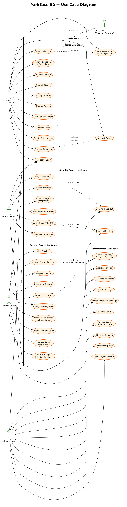

# Software Requirements Specification (SRS)

**Project:** ParkEase BD — A Location-Based Shared Parking Platform
**Team:** Wake Up to Reality
**Version:** 1.0
**Date:** 10 August 2026
**Course:** UIU Software Engineering Lab | Section D | Lab 422
**Prepared by:** Marjia Islam (STQA & System Analyst)

| Name | GitHub | Role |
|---|---|---|
| Faysal Ahmed Fahim | [@0xFaysal](https://github.com/0xFaysal) | Backend Development |
| Md. Minhajul Islam | [@Minhajh20](https://github.com/Minhajh20) | Frontend Development |
| Anisa Akter Mahi | [@0xAnisa](https://github.com/0xAnisa) | Project Coordination & UI/UX Design |
| Marjia Islam | [@MarjiaIslam](https://github.com/MarjiaIslam) | STQA & System Analysis |

---

## 1. Introduction

### 1.1 Purpose

This document specifies the functional and non-functional requirements of **ParkEase BD**, a shared residential parking platform being built for the UIU Software Engineering Lab (Section D, Lab 422) semester project. It is the single reference that the frontend, backend, and QA members of the team use to agree on *what the system must do* before agreeing on *how it is built*. It is intended for:

- the four project team members, to plan and estimate implementation work;
- the course instructor and faculty evaluator, to assess scope and completeness;
- future contributors, to understand system behavior without re-reading source code.

This SRS instead defines *observable, testable behavior*: what a Driver, Parking Owner, Security Guard, or Administrator can do, and what the system guarantees in return.

### 1.2 Scope

ParkEase BD is a single Next.js web application backed by an Express/TypeScript API, PostgreSQL, and Redis. It connects two primary markets in Dhaka:

- **Residential property owners** with parking spaces that sit unused during the day, and
- **Drivers** who need short-term, hourly parking near hospitals, offices, malls, and universities.

The platform lets an Owner list individual parking spots with weekly availability, lets a Driver search, quote, and reserve a spot for a specific time window, lets a Security Guard verify vehicle entry and exit with a QR code or OTP, and lets an Administrator verify listings, resolve disputes, and approve owner payouts.

**In scope for the semester build:**

- Role-based accounts for Driver, Parking Owner, Security Guard, and Administrator, with a controlled (non-self-service) Guard onboarding process.
- Vehicle management for Drivers.
- Property, parking-spot, weekly-availability, and exception management for Owners, gated by Admin verification.
- Location- and time-based parking search with a map view.
- Backend-priced quotation, a five-minute conflict-safe booking hold, and simulated/sandbox payment via SSLCOMMERZ.
- Purpose-bound QR/OTP verification for entry and exit, performed by an assigned Guard.
- Overtime, cancellation, no-show, and refund handling.
- Owner earnings, a simulated payout-approval workflow, and a transaction ledger.
- Reviews and a dispute-resolution workflow.
- Admin oversight: property verification, user/guard management, booking overrides, payment reconciliation, and audit logs.
- Realtime UI updates via Socket.IO, with REST as the source of truth.

**Out of scope for the semester build:**

- Integration with real payment gateways (bKash, Nagad, card networks, or live SSLCOMMERZ); only the SSLCOMMERZ **sandbox** is used.
- Physical IoT hardware: automated barriers, parking sensors, or license-plate-recognition cameras.
- A native mobile application (the web app is responsive/mobile-first instead).
- City-wide government traffic-system integration or guaranteed parking availability across Dhaka.
- Multilingual (Bangla) localization, loyalty/rewards programs, dynamic pricing, and recurring/subscription bookings.

### 1.3 Definitions, Acronyms and Abbreviations

| Term | Definition |
|---|---|
| Driver | A registered user searching for and booking parking for a vehicle. |
| Parking Owner | A registered user who lists a property and its parking spots for booking. |
| Security Guard | A user account, created only by an Owner or Admin, who verifies entry/exit at an assigned property. |
| Admin | A platform operator who verifies listings, resolves disputes, and approves payouts. |
| Property | A physical location owned by a Parking Owner that contains one or more parking spots. |
| Parking Spot | One physical, individually bookable parking space belonging to a property. |
| Quote | A time-limited, backend-calculated price offer for a specific spot, vehicle, and time range. |
| Hold | A five-minute reservation (`HELD` booking) created from an unused quote, before payment. |
| Booking | The record of a Driver's reservation of a parking spot for a time range, tracked through a defined status lifecycle. |
| Access Token (QR/OTP) | A short-lived, purpose-bound (`ENTRY` or `EXIT`) credential used by a Guard to authorize physical entry or exit. |
| Overtime / Overstay | Time a vehicle remains parked beyond the booking's effective end time plus its grace period. |
| Grace Period | A configured buffer after the booking end time before overtime charges apply. |
| Security Deposit | A refundable amount collected at booking time to cover potential overtime charges. |
| Ledger | An append-only record of every financial movement (payment, refund, commission, payout) for audit purposes. |
| Owner Earning | The net amount owed to an Owner for a completed booking, after platform commission and adjustments. |
| Payout | A (simulated, Admin-approved) transfer of available owner earnings to a payout account. |
| Dispute | A formal complaint raised by a Driver or Owner about a specific booking, resolved by Admin. |
| Idempotency Key | A client-generated identifier ensuring a repeated request for the same user intent has exactly one effect. |
| RBAC | Role-Based Access Control. |
| DTO | Data Transfer Object — the shape of data returned by the API, distinct from internal database rows. |
| IPN | Instant Payment Notification — the SSLCOMMERZ server-to-server payment callback. |
| DFD | Data Flow Diagram. |

### 1.4 References

| Document | Description |
|---|---|
| [Project proposal](./project-idea.md) | Problem statement, proposed solution, users, and technology justification. |
| [Architecture document](./ARCHITECTURE.md) | System structure and engineering decisions. |
| [API design document](./api-design.md) | API conventions and endpoint design. |
| ParkEase BD Backend Architecture Blueprint (v2.1, synchronized 3 Aug 2026) | Authoritative database schema, booking/payment state machines, and API contracts used as the technical source for this SRS. |
| ParkEase BD Frontend Architecture & UX Specification (v2.1, synchronized 3 Aug 2026) | Authoritative route map, screen inventory, and UX rules used as the technical source for this SRS. |
| [Contributing guide](../CONTRIBUTING.md) | Branching, commit, and review workflow. |

---

## 2. Overall Description

### 2.1 Product Perspective

ParkEase BD is a new, standalone product; it does not replace or integrate with an existing system. It is built as a **modular monolith** — one Next.js frontend and one Express API — so a four-person team can deliver a complete, demonstrable workflow within a semester without the operational overhead of microservices.

The system sits between four human actors and two external services: the SSLCOMMERZ sandbox payment gateway and the OpenStreetMap tile service. PostgreSQL is the single source of truth for users, bookings, payments, and earnings; Redis is used only for caching, rate limiting, and delayed jobs and is never the final authority for booking availability.

**Figure 2.1 — System Context Diagram (DFD Level 0)**


The context diagram shows the system as a single process. Drivers search, book, pay, and verify; Owners manage listings and earnings; Guards verify entry/exit; Admins oversee the platform; and the two external systems are used strictly for payment validation and map rendering. Every arrow into the system crosses an authorization boundary — the backend, not the browser, decides what each actor is allowed to see or do.

### 2.2 Product Functions

At a high level, ParkEase BD provides:

1. **Account & role management** — registration, login, forced password change for controlled accounts, and role-based dashboards.
2. **Listing management** — property creation, image upload, Admin verification, individual parking-spot configuration, and weekly availability/exception scheduling.
3. **Discovery** — map- and filter-based parking search with distance, price, and facility filters.
4. **Conflict-safe booking** — price quotation, a five-minute hold, and double-booking prevention enforced at the database level.
5. **Payment** — sandbox payment-session creation and backend-validated confirmation.
6. **Physical verification** — purpose-bound QR/OTP generation and Guard-confirmed check-in/check-out.
7. **Financial settlement** — overtime calculation, deposit refund, owner earnings, and simulated payouts.
8. **Trust & safety** — reviews, disputes, incident reports, and full audit logging.
9. **Operational oversight** — Admin queues for verification, disputes, payouts, reconciliation, and system settings.

### 2.3 User Classes and Characteristics

| User Class | Description | Technical Expertise | Frequency of Use |
|---|---|---|---|
| Driver | Searches for and books parking; uses the app primarily on a mobile device while traveling. | General smartphone user; no technical background assumed. | Frequent, short sessions (search → book → verify). |
| Parking Owner | Lists properties and parking spots, manages availability, guards, and earnings; primarily uses a desktop/laptop browser. | Comfortable with forms and dashboards; not necessarily technical. | Regular, longer sessions (setup, then periodic monitoring). |
| Security Guard | Verifies entry/exit at one or more assigned properties; uses a phone at the gate. | Basic smartphone user; needs a very simple, fast interface. | Frequent, very short interactions during a shift. |
| Administrator | Verifies listings, resolves disputes, approves payouts, and audits the platform. | Power user; comfortable with tables, filters, and detail panels. | Regular, task-queue-driven sessions. |

### 2.4 Operating Environment

- **Client:** Modern evergreen browsers (Chrome, Firefox, Edge, Safari) on desktop, tablet, and mobile; no native app.
- **Frontend runtime:** Next.js (App Router) with React and TypeScript, deployed to a Node.js-compatible host (e.g., Vercel).
- **Backend runtime:** Node.js LTS running Express.js and TypeScript, deployed to a container-friendly host (e.g., Render/Railway).
- **Data tier:** PostgreSQL (managed) accessed through Prisma ORM; Redis (managed) for cache, rate limits, and BullMQ job queues.
- **External services:** SSLCOMMERZ sandbox for payment; OpenStreetMap tile servers for maps.
- **Local development:** Docker Compose provisions PostgreSQL and Redis identically across all team members' machines.

### 2.5 Design and Implementation Constraints

- The technology stack is fixed by the project proposal: Next.js/React/TypeScript/Tailwind on the frontend; Express/TypeScript/PostgreSQL/Prisma/Redis on the backend. No substitution without team agreement.
- Only the SSLCOMMERZ **sandbox** may be used; no real money moves through the system this semester.
- The backend is the sole authority for booking availability, price, payment validation, refunds, owner earnings, and role authorization — the frontend must never treat an optimistic UI state as confirmed.
- Double-booking must be prevented at the database level (PostgreSQL exclusion constraint), not only in application code.
- All monetary values are stored and transmitted as integer paisa, never floating-point currency.
- Exact residential addresses, access instructions, payout account numbers, and raw QR/OTP values must never be exposed to an unauthorized party, logged, or persisted in browser storage.
- The team has four members and one semester; scope decisions favor a complete, demonstrable end-to-end workflow over breadth of edge-case coverage.
- All work follows GitFlow branching and Conventional Commits as defined in the [Contributing guide](../CONTRIBUTING.md).

### 2.6 Assumptions and Dependencies

- Team members have continuous access to GitHub, a local Docker environment, and a shared understanding of the two synchronized architecture documents referenced in §1.4.
- The SSLCOMMERZ sandbox environment and OpenStreetMap tile service remain available and free to use throughout the semester.
- Seed/demo data (sample properties, spots, and users) will be used for evaluation rather than real-world onboarding.
- Users are assumed to access the platform from within Bangladesh with reasonably reliable mobile or broadband internet; the system degrades to polling rather than failing outright when a realtime connection is unavailable.

---

## 3. System Models

### 3.1 Use Case Diagram

The use case diagram groups the platform's functionality by actor. `Driver`, `Parking Owner`, and `Security Guard` are largely independent of one another; `Administrator` oversees all of them. `SSLCOMMERZ` participates only as a secondary actor included by the Driver's payment use case.

**Figure 3.1 — Use Case Diagram**



Key relationships shown on the diagram:

- **«include»** — *Create Booking Hold* always includes *Request Quote* (a hold cannot exist without a valid quote); *Make Payment* always includes the SSLCOMMERZ session; *Manage Properties* includes submitting to the Admin's *Verify / Reject / Suspend Property* use case.
- **«extend»** — *Request Checkout* extends *View Booking & Access QR/OTP*, since checkout depends on an already-issued access credential.
- **«precedes»** — *Verify Entry* must occur before *Confirm Check-in*, and *Verify Exit* must occur before *Confirm Checkout*; the Guard's verification step is deliberately separate from the transition it authorizes, so that resolving a credential never by itself changes booking state.

### 3.2 Data Flow Diagram (Level 1)

The Level 1 DFD decomposes the single system process from the context diagram into nine functional processes and eight persistent data stores. It traces how a request from an actor moves through processing before it is written to a data store or forwarded to another process.

**Figure 3.2 — Data Flow Diagram (Level 1)**


| Process | Responsibility |
|---|---|
| 1.0 Manage Accounts, Authentication & Roles | Registration, login, session/refresh handling, forced password change, role self-enablement. |
| 2.0 Manage Properties, Spots & Availability | Property/spot CRUD, weekly availability, exceptions, and routing submissions to Admin verification. |
| 3.0 Search & Discover Parking | Location/time/vehicle filtering and ranked, privacy-safe result presentation. |
| 4.0 Generate Quote & Booking Hold | Backend pricing, five-minute conflict-safe hold creation, and idempotent hold requests. |
| 5.0 Process Payments & Refunds | SSLCOMMERZ session creation, IPN validation, ledger entries, and refund handling. |
| 6.0 Verify Entry/Exit & Manage Sessions | Purpose-bound QR/OTP issuance, Guard-confirmed check-in/check-out, and overtime calculation. |
| 7.0 Manage Owner Earnings & Payouts | Earning calculation, payout-account management, and payout-request processing. |
| 8.0 Manage Reviews, Disputes & Incidents | Review submission, dispute lifecycle, and Guard incident reports. |
| 9.0 Admin Oversight, Settings & Audit | Verification decisions, dispute resolution, payout approval, reconciliation, and audit logging. |

| Data Store | Contents |
|---|---|
| D1 | Users, roles, and sessions |
| D2 | Vehicles |
| D3 | Properties, parking spots, availability, and guard assignments |
| D4 | Quotes, bookings, and status history |
| D5 | Payments, refunds, and ledger entries |
| D6 | Owner earnings, payout accounts, and payout requests |
| D7 | Reviews, disputes, incidents, and notifications |
| D8 | Audit logs and platform settings |

---

## 4. Functional Requirements

Each requirement has a Priority of **High** (required for the semester MVP demonstration), **Medium** (expected but can slip past the first milestone), or **Low** (stretch goal if time permits).

### 4.1 Authentication, Accounts & Roles

| ID | Requirement | Priority |
|---|---|---|
| FR-AUTH-01 | The system shall allow a new user to self-register as Driver and/or Parking Owner with full name, email, phone, and password. | High |
| FR-AUTH-02 | The system shall never allow public self-registration for the Guard or Admin role. | High |
| FR-AUTH-03 | The system shall authenticate users via a single normalized identifier field accepting either email or phone, plus a password. | High |
| FR-AUTH-04 | The system shall issue an HttpOnly, Secure session cookie with a rotating refresh token on successful login. | High |
| FR-AUTH-05 | The system shall enforce CSRF protection on all cookie-authenticated, state-changing requests. | High |
| FR-AUTH-06 | The system shall block access to every protected route except password change, session list, and logout while `mustChangePassword` is true. | High |
| FR-AUTH-07 | The system shall allow a user to self-enable only the DRIVER or PARKING_OWNER role; GUARD and ADMIN must be assigned by an authorized actor. | High |
| FR-AUTH-08 | The system shall allow a user to view and revoke their own active sessions, individually or all at once. | Medium |
| FR-AUTH-09 | The system shall support password reset via a time-limited token sent to a verified contact. | Medium |
| FR-AUTH-10 | The system shall support email and phone verification requests and confirmations. | Medium |
| FR-AUTH-11 | The system shall rate-limit login attempts to 5 per 15 minutes per IP address. | High |

### 4.2 Vehicle Management

| ID | Requirement | Priority |
|---|---|---|
| FR-VEH-01 | A Driver shall be able to add a vehicle with type, registration number, brand, model, color, and optional dimensions. | High |
| FR-VEH-02 | The system shall reject a vehicle registration number already registered to another vehicle. | High |
| FR-VEH-03 | A Driver shall be able to edit or delete their own vehicle. | High |
| FR-VEH-04 | The system shall validate vehicle dimensions against a parking spot's maximum dimensions at quote time. | Medium |

### 4.3 Property & Parking Spot Management

| ID | Requirement | Priority |
|---|---|---|
| FR-PROP-01 | A Parking Owner shall be able to create a property draft with name, description, public area, approximate/exact address, coordinates, and access instructions. | High |
| FR-PROP-02 | A Parking Owner shall be able to upload property images with an image type and sort order. | High |
| FR-PROP-03 | A Parking Owner shall be able to submit a complete property draft for Admin verification. | High |
| FR-PROP-04 | A Parking Owner shall be able to add individual parking spots with a unique spot code, vehicle type, hourly rate, min/max duration, buffer, grace period, overtime multiplier, minimum deposit, dimensions, and facility flags. | High |
| FR-PROP-05 | A Parking Owner shall be able to block, unblock, or set a parking spot to maintenance. | Medium |
| FR-PROP-06 | A Parking Owner shall be able to define recurring weekly availability rules per parking spot. | High |
| FR-PROP-07 | A Parking Owner shall be able to create date-specific availability exceptions (blocked or special-available) with a reason. | Medium |
| FR-PROP-08 | The system shall permit unrestricted edits to a property only while it is in DRAFT or REJECTED state; edits to a VERIFIED property's safety-relevant fields shall trigger re-review. | Medium |
| FR-PROP-09 | A Parking Owner shall be able to temporarily close and reopen a property. | Low |

### 4.4 Guard Account & Assignment Management

| ID | Requirement | Priority |
|---|---|---|
| FR-GRD-01 | A Parking Owner shall be able to create a Guard account for one of their own verified properties, providing a name, at least one contact, and a temporary password. | High |
| FR-GRD-02 | The system shall never return a Guard's password in an API response and shall force a password change on first login. | High |
| FR-GRD-03 | If the submitted contact already belongs to an existing account, the system shall return a generic conflict without disclosing the existing account's identity, and shall offer a privacy-preserving assignment invitation. | Medium |
| FR-GRD-04 | A Guard shall be able to accept or reject a pending property assignment; only an ACTIVE assignment grants operational access. | High |
| FR-GRD-05 | A Parking Owner shall be able to suspend or end an assignment for their own property, but shall not be able to suspend, block, or reset the password of an established Guard account. | High |
| FR-GRD-06 | Only an Admin shall be able to suspend, restore, or issue a new temporary password for a Guard's global account. | High |
| FR-GRD-07 | The system shall prevent a Parking Owner from browsing or searching a global directory of Guard accounts. | Medium |

### 4.5 Parking Search & Discovery

| ID | Requirement | Priority |
|---|---|---|
| FR-SRCH-01 | The system shall allow any user, including unauthenticated visitors, to search parking by location, radius, date/time range, and vehicle type. | High |
| FR-SRCH-02 | The system shall support filtering by price range, covered parking, CCTV, and guard presence. | Medium |
| FR-SRCH-03 | The system shall support sorting results by distance, price, or rating. | Medium |
| FR-SRCH-04 | Public search results shall include only approximate coordinates, public area, facility badges, and estimated price. | High |
| FR-SRCH-05 | Public and unauthenticated responses shall exclude exact address, exact entrance coordinates, and access instructions. | High |
| FR-SRCH-06 | The system shall paginate search results and never return an unbounded result set. | Medium |

### 4.6 Booking Quote & Hold

| ID | Requirement | Priority |
|---|---|---|
| FR-BKG-01 | The system shall generate a price quotation (base amount, platform fee, refundable deposit, discount) from backend-held pricing rules for a selected spot, vehicle, and time range. | High |
| FR-BKG-02 | A quotation shall expire after a fixed backend-configured duration and shall be usable at most once. | High |
| FR-BKG-03 | A Driver shall be able to convert an unexpired, unused quotation into a HELD booking that reserves the spot for five minutes. | High |
| FR-BKG-04 | The system shall reject a hold request that overlaps an existing active booking for the same spot, with a clear conflict error. | High |
| FR-BKG-05 | The system shall automatically release an unpaid HELD booking after its hold-expiry window, returning the spot to available status. | High |
| FR-BKG-06 | The system shall honor an Idempotency-Key header on hold creation so repeated submissions of one user intent create at most one booking. | High |
| FR-BKG-07 | A Driver shall be able to cancel a booking according to the cancellation policy applicable to its current status. | Medium |
| FR-BKG-08 | A Driver shall be able to request a time extension for an active booking, subject to a new quote and availability check. | Medium |

### 4.7 Payment Processing

| ID | Requirement | Priority |
|---|---|---|
| FR-PAY-01 | The system shall create a SSLCOMMERZ sandbox payment session only after a Driver explicitly initiates payment for a held booking. | High |
| FR-PAY-02 | The system shall confirm a booking only after validating payment through the SSLCOMMERZ IPN/validation API; a browser return URL alone shall never confirm a booking. | High |
| FR-PAY-03 | The system shall process duplicate payment callbacks idempotently, producing exactly one confirmed booking and one ledger effect. | High |
| FR-PAY-04 | The system shall record every payment, refund, and financial adjustment as an immutable, auditable ledger entry. | High |
| FR-PAY-05 | If payment validates after the booking hold has already expired, the system shall attempt controlled recovery when the spot remains available, or trigger a refund/manual-review flow when it does not. | Medium |
| FR-PAY-06 | The system shall support a purpose-specific outstanding-payment session for post-checkout amounts such as uncovered overtime. | Medium |
| FR-PAY-07 | A Driver shall be able to view their payment and refund history with status, purpose, and timestamps. | Medium |

### 4.8 Entry/Exit Verification & Parking Sessions

| ID | Requirement | Priority |
|---|---|---|
| FR-VER-01 | The system shall issue a purpose-bound (ENTRY) QR code and OTP to the Driver only after a booking reaches a payment-confirmed state. | High |
| FR-VER-02 | An assigned, ACTIVE Guard shall be able to resolve a Driver's entry credential and view masked vehicle/booking details before confirming check-in. | High |
| FR-VER-03 | The system shall atomically validate and consume an entry credential during check-in, preventing reuse. | High |
| FR-VER-04 | A Driver shall be able to request checkout for a checked-in booking, triggering issuance of a short-lived, purpose-bound (EXIT) QR code and OTP. | High |
| FR-VER-05 | A booking shall not be marked complete from a Driver's checkout request alone; completion requires explicit Guard confirmation of physical exit. | High |
| FR-VER-06 | The system shall reject an entry credential presented for an exit operation and vice versa. | High |
| FR-VER-07 | The system shall calculate overtime charges when actual exit exceeds the effective booking end time plus grace period, deducting first from the security deposit. | High |
| FR-VER-08 | A Guard shall be able to report an incident, with an optional evidence upload, linked to a specific booking. | Medium |
| FR-VER-09 | The system shall rate-limit OTP verification attempts per booking and lock further attempts after repeated failures. | Medium |

### 4.9 Owner Earnings & Payouts

| ID | Requirement | Priority |
|---|---|---|
| FR-FIN-01 | The system shall calculate an Owner's net earning per completed booking as gross parking amount minus platform commission, plus/minus dispute or penalty adjustments. | High |
| FR-FIN-02 | Owner earnings shall remain PENDING or ON_HOLD until the booking's dispute window has passed, after which they become AVAILABLE. | Medium |
| FR-FIN-03 | A Parking Owner shall be able to add a payout account (Bank, bKash, or Nagad) with a masked account number after saving. | Medium |
| FR-FIN-04 | A Parking Owner shall be able to request a payout only from an ACTIVE, Admin-verified payout account and only up to their available balance. | Medium |
| FR-FIN-05 | The system shall prevent two concurrent payout requests from spending the same available balance twice. | Medium |
| FR-FIN-06 | An Admin shall be able to approve, reject, or mark a payout request as paid (simulated payout). | Medium |

### 4.10 Reviews, Disputes & Notifications

| ID | Requirement | Priority |
|---|---|---|
| FR-RVW-01 | A Driver shall be able to submit exactly one review per completed booking, rating overall experience, security, location accuracy, and cleanliness. | Medium |
| FR-RVW-02 | A Driver or Parking Owner shall be able to open a dispute on a booking with a category, description, and optional evidence. | Medium |
| FR-RVW-03 | An open dispute shall place the associated owner earning on hold until resolution. | Medium |
| FR-RVW-04 | Only the parties to a dispute shall be able to view and respond to it; Admin shall see the complete case. | Medium |
| FR-RVW-05 | The system shall generate and deliver in-app notifications for key booking, payment, dispute, and payout events, and allow marking them read. | Medium |

### 4.11 Admin Oversight & Platform Operations

| ID | Requirement | Priority |
|---|---|---|
| FR-ADM-01 | An Admin shall be able to review a pending property, including images, exact address, and access instructions, and approve, reject (with reason), or suspend it. | High |
| FR-ADM-02 | An Admin shall be able to suspend, restore, or block a user account. | Medium |
| FR-ADM-03 | An Admin shall be able to create a Guard account, assign it to eligible properties, and issue an audited temporary password. | Medium |
| FR-ADM-04 | An Admin shall be able to review and override a booking's state through a controlled, reason-required, fully audited action. | Low |
| FR-ADM-05 | An Admin shall be able to resolve a dispute with a resolution type, details, and optional refund/earning adjustment. | Medium |
| FR-ADM-06 | An Admin shall be able to verify or reject a payout account and approve, reject, or mark a payout request as paid. | Medium |
| FR-ADM-07 | An Admin shall be able to review payment reconciliation mismatches between local and gateway records and mark them reconciled. | Low |
| FR-ADM-08 | An Admin shall be able to browse a filterable, immutable audit log of sensitive actions across the platform. | Medium |
| FR-ADM-09 | An Admin shall be able to edit only an allowlisted set of non-secret operational settings, with a required reason and version-conflict handling. | Low |
| FR-ADM-10 | An Admin shall be able to view and retry failed background jobs. | Low |

### 4.12 Realtime Updates

| ID | Requirement | Priority |
|---|---|---|
| FR-RT-01 | The system shall push realtime updates for booking, payment, availability, and dispute state changes to authorized, room-scoped clients. | Medium |
| FR-RT-02 | The system shall authorize every realtime room join server-side based on the connected user's roles, ownership, or assignment. | High |
| FR-RT-03 | On socket reconnection, the frontend shall refetch REST state for all currently visible resources. | Medium |
| FR-RT-04 | When realtime connectivity is unavailable, the system shall fall back to polling critical screens every 15–30 seconds. | Medium |

---

## 5. Non-Functional Requirements

| ID | Type | Requirement |
|---|---|---|
| NFR-01 | Performance | Standard read API endpoints shall respond within 500 ms at the 95th percentile under expected demonstration load. |
| NFR-02 | Performance | Search and availability data shall be cached with short TTLs (15–30 s search, 10–20 s availability) to stay near-real-time without overloading PostgreSQL. |
| NFR-03 | Security | All passwords shall be hashed with Argon2id; no plaintext password shall ever be stored, logged, or returned by the API. |
| NFR-04 | Security | All cookie-authenticated, state-changing requests shall require a valid CSRF token. |
| NFR-05 | Security | Exact address, access instructions, and payout account numbers shall be encrypted at rest and masked in every response to an unauthorized party. |
| NFR-06 | Security | Login, OTP, booking-hold, payment-session, and search endpoints shall enforce documented per-user/IP rate limits. |
| NFR-07 | Reliability | A PostgreSQL exclusion constraint shall guarantee zero double-booking under concurrent load, verified by an automated test issuing 20 simultaneous hold requests for the same spot and time window, of which exactly one succeeds. |
| NFR-08 | Reliability | The system shall reject writes with a 503 response (never silently corrupt data) if PostgreSQL is unreachable, and shall degrade gracefully — skipping cache and delaying non-critical jobs — if Redis is unreachable. |
| NFR-09 | Reliability | Every background job shall be idempotent and safely retryable using a deterministic job ID. |
| NFR-10 | Availability | Booking, payment, and verification flows shall not depend on Socket.IO availability. |
| NFR-11 | Usability | Guard and Driver interfaces shall be mobile-first with touch-friendly targets; Owner and Admin interfaces shall be desktop-optimized with tables and filters. |
| NFR-12 | Usability | Every page shall provide loading, empty, and error states; every destructive or financial action shall require explicit confirmation. |
| NFR-13 | Accessibility | All form inputs shall have visible labels and associated error messages; status shall never be conveyed by color alone. |
| NFR-14 | Auditability | Every booking status transition and every sensitive Admin/Owner action shall be recorded with actor, timestamp, and before/after data. |
| NFR-15 | Maintainability | Backend modules shall follow a consistent layered structure (route/controller/service/repository/policy/schema); frontend features shall follow a consistent feature-folder structure. |
| NFR-16 | Compatibility | The web application shall function on current versions of Chrome, Firefox, Edge, and Safari, and shall be responsive across mobile, tablet, and desktop breakpoints. |
| NFR-17 | Privacy | Exact residential address, access instructions, and unmasked vehicle/contact data shall be visible only to an authorized Driver, assigned Guard, owning Owner, or Admin. |
| NFR-18 | Data Integrity | All monetary values shall be stored and computed as integer paisa; the frontend shall never derive a final payable amount from displayed, formatted text. |
| NFR-19 | Testability | Booking-hold concurrency, duplicate-IPN handling, and duplicate-checkout scenarios shall each have an automated regression test before the corresponding feature is considered complete. |
| NFR-20 | Scalability | The system shall be architected as a modular monolith sufficient for a semester demonstration load; horizontal auto-scaling is not required. |

---

## 6. Acceptance Criteria

The system is considered functionally complete for evaluation when all of the following are demonstrable:

1. **Double-booking prevention:** an automated test issues 20 concurrent hold requests for the same parking spot and overlapping time window; exactly one succeeds, and the rest receive a clear `BOOKING_SLOT_UNAVAILABLE` error. Adjacent, non-overlapping bookings on the same spot both succeed.
2. **Hold expiry:** an unpaid `HELD` booking automatically expires within its configured window, and the parking spot becomes searchable again without manual intervention.
3. **End-to-end Driver flow:** register → add a vehicle → search parking → request a quote → create a hold → pay via the SSLCOMMERZ sandbox → receive a confirmed booking → view the entry QR/OTP → get checked in by a Guard → request checkout → get checked out by a Guard → see the correct overtime/refund settlement.
4. **End-to-end Owner flow:** create a property → upload images → submit for verification → get approved by an Admin → create a parking spot → define weekly availability → receive and manage a booking → see the earning appear once the dispute window passes → request a (simulated) payout.
5. **End-to-end Guard flow:** an Owner or Admin creates/invites a Guard → the Guard changes the temporary password on first login → the Guard accepts the property assignment → the Guard has zero operational access before acceptance and full access after.
6. **End-to-end Admin flow:** the pending-property queue, approve/reject-with-reason, dispute resolution, payout approval, payment reconciliation, and audit-log browsing are each demonstrable against seed data.
7. **Privacy guarantee:** manual and automated review confirms that exact address, access instructions, raw QR/OTP values, full payout account numbers, and passwords are never observable in an unauthorized API response, browser storage, log, or analytics event.
8. **Traceability:** every High-priority requirement in Section 4 maps to at least one implemented backend endpoint and, where user-facing, one implemented frontend screen.
9. **Regression safety:** the mandatory concurrency and security test suite referenced in NFR-07 and NFR-19 passes before a phase is marked complete.
10. **Diagram consistency:** the Context, Use Case, and Data Flow diagrams in Section 3 are re-validated against the implemented route map and database schema at each major milestone review, and updated if they drift.

---

## Appendix A — Diagram Sources

The diagrams in Section 3 and Section 2.1 are generated from PlantUML source files kept alongside this document, so they can be regenerated after any change to the route map or data model:

```text
docs/diagrams/context-diagram.puml   → docs/diagrams/context-diagram.png
docs/diagrams/use-case-diagram.puml  → docs/diagrams/use-case-diagram.png
docs/diagrams/dfd-level1.puml        → docs/diagrams/dfd-level1.png
```

To regenerate after editing a `.puml` file (requires Java):

```bash
java -jar plantuml.jar -tpng docs/diagrams/*.puml
```

**End of Document**
