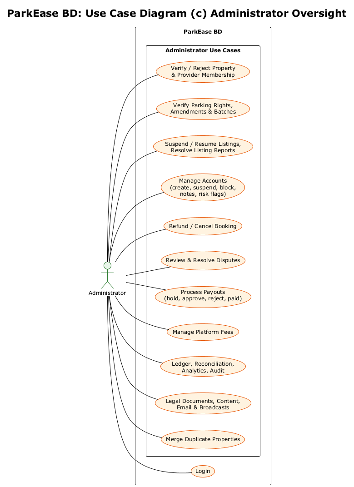
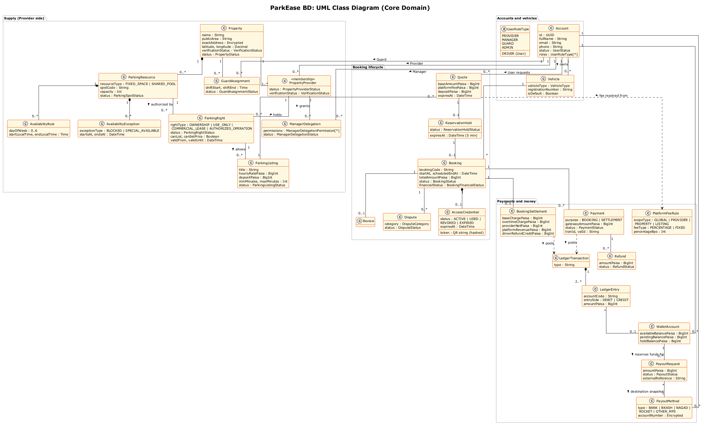
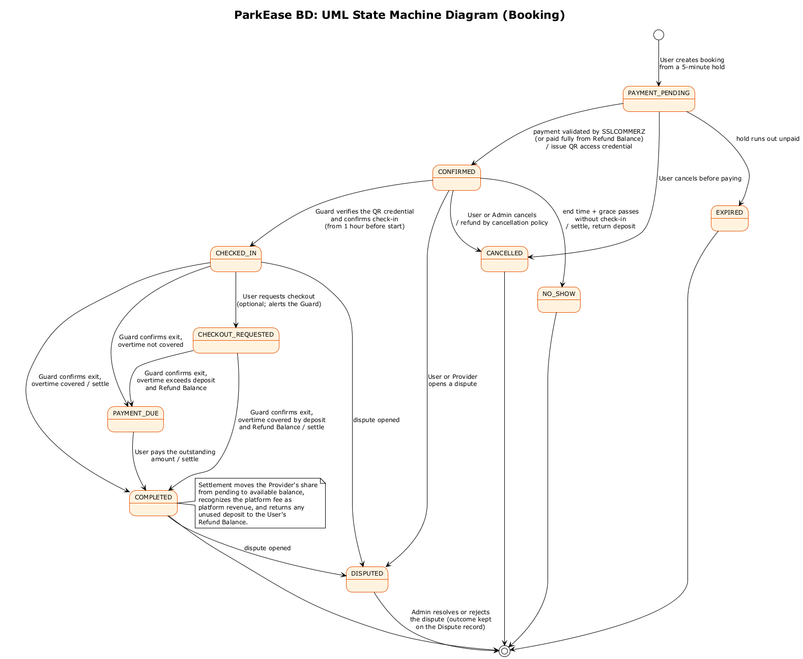
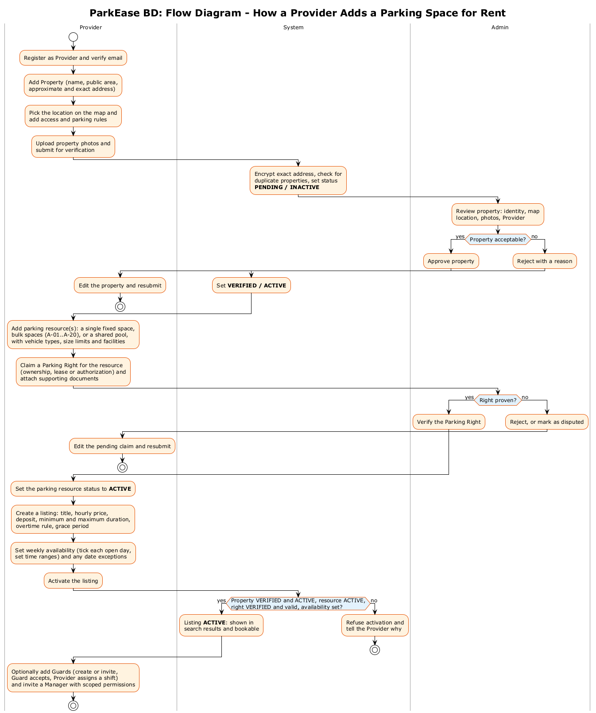
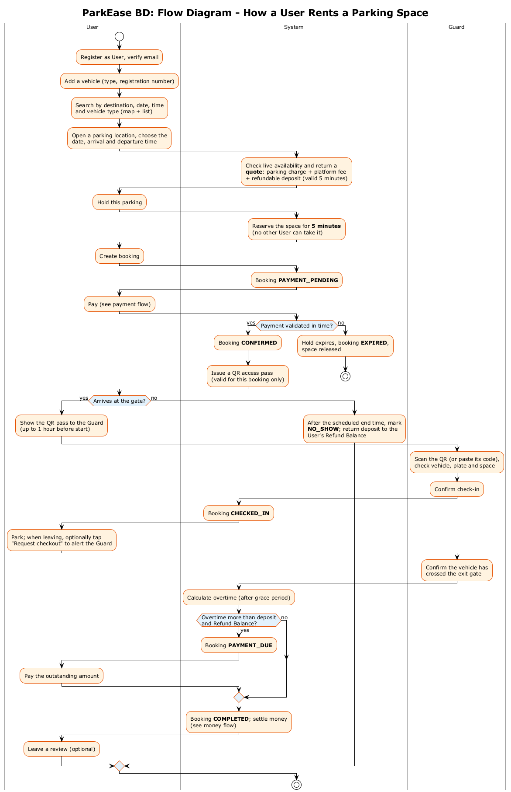
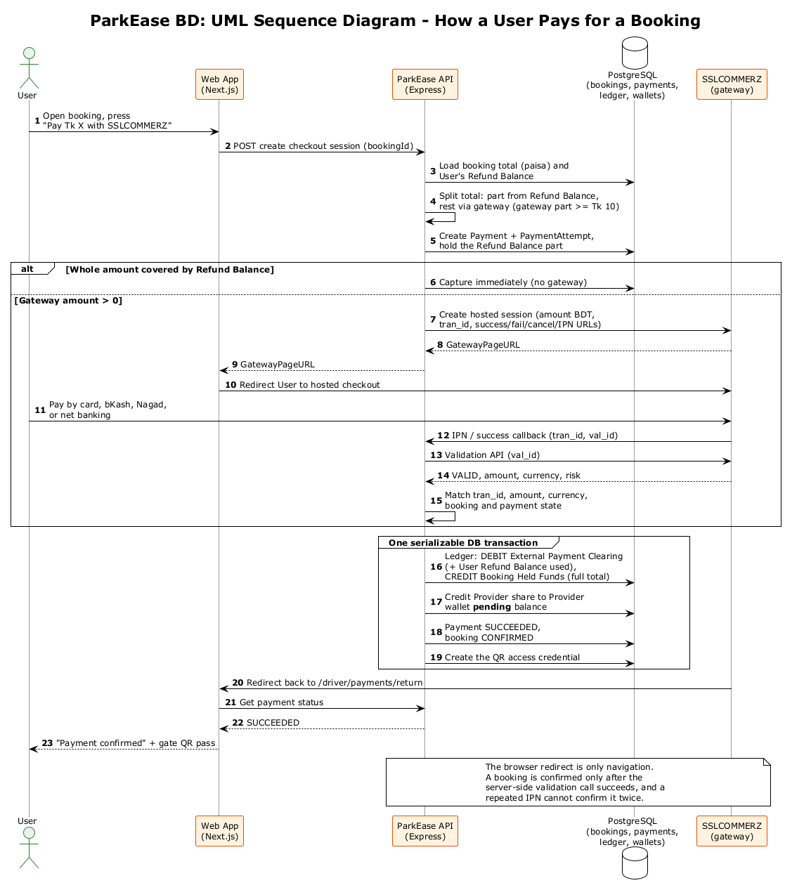
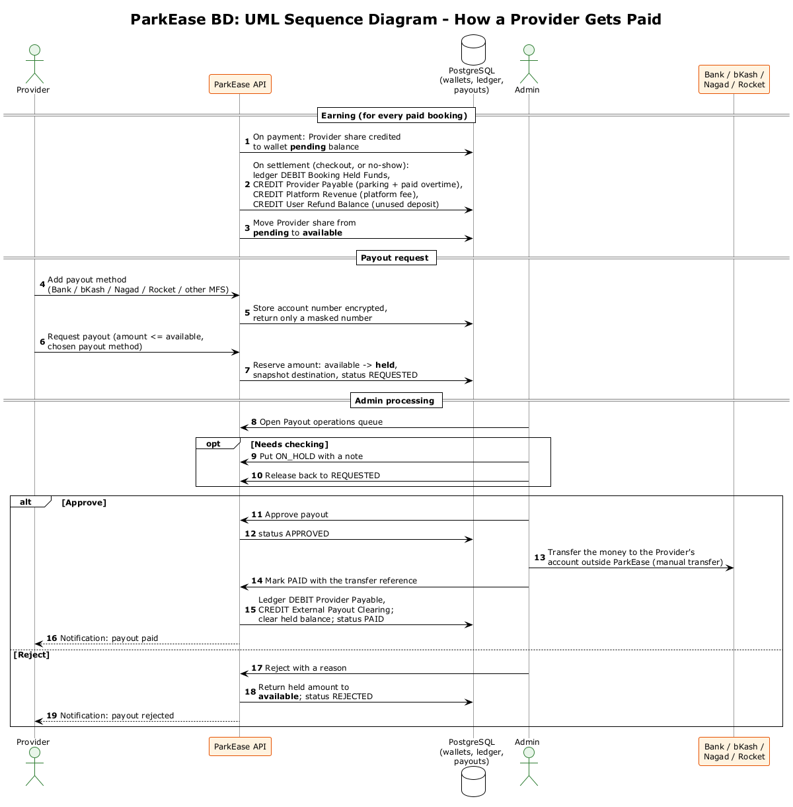
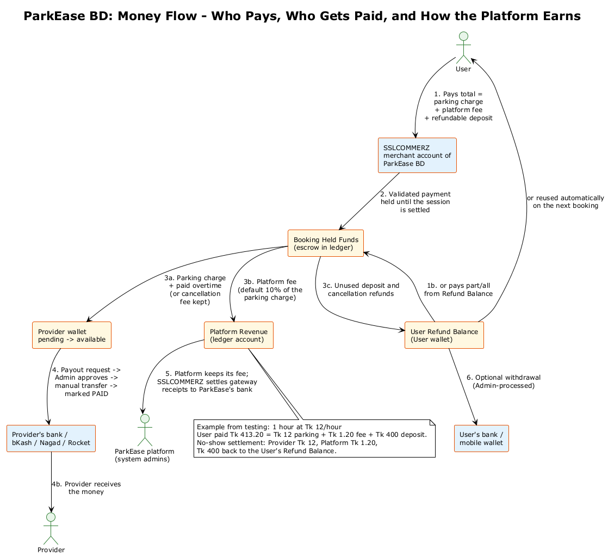

# Software Requirements Specification (SRS)

**Project:** ParkEase BD: A Location-Based Shared Parking Platform
**Team:** Wake Up to Reality
**Date:** 11 September 2026
**Course:** UIU Software Engineering Lab | Section D | Lab 422
**Prepared by:** Marjia Islam (STQA & System Analyst)

| Name | GitHub | Role |
|---|---|---|
| Faysal Ahmed Fahim | [@0xFaysal](https://github.com/0xFaysal) | Backend Development |
| Md. Minhajul Islam | [@Minhajh20](https://github.com/Minhajh20) | Frontend Development |
| Anisa Akter Mahi | [@0xAnisa](https://github.com/0xAnisa) | Project Coordination & UI/UX Design |
| Marjia Islam | [@MarjiaIslam](https://github.com/MarjiaIslam) | STQA & System Analysis |

**Revision history**

| Version | Date | Changes |
|---|---|---|
| 1.0 | 11 September 2026 | First release. |
| 1.1 | 27 September 2026 | Updated according to the decision from the last team meeting |


## 1. Introduction

### 1.1 Purpose

This document specifies the functional and non-functional requirements of **ParkEase BD**, a shared residential parking platform built for the UIU Software Engineering Lab (Section D, Lab 422) semester project. The deployed code is the reference: every requirement here describes behavior the system implements at `main` commit `8fc5fd9`. The document is intended for:

- the four project team members, to agree on behavior and trace it to code;
- the course instructor and faculty evaluator, to assess scope and completeness;
- future contributors, to understand system behavior without re-reading source code.

This SRS defines *observable, testable behavior*: what a User, Provider, Manager, Security Guard, or Administrator can do, and what the system guarantees in return. Database columns and API payloads are defined in the architecture documents listed in §1.4; they appear here only where a requirement cannot be stated without them.

### 1.2 Scope

ParkEase BD is a single Next.js web application backed by an Express/TypeScript API, PostgreSQL, and Redis. It connects two sides of a parking marketplace in Dhaka:

- **Providers**: residential property owners, or people with a verified right to rent out a space, whose parking sits unused during the day; and
- **Users**: drivers who need short-term, hourly parking near hospitals, offices, malls, and universities.

A Provider registers a property, proves the right to rent each parking space, and publishes priced listings with weekly availability. A User searches, gets a server-priced quote, holds a space for five minutes, books, and pays. At the gate, an assigned Security Guard scans the User's QR pass to check the vehicle in and out. The platform collects the payment, keeps a platform fee, pays the Provider, and returns unused deposits to the User. Administrators verify properties and parking rights, handle disputes and payouts, and run the platform.

Because parking in Dhaka apartment buildings is often shared, one property can have several Providers. The system then applies shared governance: a Building Manager can be appointed, and shared changes need the approval of every verified Provider. A Provider can also delegate day-to-day work to a Manager with an explicit set of permissions.

**In scope:**

- Self-registered User and Provider accounts; Manager and Guard accounts created by a Provider or Admin; Admin-created accounts; one Administrator account provisioned at deployment.
- Vehicles, map search, favorites, saved places, and recent searches for Users.
- Properties with images, duplicate detection, Admin verification, multiple Providers per property, Building Manager appointment, and shared change proposals.
- Parking resources (fixed spaces and shared pools), parking-right claims with evidence and Admin verification, listings, weekly availability, and date exceptions.
- Guard membership and shift assignment; Manager delegation with fine-grained permissions.
- Quotes, five-minute holds, bookings, payment through the SSLCOMMERZ sandbox and the User's Refund Balance, cancellation, QR gate verification, overtime, and no-show settlement.
- A double-entry ledger, wallets, Provider earnings, platform fee rules, and Admin-processed payouts for Providers and User withdrawals.
- Reviews with Provider replies, disputes, listing reports, and in-app notifications.
- Admin operations: accounts, risk flags and notes, analytics, ledger and reconciliation, audit and security events, legal documents, help content, email templates and campaigns, and broadcasts.
- Realtime updates through Socket.IO, with REST as the source of truth and polling as a fallback.

**Out of scope:**

- Live payment processing; only the SSLCOMMERZ **sandbox** is used, and payouts are transferred manually outside the system.
- Short numeric OTPs for gate entry; the gate credential is a QR code only.
- Physical IoT hardware such as barriers, sensors, or number-plate cameras.
- A native mobile app; the web app is responsive instead.
- Bangla localization, loyalty programs, dynamic pricing, and recurring bookings.

### 1.3 Definitions, Acronyms and Abbreviations

In this document, **User** (capitalized) always means the parking customer role, and **Provider** means the person who rents out parking space. Any registered person, whatever their role, is called an *account holder*.

| Term | Definition |
|---|---|
| User | A registered person who searches for and books parking for a vehicle, that is, the driver. Stored with the role code `DRIVER`. |
| Provider | A registered person who owns a property's parking spaces, or holds a verified right to rent them out, and lists them for booking. Formerly called "Parking Owner"; stored with the role code `PROVIDER`. |
| Manager | A controlled account (role `MANAGER`) created by a Provider or Admin. The role itself grants nothing; authority comes from a Manager Delegation or a Building Manager appointment. |
| Security Guard | A controlled account (role `GUARD`) created by a Provider, a Manager with permission, or an Admin. It verifies vehicles at the gate of properties where it is an active member with an active shift. |
| Admin | The platform's own administrator account (role `ADMIN`), provisioned at deployment and never granted through the application. |
| Property | A physical building or site that contains parking. A property records who created it, but authority over it comes only from Provider memberships. |
| Provider Membership | The link between a Provider and a property (`PENDING`, `ACTIVE`, `SUSPENDED`, `ENDED`), which an Admin verifies. Only an active, verified membership grants Provider authority. |
| Governance mode | Derived, not stored: `SINGLE_PROVIDER` when the property has at most one active verified Provider, `MULTI_PROVIDER` when it has two or more. |
| Building Manager | A Manager appointed to a whole property. It may set common rules and temporarily close the property, but has no commercial authority. |
| Change Proposal | A versioned proposal to change a multi-provider property's common rules, closure, or identity and location, which every active verified Provider must approve. |
| Manager Delegation | A grant from one Provider to one Manager for one property, with a set of permissions and a scope of either the whole property or selected parking resources. |
| Parking Resource | A reservable parking unit of a property: a `FIXED_SPACE` (one space, capacity 1) or a `SHARED_POOL` (capacity N). Status `ACTIVE`, `BLOCKED`, `MAINTENANCE`, or `INACTIVE`. |
| Parking Right | A Provider's claim to be allowed to rent out a resource: `OWNERSHIP`, `USE_ONLY`, `COMMERCIAL_LEASE`, or `AUTHORIZED_OPERATION`. It is verified by an Admin and carries commercial permissions such as "can list" and "can set price". |
| Listing | A priced, bookable offer for a resource (or one unit of it) backed by a verified Parking Right. Status `DRAFT`, `ACTIVE`, `PAUSED`, `SUSPENDED`, or `ENDED`. |
| Guard Membership | A Guard's shared membership of a property, which the Guard must accept. |
| Guard Assignment | A Provider-scoped shift (start and end time) given to a Guard who is already a member of the property. |
| Quote | A server-calculated price for one listing, vehicle, and time range, valid for 5 minutes and usable once. |
| Hold | A 5-minute reservation created from a quote, protected against double-booking by a database constraint. |
| Booking | A User's reservation, tracked through the states in §3.4. |
| Access Credential | The QR pass issued to a User when a booking is confirmed. One credential per booking; it is looked up by hash and can be used once for check-in. |
| Refund Balance | The User's wallet balance of returned deposits and refunds. It is applied automatically to the next booking or can be withdrawn. |
| Settlement | The accounting at the end of a booking that splits the held payment between the Provider, the platform, and the User. |
| Platform fee | The platform's revenue on a booking, charged to the User on top of the parking charge. |
| Ledger | Append-only double-entry records of every money movement; each transaction's debits equal its credits. |
| Payout | An Admin-processed transfer from a Provider's available balance, or a User's Refund Balance, to a saved bank or mobile-wallet account. |
| IPN | Instant Payment Notification, the SSLCOMMERZ server-to-server callback. |
| RBAC | Role-Based Access Control. |
| DFD | Data Flow Diagram. |

### 1.4 References

| Document | Description |
|---|---|
| [Project proposal](./project-idea.md) | Problem statement, target users, and technology justification. |
| [Backend Architecture Blueprint](./Backend-Architecture.md) | Database schema, state machines, and API contracts. |
| [Frontend Architecture & UX Specification](./Frontend-Architecture.md) | Route map, screen inventory, and UX rules. |
| [Property governance](../backend/docs/property-governance.md) | Multi-provider authority matrix and lifecycle rules. |
| [SSLCOMMERZ payments](../backend/docs/sslcommerz-payments.md) | Payment, validation, and refund architecture. |
| [Design system](./DESIGN.md) | Visual identity and component conventions. |
| [Cancellation & Refund Policy](./policies/Cancellation_&_Refund_Policy.md) and [Terms of Service & Privacy Policy](./policies/Terms_of_Service_&_Privacy_Policy.md) | Policy text that users accept. |
| [Contributing guide](../CONTRIBUTING.md) | Branching, commit, and review workflow. |

---

## 2. Overall Description

### 2.1 Product Perspective

ParkEase BD is a new, standalone product built as a **modular monolith**: one Next.js frontend and one Express API. PostgreSQL is the single source of truth for accounts, properties, bookings, payments, wallets, and the ledger; Redis holds only short-lived data such as rate-limit counters and verification codes.

**Figure 2.1: System Context Diagram (DFD Level 0)**


Five human actors use the system. It depends on four external services: the SSLCOMMERZ sandbox for payments and refunds, OpenStreetMap for map tiles and address search, Cloudinary for property images, and an SMTP email service for verification codes, setup links, and campaigns. Every request crosses an authorization boundary: the backend, not the browser, decides what each actor may see or do.

### 2.2 Product Functions

1. **Accounts:** registration with legal acceptance, email and phone verification, login, session management, password reset, setup links for controlled accounts, and Admin-created accounts.
2. **Discovery:** map and list search by location, time, and vehicle type, with favorites, saved places, and recent searches.
3. **Supply:** properties, images, duplicate detection, multiple Providers per property, Building Manager appointment, change proposals, parking resources, parking rights, listings, and availability.
4. **Staff:** Guard membership and shifts, and Manager delegation with permissions.
5. **Booking:** quote, five-minute hold, booking, cancellation, and checkout request.
6. **Payment:** SSLCOMMERZ hosted checkout with server-side validation, Refund Balance applied first, refunds, and outstanding-amount payment.
7. **Gate:** QR verification, check-in, and check-out by an assigned Guard.
8. **Money:** settlement, ledger, wallets, platform fee rules, Provider earnings, and payouts.
9. **Trust:** reviews and Provider replies, disputes, listing reports, and notifications.
10. **Administration:** verification queues, account moderation, finance operations, analytics, audit, content, and communications.

### 2.3 Actor Classes and Characteristics

| Actor | Description | Technical expertise | Frequency of use |
|---|---|---|---|
| User | Searches for, books, and pays for parking; mostly on a phone while traveling. | General smartphone user. | Frequent, short sessions. |
| Provider | Lists properties and spaces, sets prices and availability, staffs the gate, and tracks earnings; mostly on a laptop. | Comfortable with forms and dashboards. | Regular sessions: setup, then monitoring. |
| Manager | Runs operations for one or more Providers within the permissions they grant; may be a Building Manager for a shared property. | Comfortable with dashboards. | Daily during working hours. |
| Security Guard | Scans QR passes and confirms entry and exit at the gate; uses a phone. | Basic smartphone user; needs a very simple interface. | Many very short interactions per shift. |
| Administrator | Operates the platform: verification, disputes, payouts, fees, content, and audit. | Power user. | Queue-driven sessions. |

One account may hold several roles (for example `PROVIDER` and `MANAGER`). Each role's permissions apply only in that role's portal and scope.

### 2.4 Role Permission Matrix

"Delegated" means the Manager holds an `ACTIVE` delegation that includes the named permission for that property or resource. "Assigned" means the Guard is an active member of the property **and** has an active assignment for the booking's Provider. The backend enforces every cell.

| Capability | User | Provider | Manager | Guard | Admin |
|---|---|---|---|---|---|
| Self-register | Yes | Yes | No | No | No |
| Manage own vehicles, favorites, saved places | Yes | | | | |
| Search parking (signed in, verified account) | Yes | Yes | Yes | Yes | Yes |
| Quote, hold, book, pay, request checkout | Own | | | | |
| Cancel a booking | Own | | | | Any |
| Create a property or join an existing one | | Yes | | | |
| Edit property identity and location | | Sole Provider, or by proposal | | | Yes |
| Common rules, temporary closure | | Sole Provider | Building Manager | | Yes |
| Manage property images | | Yes | `IMAGE_MANAGE` (single-provider only) | | Yes |
| Manage parking resources | | Own scope | `RESOURCE_MANAGE` | | Status only |
| Claim parking rights | | Yes | | | Verify |
| Manage listings, pricing, availability | | Own rights | `LISTING_MANAGE`, `PRICE_MANAGE`, `AVAILABILITY_MANAGE` | | Suspend, resume |
| View bookings and live sessions | Own | Own | `BOOKING_VIEW` | Assigned | All |
| Add Guards to a property | | Yes | `GUARD_ADD_TO_PROPERTY` | | Remove only |
| Assign Guard shifts | | Own scope | `GUARD_ASSIGN` | | |
| Accept a property invitation or delegation | | | Own | Own | |
| Verify QR, check in, check out | | | | Assigned | |
| Create Manager accounts, delegate, end delegation | | Own | | | Create accounts |
| View earnings | | Own | `EARNINGS_VIEW` (read only) | | All |
| Payout methods and payout requests | Refund Balance | Available earnings | | | Hold, approve, reject, mark paid |
| Write a review / reply to a review | Own completed booking | Reply | | | View |
| Open a dispute | Own booking | Own booking | | | Review, resolve, reject |
| Report a listing | Yes | | | | Resolve, dismiss |
| Suspend, block, or create accounts; audit, finance, content | | | | | Yes |

### 2.5 Operating Environment

- **Client:** current Chrome, Firefox, Edge, and Safari on desktop, tablet, and phone.
- **Frontend:** Next.js 16 (App Router), React 19, TypeScript, Tailwind CSS 4, deployed on Vercel.
- **Backend:** Node.js 22, Express 5, TypeScript, Prisma 7, deployed on Vercel as a serverless function.
- **Data:** Supabase PostgreSQL (Singapore) as the system of record; Upstash Redis for rate limits and verification codes.
- **External services:** SSLCOMMERZ sandbox, OpenStreetMap, Cloudinary, SMTP email.
- **Scheduled work:** a daily Vercel cron runs the email-campaign worker. Hold expiry and no-show settlement run when an affected booking or resource is next read.
- **Local development:** Docker Compose for PostgreSQL and Redis.

### 2.6 Design and Implementation Constraints

- The backend is the sole authority for availability, price, fee, payment validation, refunds, earnings, and authorization. The browser never sends an amount to be charged.
- Double-booking is prevented in the database by PostgreSQL exclusion constraints on parking allocations, not only in application code.
- All money is stored and calculated as integer paisa. SSLCOMMERZ receives a decimal amount only at the gateway boundary, and the gateway amount must be at least ৳10.
- Exact addresses, access instructions, and payout account numbers are encrypted at rest (AES-256-GCM) and returned only to authorized parties, masked where applicable.
- Authority over a property comes from Provider memberships, delegations, and assignments that are checked on every request, never from who created a record.
- Only the SSLCOMMERZ sandbox may be used; production must keep simulated payments disabled.
- Work follows GitFlow branching and Conventional Commits as described in the [Contributing guide](../CONTRIBUTING.md).

### 2.7 Assumptions and Dependencies

- SSLCOMMERZ sandbox, OpenStreetMap, Cloudinary, Supabase, Upstash, and the SMTP provider remain available and free to use during the semester.
- Providers upload honest evidence for parking rights; the Admin's review, not an external registry, is the control against false claims.
- Users access the platform from Bangladesh; all times are shown and entered in Asia/Dhaka time.
- Realtime delivery is best-effort. Screens refetch over REST and poll critical data, so a missing Socket.IO connection delays updates but does not break any flow.

---

## 3. System Models

### 3.1 Use Case Diagrams

The use case model is split into three figures. Figure 3.1a covers booking and gate operations for the User and Security Guard, with SSLCOMMERZ as a secondary actor. Figure 3.1b covers the Provider and Manager; operations both can perform are linked to an abstract *Property Operator* actor that both specialize, and a Manager performs them only with the matching delegated permission. Figure 3.1c covers the Administrator.

**Figure 3.1a: Use Case Diagram: Booking & Gate Operations**


**Figure 3.1b: Use Case Diagram: Provider & Manager**


**Figure 3.1c: Use Case Diagram: Administrator Oversight**



Key relationships:

- **«include»:** *Hold Parking* includes *Request Quote*; *Create Booking* includes *Hold Parking*; *Pay* includes the SSLCOMMERZ session when the Refund Balance does not cover the total.
- **«extend»:** *Request Checkout* extends *View Booking & QR Access Pass*; it is optional, because the Guard can confirm the exit without it.
- **«requires»:** *Manage Listings & Pricing* requires a verified Parking Right.
- **«precedes»:** a Guard must accept the property invitation before seeing bookings; a Manager must accept a delegation before operating; a QR credential is verified before check-in is confirmed.

### 3.2 Data Flow Diagram (Level 1)

**Figure 3.2: Data Flow Diagram (Level 1)**


| Process | Responsibility |
|---|---|
| 1.0 Manage Accounts, Authentication & Sessions | Registration, legal acceptance, verification codes, login, refresh-token sessions, password reset, setup links, Admin-created accounts. |
| 2.0 Manage Properties, Memberships & Governance | Property create and edit, images, duplicate matching and merge, Provider memberships, Building Manager nominations and votes, common rules, closure, change proposals. |
| 3.0 Manage Resources, Parking Rights, Listings & Availability | Resources and units, right claims with evidence, amendments and batches, listings, weekly availability, exceptions. |
| 4.0 Manage Guards & Manager Delegations | Controlled account creation, Guard memberships and shift assignments, Manager delegations and permissions. |
| 5.0 Search & Discover Parking | Location, time, and vehicle search over active listings; favorites, saved places, recent searches. |
| 6.0 Quote, Hold & Booking | Quotes, holds, bookings, cancellation, checkout requests. |
| 7.0 Payments, Refunds & Settlement | Refund Balance application, SSLCOMMERZ sessions and validation, refunds, settlement, outstanding-amount payment. |
| 8.0 Gate Verification & Sessions | QR verification, check-in, check-out, overtime. |
| 9.0 Wallets, Earnings & Payouts | Wallet balances, Provider earnings, payout methods, payout requests. |
| 10.0 Reviews, Disputes, Reports & Notifications | Reviews and replies, disputes, listing reports, notifications. |
| 11.0 Admin Oversight, Content & Audit | Verification decisions, account moderation, finance operations, fee rules, legal documents, content, email, analytics, audit. |

| Data store | Contents |
|---|---|
| D1 | Accounts, roles, sessions, verification and setup tokens, legal acceptances |
| D2 | Vehicles, favorites, saved places, recent searches |
| D3 | Properties, images, Provider memberships, Building Manager appointments, votes, change proposals |
| D4 | Parking resources and units, parking rights and evidence, listings, availability rules and exceptions |
| D5 | Guard memberships and assignments, Manager delegations |
| D6 | Quotes, holds, allocations, bookings, access credentials |
| D7 | Payments, refunds, settlements, ledger, wallets, payout methods and requests, platform fee rules |
| D8 | Reviews, disputes, listing reports, notifications |
| D9 | Audit events, risk flags, notes, legal documents and content, email templates, campaigns and deliveries |

### 3.3 UML Class Diagram

Figure 3.3 shows the main classes behind the functional requirements, grouped into accounts and vehicles, supply, the booking lifecycle, and payments and money. Only attributes that a requirement depends on are shown.

**Figure 3.3: UML Class Diagram (Core Domain)**



- One **Account** can hold several roles. A User is an account with the `DRIVER` role; a Provider is an account with the `PROVIDER` role.
- A Provider's authority over a **Property** comes from a **PropertyProvider** membership. A property can have several Providers.
- A **ParkingResource** can be listed only through a verified **ParkingRight**, and each **ParkingListing** carries the price, deposit, and duration limits Users see.
- A **Quote** becomes a **ReservationHold**, which becomes a **Booking**. A Booking has at most one **AccessCredential**, one or more **Payments**, and at most one **BookingSettlement**.
- Every money movement is a balanced **LedgerTransaction** of two or more **LedgerEntries**; wallet balances change only through them.

### 3.4 Booking State Machine

**Figure 3.4: UML State Machine Diagram (Booking)**



A booking starts in `PAYMENT_PENDING` and becomes `CONFIRMED` once payment is validated, at which point the QR credential is issued. A Guard can check it in from one hour before the start until the end of the booking (`CHECKED_IN`). The User may request checkout (`CHECKOUT_REQUESTED`), which alerts the Guard; the Guard's exit confirmation completes the booking (`COMPLETED`), or leaves it `PAYMENT_DUE` when overtime is more than the deposit and Refund Balance can cover. An unpaid booking whose hold runs out becomes `EXPIRED`; a paid booking that is never checked in becomes `NO_SHOW` after its end time plus grace period. The User (or an Admin) can cancel before the start. Opening a dispute moves the booking to `DISPUTED`; the Admin's decision is recorded on the dispute.

### 3.5 Core Business Flows

This section describes the five flows that make ParkEase BD a marketplace: how a Provider puts a space up for rent, how a User rents it, how the User pays, how the Provider receives the money, and how the platform earns.

#### 3.5.1 How a Provider adds a parking space for rent

**Figure 3.5: Flow Diagram - Provider Listing a Parking Space**



1. **Register.** The person registers as a Provider and verifies their email (FR-AUTH-01, FR-AUTH-05).
2. **Add the property.** The Provider enters the name, public area, approximate public address, and exact private address; picks the location on the map (search, click, drag, or current location); adds access instructions, parking and safety rules, height limit, entry cut-off, and whether visitor ID is required; uploads photos; and submits. If a matching property already exists, the Provider can ask to join it instead. The property starts as `PENDING` / `INACTIVE` (FR-PROP-01 to FR-PROP-05).
3. **Admin verifies.** The Admin checks the details, map location, photos, and Provider, and approves (`VERIFIED` / `ACTIVE`) or rejects with a reason (FR-ADM-02).
4. **Add parking resources.** One fixed space, up to 100 fixed spaces in one batch, or a shared pool with a capacity, each with vehicle types, size limits, and facilities (FR-RES-01, FR-RES-02).
5. **Prove the right to rent.** For each resource, the Provider claims a Parking Right with optional evidence files; the Admin verifies, rejects, or disputes it (FR-RES-04 to FR-RES-08).
6. **Activate the resource and create the listing.** The Provider sets the resource status to `ACTIVE` and creates a draft listing with the hourly price, deposit, minimum and maximum duration, overtime rule, and grace period (FR-RES-03, FR-LST-01).
7. **Set availability.** The Provider ticks each open day, sets up to two time ranges per day, and adds date exceptions (FR-LST-04, FR-LST-05).
8. **Activate the listing.** The system activates it only if the property is verified and active, the resource is active, the right is verified and valid, and weekly availability exists (FR-LST-02). It then appears in search.
9. **Staff the gate (optional).** The Provider adds Guards to the property, who accept and then receive a shift, and may delegate work to a Manager (FR-STF-01 to FR-STF-06, FR-MGR-01 to FR-MGR-06).

#### 3.5.2 How a User rents a parking space

**Figure 3.6: Flow Diagram - User Renting a Parking Space**



1. **Register and add a vehicle** (FR-AUTH-01, FR-VEH-01).
2. **Search** by destination, date, time, and vehicle type on a map and list (FR-DSC-01).
3. **Quote.** The User opens a location, picks the date, arrival, and departure, and receives a server-priced quote: parking charge + platform fee + refundable deposit, valid for 5 minutes (FR-BKG-01).
4. **Hold and book.** "Hold this parking" reserves the space for 5 minutes; "Create booking" creates it in `PAYMENT_PENDING` (FR-BKG-02, FR-BKG-03).
5. **Pay** as described in §3.5.3. The booking becomes `CONFIRMED` and the User receives a QR access pass (FR-PAY-01 to FR-PAY-04).
6. **Arrive.** From one hour before the start, the Guard scans the QR pass, checks the vehicle, plate, and assigned space, and confirms check-in (FR-GATE-01 to FR-GATE-03).
7. **Leave.** The User may tap "Request checkout". The Guard confirms that the vehicle has left; the system calculates overtime after the grace period, takes it from the deposit first, and asks the User to pay only what is left (FR-GATE-04, FR-GATE-05, FR-PAY-06).
8. **Settle and review.** The booking is `COMPLETED` and settled (§3.5.4). The User may leave one review (FR-TRS-01).
9. **No-show or cancellation.** If the User never arrives, the booking is settled as `NO_SHOW` and the deposit is returned. If the User cancels before the start, the refund follows the cancellation rules (FR-BKG-05, FR-FIN-06).

#### 3.5.3 How the User pays

**Figure 3.7: UML Sequence Diagram - User Payment**



1. The User presses **Pay** on the booking. The browser never sends an amount; the backend loads the booking total in paisa.
2. The User's **Refund Balance** is applied first. The rest goes through the gateway and must be at least ৳10; if the balance covers everything, no gateway is used.
3. The backend creates a Payment and an SSLCOMMERZ hosted-checkout session, and the User pays by card, mobile banking, or net banking.
4. SSLCOMMERZ calls back (IPN or success URL). The backend calls the validation API and matches the transaction ID, amount, currency, and risk status.
5. In one serializable transaction, the backend posts the balanced ledger entry into **Booking Held Funds**, credits the Provider's share to their **pending** balance, marks the payment `SUCCEEDED`, confirms the booking, and issues the QR credential.
6. The browser's return page only reads the status; replaying it cannot confirm a booking.

#### 3.5.4 How the Provider gets paid

**Figure 3.8: UML Sequence Diagram - Provider Payout**



1. **Earning.** On payment, the Provider's share appears as **pending**. At settlement (check-out, no-show, or cancellation), the ledger moves the held money: parking charge and paid overtime (or the non-refunded part of a cancelled booking) to **Provider Payable**, the platform fee to **Platform Revenue**, and the unused deposit to the User's **Refund Balance**. The Provider's share becomes **available** (FR-FIN-02, FR-FIN-03).
2. **Payout method.** The Provider saves a Bank, bKash, Nagad, Rocket, or other MFS account; the number is encrypted and shown masked (FR-FIN-07).
3. **Request.** The Provider requests up to their available balance. The amount moves from **available** to **held**, and the destination is snapshotted (FR-FIN-08).
4. **Admin processing.** The Admin can hold the request with a note and release it, reject it (money returns to available), or approve it (FR-FIN-09).
5. **Transfer.** The Admin sends the money outside the system and marks the request **PAID** with the transfer reference. The ledger clears Provider Payable to External Payout Clearing, and the Provider is notified.

A User's Refund Balance withdrawal follows the same steps.

#### 3.5.5 How the platform (the ParkEase system admins) gets paid

**Figure 3.9: Money Flow - Who Pays, Who Gets Paid, and How the Platform Earns**



ParkEase BD earns through a **platform fee added on top of the parking charge**; the Provider's price is not reduced.

- **Where the money lands.** Gateway payments are collected in ParkEase BD's SSLCOMMERZ merchant account, which SSLCOMMERZ settles to the platform's bank account. Inside the system, the money waits in Booking Held Funds until settlement.
- **What the platform keeps.** At settlement, the platform fee becomes **Platform Revenue**. Everything else is owed: the Provider's share (paid out as in §3.5.4) and unused deposits and refunds (kept as the User's Refund Balance).
- **How the fee is set.** The default is **10% of the parking charge**, rounded up to the next paisa. An Admin can create fee rules at the global, Provider, property, or listing level, as a percentage or a fixed amount, with start and end dates. The most specific active rule wins, and each quote stores the rule it used (FR-FIN-05).
- **Cancellations.** The platform fee is never refunded. The parking charge is refunded on a sliding scale: 100% at 12 hours or more before the start, 90% at 6 hours, 75% at 3 hours, 50% at 1 hour, and nothing later; the deposit is always returned. The part of the parking charge that isn't refunded goes to the Provider (FR-FIN-06).
- **Gateway charges.** SSLCOMMERZ deducts its processing fee from what it settles to ParkEase BD; the platform bears it, and it is not recorded in the ledger.

**Worked example (from acceptance testing, 26 September 2026).** One hour at a listing priced ৳12/hour with a ৳400 deposit:

| Item | Amount |
|---|---|
| Parking charge (paid to the Provider) | ৳12.00 |
| Platform fee, 10% (kept by ParkEase BD) | ৳1.20 |
| Refundable deposit (returned to the User) | ৳400.00 |
| **Total the User paid through SSLCOMMERZ** | **৳413.20** |

The User didn't arrive, so the booking was settled as a no-show: the Provider was credited ৳12.00, the platform recognized ৳1.20, and ৳400.00 went back to the User's Refund Balance.

---

## 4. Functional Requirements

Each requirement has a Priority of **High** (core to the marketplace), **Medium** (expected), or **Low** (supporting).

### 4.1 Authentication, Accounts & Sessions

| ID | Requirement | Priority |
|---|---|---|
| FR-AUTH-01 | The system shall let a visitor self-register as a User or a Provider with full name, email, Bangladesh mobile number, and password, and shall reject the registration unless the current Terms of Service and Privacy Policy are accepted. | High |
| FR-AUTH-02 | The system shall never allow self-registration as Manager, Guard, or Admin. | High |
| FR-AUTH-03 | Passwords shall be 12 to 128 characters with an upper-case letter, a lower-case letter, a digit, and a special character, and no spaces. | High |
| FR-AUTH-04 | The system shall authenticate with one identifier field (email or phone) and a password, with an optional "remember this device" choice that extends the refresh-token lifetime from 1 day to 30 days. | High |
| FR-AUTH-05 | The system shall verify email and phone with 6-digit codes. | High |
| FR-AUTH-06 | The system shall issue HttpOnly cookie sessions with rotating refresh tokens, and shall require a CSRF token on every state-changing cookie request. | High |
| FR-AUTH-07 | An account holder shall be able to list and revoke their sessions, change their password, and reset a forgotten password through a time-limited, single-use link. | Medium |
| FR-AUTH-08 | Manager and Guard accounts, and accounts created by an Admin, shall be onboarded through a single-use setup link emailed to the person; no temporary password is created or shown. | High |
| FR-AUTH-09 | An account whose `mustChangePassword` flag is set shall be limited to changing its password until it does so. | High |
| FR-AUTH-10 | Operational actions shall require an account that is ready: password set, email verified, and status `ACTIVE`. | High |
| FR-AUTH-11 | The system shall record each acceptance of each versioned legal document with its time and source. | Medium |
| FR-AUTH-12 | The Admin account shall be provisioned by the database seed from environment configuration. | High |

### 4.2 Vehicles & Discovery

| ID | Requirement | Priority |
|---|---|---|
| FR-VEH-01 | A User shall be able to add a vehicle with type (motorcycle, sedan, SUV, or microbus), brand, model, registration number, and colour. | High |
| FR-VEH-02 | The system shall normalize registration numbers and reject one that is already registered. | High |
| FR-VEH-03 | A User shall be able to edit and delete their vehicles and mark one as the default. | Medium |
| FR-DSC-01 | A signed-in account holder with a ready account shall be able to search active listings by location, radius, time range, and vehicle type, on a map and in a list. | High |
| FR-DSC-02 | Search results and property details shall show only verified, active properties with active listings, the approximate location and public address, facilities, and the price; they shall never show the exact address or access instructions. | High |
| FR-DSC-03 | A User shall be able to save favorite properties, save named places, and keep and clear a list of recent searches. | Low |

### 4.3 Properties, Memberships & Governance

| ID | Requirement | Priority |
|---|---|---|
| FR-PROP-01 | A Provider shall be able to create a property with name, public area, approximate public address, exact private address, coordinates, optional entrance coordinates, access instructions, parking and safety rules, vehicle height limit, entry cut-off time, and whether visitor ID is required. | High |
| FR-PROP-02 | The system shall encrypt the exact address and access instructions at rest and return them only to the property's Providers, authorized Managers, and Admins. | High |
| FR-PROP-03 | Before creation, the system shall offer possible matching properties (by address fingerprint and location), and a Provider shall be able to request to join an existing property instead of creating a duplicate. | Medium |
| FR-PROP-04 | A new property shall be `PENDING` verification and `INACTIVE` until an Admin verifies it. | High |
| FR-PROP-05 | A Provider shall be able to upload up to 10 images (JPEG, PNG, or WebP, 5 MB each), reorder them, choose a cover, and delete them. | High |
| FR-PROP-06 | Changing the location of a verified property shall require re-verification. | High |
| FR-PROP-07 | A Provider membership shall count for authority only while it is `ACTIVE` and Admin-verified. | High |
| FR-GOV-01 | The system shall derive governance mode on every request: `SINGLE_PROVIDER` with at most one active verified Provider, `MULTI_PROVIDER` with two or more. | High |
| FR-GOV-02 | In single-provider mode, the Provider shall control common rules, temporary closure, and images directly. | High |
| FR-GOV-03 | In multi-provider mode, a change to common rules or to identity and location shall be made as a versioned change proposal that every active verified Provider must approve; any rejection, with a reason, ends the proposal. | Medium |
| FR-GOV-04 | Providers shall be able to nominate a Building Manager for a property; in multi-provider mode every active verified Provider must approve. An active Building Manager may set common rules and temporarily close the property, and has no commercial authority. | Medium |
| FR-GOV-05 | When a second Provider is verified, a sole-provider Building Manager shall move to `PENDING_RECONFIRMATION`; when a Provider leaves, their Manager delegations and Guard assignments shall end in the same transaction. | Medium |
| FR-GOV-06 | Temporary closure shall be allowed only to a sole Provider, an active Building Manager, or an Admin. | Medium |

### 4.4 Parking Resources & Parking Rights

| ID | Requirement | Priority |
|---|---|---|
| FR-RES-01 | A Provider shall be able to add a parking resource as a fixed space (with a unique spot code) or a shared pool (with a capacity), with display name, floor, zone, supported vehicle types, size limits, and covered, CCTV, and guard facilities. | High |
| FR-RES-02 | A Provider shall be able to create up to 100 fixed spaces in one transaction from a pattern, a range, or a pasted list, with duplicate codes rejected before anything is saved. | Medium |
| FR-RES-03 | A Provider shall be able to edit a resource and set its status to `ACTIVE`, `BLOCKED`, `MAINTENANCE`, or `INACTIVE`. New resources are created `INACTIVE`. A resource with unfinished bookings cannot be deleted. | High |
| FR-RES-04 | A Provider shall be able to claim a Parking Right for a resource, choosing the right type, quantity, validity dates, and commercial permissions (publish listings, set pricing, manage bookings, delegate to a Manager). | High |
| FR-RES-05 | A claim may include up to 5 evidence files (PDF, JPEG, PNG, or WebP, 10 MB each), checked by content type, stored privately, and downloaded only through short-lived signed links. | Medium |
| FR-RES-06 | An Admin shall be able to mark a claim `VERIFIED`, `REJECTED`, `DISPUTED`, or `REVOKED`. A pending claim can be edited by the Provider, with version checks against stale edits. | High |
| FR-RES-07 | A verified right shall not be edited in place; the Provider requests an amendment with evidence, and the right changes only when an Admin approves it. | Medium |
| FR-RES-08 | A Provider shall be able to submit claims for many resources as one batch, which the Admin can review together or one by one. | Low |

### 4.5 Listings & Availability

| ID | Requirement | Priority |
|---|---|---|
| FR-LST-01 | A Provider shall be able to create a draft listing from a verified right, for a whole resource or one unit, with title, hourly price, refundable deposit, minimum and maximum duration, overtime rule (multiplier of the hourly rate or a fixed hourly rate), and grace period. | High |
| FR-LST-02 | The system shall activate a listing only when the property is `VERIFIED` and `ACTIVE`, the resource (and unit) is `ACTIVE`, the right is `VERIFIED`, currently valid, and allows listing, and weekly availability exists. | High |
| FR-LST-03 | A Provider shall be able to edit, pause, resume, and end a listing; an Admin shall be able to suspend and resume any listing. | Medium |
| FR-LST-04 | A Provider shall be able to set weekly availability per resource, with up to two time ranges per day, in Asia/Dhaka time. | High |
| FR-LST-05 | A Provider shall be able to add, edit, and delete date-specific exceptions, either blocking time or adding special availability, with a reason. | Medium |

### 4.6 Guards & Manager Delegation

| ID | Requirement | Priority |
|---|---|---|
| FR-STF-01 | A Provider, or a Manager with `GUARD_ADD_TO_PROPERTY`, shall be able to create a Guard account (full name, email, phone) or add an existing Guard by email or phone to a property, creating a `PENDING_ACCEPTANCE` property membership. | High |
| FR-STF-02 | A Guard shall be able to accept or reject a property invitation; a Guard shall have no access to a property's bookings before accepting. | High |
| FR-STF-03 | A Provider, or a Manager with `GUARD_ASSIGN`, shall be able to give an accepted Guard a shift (start and end time) for that Provider's bookings at the property, and edit or end it. | High |
| FR-STF-04 | Property Guard membership shall be shared between Providers, while each assignment stays isolated to the Provider that created it. | Medium |
| FR-STF-05 | Only an Admin shall be able to remove a Guard from a property, and only after every Provider assignment for that Guard has ended. | Medium |
| FR-STF-06 | Providers and Managers shall not be able to browse a global directory of Guard accounts; they see only Guards of their own properties. | Medium |
| FR-MGR-01 | A Provider shall be able to create a Manager account, or invite an existing Manager by email or phone, and delegate one of their verified properties. | High |
| FR-MGR-02 | A delegation shall carry a set of permissions chosen from: `RESOURCE_VIEW`, `RESOURCE_MANAGE`, `LISTING_VIEW`, `LISTING_MANAGE`, `PRICE_MANAGE`, `AVAILABILITY_MANAGE`, `BOOKING_VIEW`, `BOOKING_MANAGE`, `IMAGE_MANAGE`, `GUARD_VIEW`, `GUARD_ADD_TO_PROPERTY`, `GUARD_ASSIGN`, `EARNINGS_VIEW`, and `REPORTS_VIEW`. | High |
| FR-MGR-03 | A delegation shall cover either the whole property (all current and future resources) or selected resources, and may have an expiry date. | High |
| FR-MGR-04 | A Manager shall be able to accept or reject a delegation; only an `ACTIVE` delegation grants access. | High |
| FR-MGR-05 | A Provider shall be able to change a delegation's permissions or end it; access is removed immediately. | High |
| FR-MGR-06 | A Manager shall see earnings only when granted `EARNINGS_VIEW`, and shall never request payouts or manage payout methods. | High |

### 4.7 Quote, Hold & Booking

| ID | Requirement | Priority |
|---|---|---|
| FR-BKG-01 | The system shall quote a listing for a User's vehicle and future time range from server-held prices: parking charge, platform fee, and deposit. A quote expires after 5 minutes and can be used once. | High |
| FR-BKG-02 | A User shall be able to turn an unexpired quote into a 5-minute hold; overlapping holds on the same resource or unit shall be rejected by the database. | High |
| FR-BKG-03 | A User shall be able to create a booking from an active hold, starting in `PAYMENT_PENDING`. | High |
| FR-BKG-04 | An unpaid booking whose hold has run out shall become `EXPIRED` and release the space. | High |
| FR-BKG-05 | A User shall be able to preview and cancel a booking before its start; a paid booking is refunded according to FR-FIN-06. | High |
| FR-BKG-06 | A User shall be able to request checkout for a checked-in booking, which moves it to `CHECKOUT_REQUESTED` and alerts the Guard. | Medium |
| FR-BKG-07 | A User shall be able to list their bookings and view each booking's details, payment summary, QR pass, and final settlement. | High |

### 4.8 Payments & Refunds

| ID | Requirement | Priority |
|---|---|---|
| FR-PAY-01 | When a User pays, the system shall apply the User's Refund Balance first and charge the rest through SSLCOMMERZ, keeping the gateway amount at least ৳10; if the balance covers the full amount, the booking shall be confirmed without the gateway. | High |
| FR-PAY-02 | The system shall confirm a payment only after server-side validation with SSLCOMMERZ; the browser return page shall never confirm a booking. | High |
| FR-PAY-03 | Duplicate callbacks shall be processed idempotently, producing one confirmed booking and one ledger effect. | High |
| FR-PAY-04 | Every payment, refund, settlement, and payout shall be recorded as a balanced ledger transaction. | High |
| FR-PAY-05 | A validated payment for a booking whose hold has expired shall be recovered if the space is still free, or refunded if it is not. | Medium |
| FR-PAY-06 | A User shall be able to pay an outstanding settlement amount (for example uncovered overtime) through a separate payment session. | Medium |
| FR-PAY-07 | Refund amounts shall always be calculated by the server; a User or Provider may request a refund on a payment, an Admin may issue a partial refund bounded by the remaining amount, and gateway refunds stay `PROCESSING` until SSLCOMMERZ confirms them. | Medium |
| FR-PAY-08 | A User shall be able to view their payments and refunds with status and time. | Medium |

### 4.9 Gate Verification & Parking Sessions

| ID | Requirement | Priority |
|---|---|---|
| FR-GATE-01 | On confirmation, the system shall issue one QR access credential per booking, shown on the User's booking page. | High |
| FR-GATE-02 | A Guard shall be able to verify a credential by scanning it or pasting it, and see the booking code, User name, vehicle, registration, and assigned space; the credential is accepted only if the Guard is an active member of the property with an active assignment for the booking's Provider. | High |
| FR-GATE-03 | A Guard shall be able to check a booking in from one hour before its start until its end time; the credential shall be consumed at check-in. | High |
| FR-GATE-04 | A Guard shall be able to confirm check-out of a `CHECKED_IN` or `CHECKOUT_REQUESTED` booking. | High |
| FR-GATE-05 | At check-out, the system shall charge overtime for time beyond the end plus grace period (at the listing's multiplier or fixed rate), take it first from the deposit and then from the Refund Balance, and leave any remainder as `PAYMENT_DUE`. | High |
| FR-GATE-06 | A Guard shall see bookings for their assigned scope from 12 hours before now to 24 hours ahead, including expected arrivals and active sessions. | Medium |
| FR-GATE-07 | Only Guards shall check vehicles in and out. | High |

### 4.10 Settlement, Wallets, Earnings & Payouts

| ID | Requirement | Priority |
|---|---|---|
| FR-FIN-01 | The system shall keep one wallet per account holder with available, pending, and held balances that change only through ledger postings. | High |
| FR-FIN-02 | At settlement, the Provider shall be credited the parking charge plus paid overtime (or the non-refunded part of a cancellation); the platform fee shall be recognized as platform revenue; the unused deposit shall go to the User's Refund Balance. | High |
| FR-FIN-03 | A Provider's share shall be pending from payment until settlement, then available for payout. | High |
| FR-FIN-04 | A Provider shall be able to see an earnings summary and transaction history. | Medium |
| FR-FIN-05 | The platform fee shall default to 10% of the parking charge, rounded up to the next paisa. An Admin shall be able to create, schedule, activate, deactivate, clone, and archive percentage or fixed fee rules at the global, Provider, property, or listing level; the most specific active rule applies, and each quote shall record the rule it used. | High |
| FR-FIN-06 | When a paid booking is cancelled, the parking charge shall be refunded at 100% if cancelled 12 hours or more before the start, 90% at 6 hours, 75% at 3 hours, 50% at 1 hour, and 0% within 1 hour; the deposit shall always be returned, the platform fee shall never be refunded, and the refund shall be credited to the User's Refund Balance. | High |
| FR-FIN-07 | A Provider or User shall be able to add payout methods (Bank, bKash, Nagad, Rocket, or other MFS), stored encrypted and shown masked, set a default, and deactivate one. | Medium |
| FR-FIN-08 | A Provider shall be able to request a payout up to their available balance, and a User up to their Refund Balance; the amount shall be moved to held immediately so it cannot be spent twice, and the destination shall be snapshotted. | High |
| FR-FIN-09 | An Admin shall be able to hold (with a note), release, approve, or reject a payout, and mark an approved payout paid with a transfer reference; rejection returns the held amount to available. | High |

### 4.11 Reviews, Disputes, Reports & Notifications

| ID | Requirement | Priority |
|---|---|---|
| FR-TRS-01 | A User shall be able to leave one review per completed booking, with a 1 to 5 rating and an optional comment. | Medium |
| FR-TRS-02 | A Provider shall be able to reply to reviews of their properties. | Low |
| FR-TRS-03 | The User or the Provider of a booking shall be able to open one dispute on it with a category (payment, access, parking condition, overcharge, vehicle damage, or other) and a description; the booking becomes `DISPUTED`. | Medium |
| FR-TRS-04 | The User and Provider shall be able to view their disputes; an Admin shall be able to begin a review with a target time (24 or 48 hours, optionally escalated), then resolve or reject it with a required note. Any financial remedy is processed through the refund workflow. | Medium |
| FR-TRS-05 | A User shall be able to report a listing; an Admin shall be able to resolve or dismiss the report. | Low |
| FR-TRS-06 | The system shall create in-app notifications for bookings, payments, refunds, payouts, Guard and Manager invitations, governance, parking rights, disputes, and Admin broadcasts, and let the account holder mark them read. | Medium |

### 4.12 Administration

| ID | Requirement | Priority |
|---|---|---|
| FR-ADM-01 | An Admin shall be able to create accounts (sent a setup link), edit safe profile fields, resend setup links, suspend, unsuspend, block, unblock, and sign an account out everywhere. | High |
| FR-ADM-02 | An Admin shall be able to review a pending property with its exact address, location, images, and Providers, and approve or reject it with a reason; verify Provider memberships; change a property's operating status; and merge duplicate properties after a preview. | High |
| FR-ADM-03 | An Admin shall be able to review parking rights, amendments, and batches, and see rights that are expiring or in conflict. | High |
| FR-ADM-04 | An Admin shall be able to change a parking resource's status, and cancel or refund a booking with a reason. | Medium |
| FR-ADM-05 | An Admin shall be able to keep private notes and raise and resolve risk flags on accounts, separately from account status. | Medium |
| FR-ADM-06 | An Admin shall be able to browse bookings, parking sessions, payments, refunds, the ledger, reconciliation figures, audit events, security events, and reviews. | Medium |
| FR-ADM-07 | An Admin shall see analytics for bookings, finance, occupancy, and accounts, and a system health view. | Low |
| FR-ADM-08 | An Admin shall be able to draft, publish, and archive versioned legal documents (published versions are never edited) and see acceptance counts. | Medium |
| FR-ADM-09 | An Admin shall be able to manage FAQ and help articles. | Low |
| FR-ADM-10 | An Admin shall be able to manage email templates (versioned, with safe placeholders, preview, and test send), and create, preview, test, schedule, send, and cancel email campaigns with delivery history and retry. | Low |
| FR-ADM-11 | An Admin shall be able to send in-app broadcast notifications to an audience. | Low |

### 4.13 Realtime Updates

| ID | Requirement | Priority |
|---|---|---|
| FR-RT-01 | The system shall push booking, payment, wallet, and assignment events to the affected account holders over Socket.IO. | Medium |
| FR-RT-02 | Screens shall refetch REST data on reconnection and poll critical data, so every flow works without a realtime connection. | High |

---

## 5. Non-Functional Requirements

| ID | Type | Requirement |
|---|---|---|
| NFR-01 | Security | Passwords shall be hashed with Argon2id; setup, reset, and verification tokens shall be stored only as hashes. |
| NFR-02 | Security | Access and refresh tokens shall be signed with separate secrets and sent only in HttpOnly cookies; refresh tokens rotate on use. |
| NFR-03 | Security | Every state-changing cookie request shall carry a valid CSRF token; responses shall use Helmet security headers and a CORS allow-list. |
| NFR-04 | Security | Exact addresses, access instructions, and payout account numbers shall be encrypted with AES-256-GCM; payout numbers shall be masked in every response. |
| NFR-05 | Security | Rate limits shall apply: registration 5 per hour, login 5 per 15 minutes, refresh 30 per 15 minutes, password reset 3 per hour, verification requests 6 and confirmations 10 per 15 minutes, sensitive account and staff-invitation actions 5 per 15 minutes, plus limits on payment sessions. |
| NFR-06 | Security | Every Provider, Manager, and Guard request shall be checked against current memberships, delegations, and assignments; roles are loaded from the database on each request. |
| NFR-07 | Integrity | PostgreSQL exclusion constraints shall make overlapping allocations of the same resource or unit impossible. |
| NFR-08 | Integrity | Money shall be integer paisa; every ledger transaction shall balance; payment capture shall run in a serializable transaction. |
| NFR-09 | Integrity | Property, right, delegation, and assignment changes shall use optimistic versions or conditional updates so two concurrent changes cannot both succeed. |
| NFR-10 | Reliability | Payment callbacks, holds, payouts, and settlements shall be idempotent. |
| NFR-11 | Availability | Booking, payment, and gate flows shall not depend on Socket.IO. |
| NFR-12 | Privacy | Search, property pages, and Guard views shall never expose exact addresses or payout details; Guard views shall show only what is needed to verify the vehicle. |
| NFR-13 | Usability | Guard and User screens shall be mobile-first; Provider, Manager, and Admin screens shall work on desktop and phone. |
| NFR-14 | Usability | Every page shall have loading, empty, and error states, and every destructive or financial action shall ask for confirmation. |
| NFR-15 | Auditability | Booking transitions and every sensitive Admin, Provider, Manager, and Guard action shall be recorded as audit events with actor, time, and before-and-after data. |
| NFR-16 | Maintainability | Backend modules shall follow the route / controller / service / repository / schema layering; frontend features shall follow the feature-folder structure. |
| NFR-17 | Compatibility | The app shall work in current Chrome, Firefox, Edge, and Safari at phone, tablet, and desktop widths. |

---

## 6. Acceptance Criteria

The system is complete for evaluation when each of the following can be demonstrated on the deployed site:

1. **Provider onboarding:** register → add a property with images → Admin verifies → add a resource → claim a right → Admin verifies → activate the resource → create a listing → set availability → activate → the listing appears in search.
2. **User rental:** register → verify email → add a vehicle → search → quote → hold → book → pay in the SSLCOMMERZ sandbox → confirmed booking with a QR pass.
3. **Gate:** an accepted Guard with an active shift verifies the QR pass, checks the vehicle in, and checks it out; overtime beyond the grace period is charged from the deposit.
4. **Settlement:** after check-out or a no-show, the Provider's available balance, the platform revenue, and the User's Refund Balance each change by the amounts in §3.5.5.
5. **Payouts:** a Provider requests a payout and an Admin holds, approves, and marks it paid; a User withdraws their Refund Balance the same way.
6. **Cancellation:** a paid booking cancelled at each notice level refunds the parking charge at the rates in FR-FIN-06 and always returns the deposit.
7. **Double-booking:** concurrent holds for the same resource and overlapping time produce exactly one success.
8. **Delegation:** a Manager with a limited permission set can do exactly those operations and nothing else, and loses access as soon as the delegation ends.
9. **Governance:** with two verified Providers, a change proposal takes effect only after both approve.
10. **Disputes:** a User opens a dispute, and an Admin begins review and resolves it with a note.
11. **Privacy:** the exact address, payout numbers, tokens, and passwords never appear in search results, Guard views, browser storage, or logs.
12. **Diagram consistency:** the diagrams in §2 and §3 are re-checked against the route map and schema at each milestone.

---

## Appendix A: Diagram Sources

All diagrams are generated from PlantUML sources kept beside this document:

```text
docs/diagrams/context-diagram.puml             → docs/diagrams/context-diagram.png
docs/diagrams/use-case-booking.puml            → docs/diagrams/use-case-booking.png
docs/diagrams/use-case-property.puml           → docs/diagrams/use-case-property.png
docs/diagrams/use-case-admin.puml              → docs/diagrams/use-case-admin.png
docs/diagrams/dfd-level1.puml                  → docs/diagrams/dfd-level1.png
docs/diagrams/uml-class-diagram.puml           → docs/diagrams/uml-class-diagram.png
docs/diagrams/uml-booking-state.puml           → docs/diagrams/uml-booking-state.png
docs/diagrams/flow-provider-listing.puml       → docs/diagrams/flow-provider-listing.png
docs/diagrams/flow-user-rental.puml            → docs/diagrams/flow-user-rental.png
docs/diagrams/seq-user-payment.puml            → docs/diagrams/seq-user-payment.png
docs/diagrams/seq-provider-payout.puml         → docs/diagrams/seq-provider-payout.png
docs/diagrams/flow-money.puml                  → docs/diagrams/flow-money.png
```

To regenerate after editing a `.puml` file (requires Java and Graphviz):

```bash
java -jar plantuml.jar -tpng docs/diagrams/*.puml
```

**End of Document**
