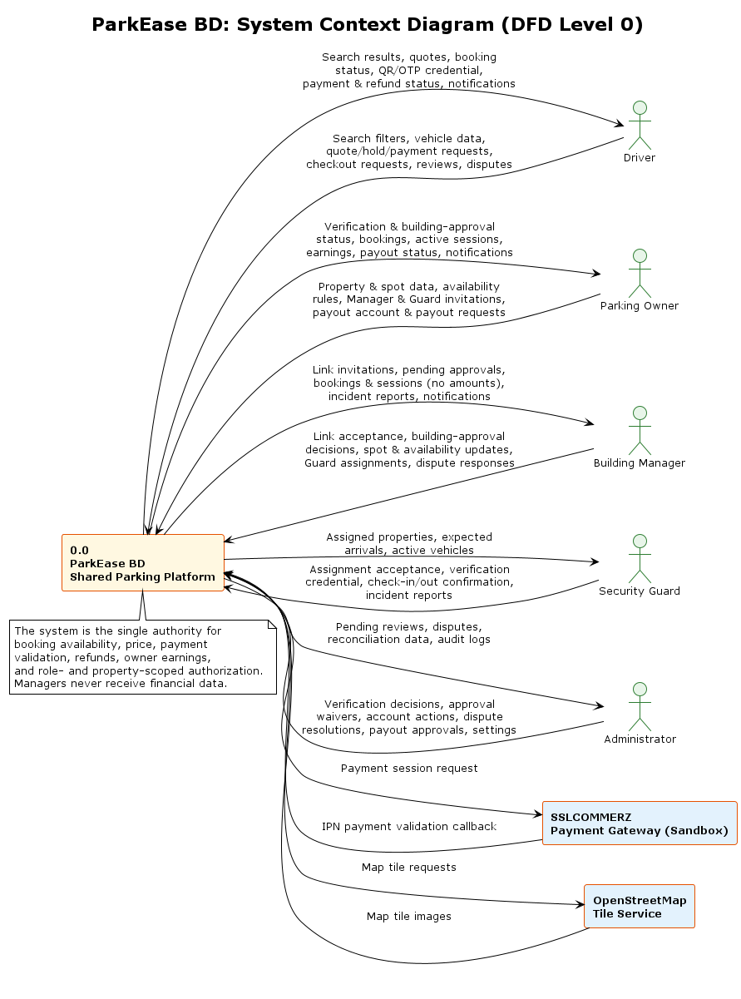
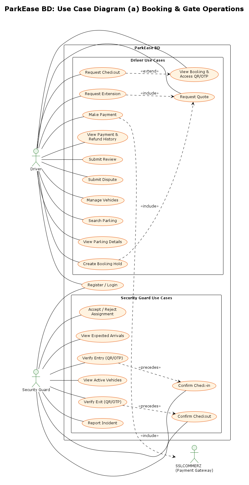
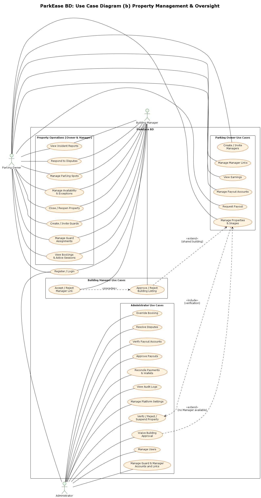
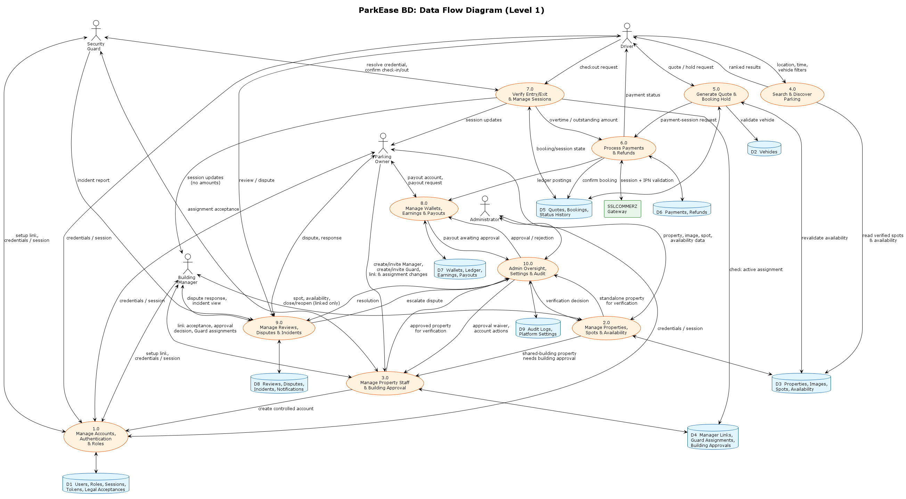

# Software Requirements Specification (SRS)

**Project:** ParkEase BD: A Location-Based Shared Parking Platform
**Team:** Wake Up to Reality
**Date:** 11 September 2026
**Course:** UIU Software Engineering Lab | Section D | Lab 422
**Prepared by:** Marjia Islam (STQA & System Analyst)

| Name | GitHub | Role |
|---|---|---|
| Faysal Ahmed Fahim | [@0xFaysal](https://github.com/0xFaysal) | Backend Development |
| Md. Minhajul Islam | [@Minhajh20](https://github.com/Minhajh20) | Frontend Development |
| Anisa Akter Mahi | [@0xAnisa](https://github.com/0xAnisa) | Project Coordination & UI/UX Design |
| Marjia Islam | [@MarjiaIslam](https://github.com/MarjiaIslam) | STQA & System Analysis |


## 1. Introduction

### 1.1 Purpose

This document specifies the functional and non-functional requirements of **ParkEase BD**, a shared residential parking platform being built for the UIU Software Engineering Lab (Section D, Lab 422) semester project. It is the single reference that the frontend, backend, and QA members of the team use to agree on *what the system must do* before agreeing on *how it is built*. It is intended for:

- the four project team members, to plan and estimate implementation work;
- the course instructor and faculty evaluator, to assess scope and completeness;
- future contributors, to understand system behavior without re-reading source code.

This SRS defines *observable, testable behavior*: what a Driver, Parking Owner, Building Manager, Security Guard, or Administrator can do, and what the system guarantees in return. Database columns and API payloads are defined in the architecture documents listed in section 1.4; they appear here only where a requirement cannot be stated without them.

### 1.2 Scope

ParkEase BD is a single Next.js web application backed by an Express/TypeScript API, PostgreSQL, and Redis. It connects two primary markets in Dhaka:

- **Residential property owners** with parking spaces that sit unused during the day, and
- **Drivers** who need short-term, hourly parking near hospitals, offices, malls, and universities.

In Dhaka apartment buildings, parking is usually a shared area run by a building manager or owners' association, not by the individual flat owner. ParkEase BD therefore adds a Building Manager who approves a listing on behalf of the building and runs day-to-day parking operations for the Owners who delegate to them.

The platform lets an Owner list individual parking spots with weekly availability, lets a Building Manager approve and operate listings in a shared building, lets a Driver search, quote, and reserve a spot for a specific time window, lets a Security Guard verify vehicle entry and exit with a QR code or OTP, and lets an Administrator verify listings, resolve disputes, and approve owner payouts.

**In scope for the semester build:**

- Role-based accounts for Driver, Parking Owner, Building Manager, Security Guard, and Administrator. Only Driver and Parking Owner can self-register; Manager and Guard accounts are created through a controlled process by an Owner or Admin; the Administrator account is the website's own admin account, provisioned at deployment.
- Vehicle management for Drivers.
- Property, parking-spot, weekly-availability, and exception management for Owners, gated by building approval (for shared-building properties) and Admin verification.
- Property-scoped delegation from an Owner to a Building Manager, with no Manager access to money.
- Location- and time-based parking search with a map view.
- Backend-priced quotation, a five-minute conflict-safe booking hold, and sandbox payment via SSLCOMMERZ.
- Purpose-bound QR/OTP verification for entry and exit, performed by an assigned Guard.
- Overtime, cancellation, no-show, and refund handling.
- Owner earnings, an internal double-entry wallet ledger, and a simulated payout-approval workflow.
- Reviews and a dispute-resolution workflow.
- Admin oversight: property verification, user, Guard, and Manager management, booking overrides, payment and wallet reconciliation, and audit logs.
- Realtime UI updates via Socket.IO, with REST as the source of truth.

**Out of scope for the semester build:**

- Integration with real payment gateways (bKash, Nagad, card networks, or live SSLCOMMERZ); only the SSLCOMMERZ **sandbox** is used.
- Physical IoT hardware: automated barriers, parking sensors, or license-plate-recognition cameras.
- A native mobile application (the web app is responsive/mobile-first instead).
- City-wide government traffic-system integration or guaranteed parking availability across Dhaka.
- Multilingual (Bangla) localization, loyalty/rewards programs, dynamic pricing, and recurring/subscription bookings.
- Formal legal verification that a Building Manager is authorized by the building's owners' association; the platform records the Manager's approval and the Admin reviews it, but does not verify the association's internal records.

### 1.3 Definitions, Acronyms and Abbreviations

| Term | Definition |
|---|---|
| Driver | A registered user searching for and booking parking for a vehicle. |
| Parking Owner | A registered user who owns a property and lists its parking spots for booking. The Owner alone receives earnings for the property. |
| Building Manager | A controlled account, created only by an Owner or Admin, that approves listings in a shared building and operates properties delegated to it. |
| Security Guard | A controlled account, created only by an Owner, Manager, or Admin, that verifies entry/exit at an assigned property. |
| Admin | The website's own administrator account, operated by the ParkEase BD platform team. It is provisioned when the system is deployed, not registered or granted through the application, and it verifies listings, resolves disputes, approves payouts, and oversees all other accounts. |
| Controlled role | A role (`MANAGER` or `GUARD`) that a user cannot self-select; it is granted only when an Owner or Admin creates or invites the account. |
| Property | A physical location owned by a Parking Owner that contains one or more parking spots. |
| Shared-building property | A property inside a building whose parking area is run by a Building Manager or owners' association. It requires building approval before Admin verification. |
| Manager Link | A property-scoped assignment between one property and one Manager, with status `PENDING_ACCEPTANCE`, `ACTIVE`, `SUSPENDED`, `ENDED`, or `CANCELLED`. Only an `ACTIVE` link grants the Manager access to that property. |
| Building Approval | The Manager's recorded approve/reject decision on a shared-building property, required before the Admin can verify it. |
| Guard Assignment | A property-scoped assignment between one property and one Guard, with the same five statuses as a Manager Link. |
| Setup link | A single-use, time-limited email link that a controlled account (Guard or Manager) uses to set its first password. No plaintext temporary password is ever created or shown. |
| Account ready | A user whose password setup is complete, whose email is verified, and whose status is `ACTIVE`. Most operational actions require a ready account. |
| Parking Spot | One physical, individually bookable parking space belonging to a property. |
| Quote | A time-limited, backend-calculated price offer for a specific spot, vehicle, and time range. |
| Hold | A five-minute reservation (`HELD` booking) created from an unused quote, before payment. |
| Booking | The record of a Driver's reservation of a parking spot for a time range, tracked through a defined status lifecycle. |
| Access Token (QR/OTP) | A short-lived, purpose-bound (`ENTRY` or `EXIT`) credential used by a Guard to authorize physical entry or exit. |
| Overtime / Overstay | Time a vehicle remains parked beyond the booking's effective end time plus its grace period. |
| Grace Period | A configured buffer after the booking end time before overtime charges apply. |
| Security Deposit | A refundable amount collected at booking time to cover potential overtime charges. |
| Wallet Account | A per-user internal balance record (available, pending, and held balances in paisa) maintained only through ledger entries. |
| Ledger | An append-only, double-entry record of every financial movement (payment, refund, commission, payout); every ledger transaction's debits equal its credits. |
| Owner Earning | The net amount owed to an Owner for a completed booking, after platform commission and adjustments. |
| Payout | A simulated, Admin-approved transfer of available owner earnings to a payout account. |
| Dispute | A formal complaint raised by a Driver or Owner about a specific booking, resolved by Admin. |
| Legal document | A versioned policy (Terms of Service, Privacy Policy, or a role operational policy) whose acceptance by each user is recorded with a timestamp and source. |
| Idempotency Key | A client-generated identifier ensuring a repeated request for the same user intent has exactly one effect. |
| RBAC | Role-Based Access Control. |
| DTO | Data Transfer Object: the shape of data returned by the API, distinct from internal database rows. |
| IPN | Instant Payment Notification: the SSLCOMMERZ server-to-server payment callback. |
| DFD | Data Flow Diagram. |

### 1.4 References

| Document | Description |
|---|---|
| [Project proposal](./project-idea.md) | Problem statement, target users (including apartment and building managers), and technology justification. |
| [Backend Architecture Blueprint](./Backend-Architecture.md) | Database schema, booking/payment state machines, and API contracts. |
| [Frontend Architecture & UX Specification](./Frontend-Architecture.md)  | Route map, screen inventory, and UX rules. |
| [Design system](./DESIGN.md) | Visual identity and component conventions. |
| [Architecture overview](./ARCHITECTURE.md) and [API design](./api-design.md) | Course template documents for system structure and API conventions. |
| [Cancellation & Refund Policy](./policies/Cancellation_&_Refund_Policy.md) and [Terms of Service & Privacy Policy](./policies/Terms_of_Service_&_Privacy_Policy.md) | Policy text that the legal-document acceptance requirements refer to. |
| [Contributing guide](../CONTRIBUTING.md) | Branching, commit, and review workflow. |

---

## 2. Overall Description

### 2.1 Product Perspective

ParkEase BD is a new, standalone product; it does not replace or integrate with an existing system. It is built as a **modular monolith**, one Next.js frontend and one Express API, so a four-person team can deliver a complete, demonstrable workflow within a semester without the operational overhead of microservices.

The system sits between five human actors and two external services: the SSLCOMMERZ sandbox payment gateway and the OpenStreetMap tile service. PostgreSQL is the single source of truth for users, bookings, payments, wallets, and earnings; Redis is used only for caching, rate limiting, and delayed jobs and is never the final authority for booking availability.

**Figure 2.1: System Context Diagram (DFD Level 0)**



The context diagram shows the system as a single process. Drivers search, book, pay, and verify; Owners manage listings, delegation, and earnings; Building Managers approve shared-building listings and run delegated operations; Guards verify entry/exit; Admins oversee the platform; and the two external systems are used strictly for payment validation and map rendering. Every arrow into the system crosses an authorization boundary: the backend, not the browser, decides what each actor is allowed to see or do.

### 2.2 Product Functions

At a high level, ParkEase BD provides:

1. **Account & role management:** registration with legal-document acceptance, login, email/phone verification, setup-link onboarding for controlled accounts, and role-based dashboards.
2. **Listing management:** property creation, image upload, building approval, Admin verification, individual parking-spot configuration, and weekly availability/exception scheduling.
3. **Property staff management:** Owner-to-Manager delegation through Manager Links, and Guard assignments managed by the Owner or the property's Manager.
4. **Discovery:** map- and filter-based parking search with distance, price, and facility filters.
5. **Conflict-safe booking:** price quotation, a five-minute hold, and double-booking prevention enforced at the database level.
6. **Payment:** sandbox payment-session creation and backend-validated confirmation.
7. **Physical verification:** purpose-bound QR/OTP generation and Guard-confirmed check-in/check-out.
8. **Financial settlement:** overtime calculation, deposit refund, owner earnings, wallet ledger, and simulated payouts.
9. **Trust & safety:** reviews, disputes, incident reports, and full audit logging.
10. **Operational oversight:** Admin queues for verification, disputes, payouts, reconciliation, controlled accounts, and system settings.

### 2.3 User Classes and Characteristics

| User Class | Description | Technical Expertise | Frequency of Use |
|---|---|---|---|
| Driver | Searches for and books parking; uses the app primarily on a mobile device while traveling. | General smartphone user; no technical background assumed. | Frequent, short sessions (search → book → verify). |
| Parking Owner | Lists properties and parking spots, delegates to a Manager, manages Guards, and tracks earnings; primarily uses a desktop/laptop browser. | Comfortable with forms and dashboards; not necessarily technical. | Regular, longer sessions (setup, then periodic monitoring). |
| Building Manager | Approves listings in the building they manage and runs daily operations (spots, availability, Guards, arrivals, incidents) for one or more properties, often for several Owners in the same building. Uses desktop at the office and a phone around the building. | Comfortable with dashboards and tables; handles many properties at once. | Daily, medium-length sessions during working hours. |
| Security Guard | Verifies entry/exit at one or more assigned properties; uses a phone at the gate. | Basic smartphone user; needs a very simple, fast interface. | Frequent, very short interactions during a shift. |
| Administrator | The website's own admin, operated by the ParkEase BD platform team. Verifies listings, resolves disputes, approves payouts, manages Manager and Guard accounts, and audits the platform. | Power user; comfortable with tables, filters, and detail panels. | Regular, task-queue-driven sessions. |

A single account may hold more than one role (for example, a Building Manager who also owns a flat can hold `MANAGER` and `PARKING_OWNER`). Each role's permissions apply only within that role's dashboard and scope.

### 2.4 Role Permission Matrix

The matrix summarizes who may perform each capability. "Linked" means the Manager holds an `ACTIVE` Manager Link to the property; "assigned" means the Guard holds an `ACTIVE` Guard Assignment. The backend enforces every cell; the frontend only hides what the backend would reject.

| Capability | Driver | Owner | Manager | Guard | Admin |
|---|---|---|---|---|---|
| Self-register | Yes | Yes | No | No | No |
| Manage own vehicles | Yes | | | | |
| Search parking, view public details | Yes | Yes | Yes | Yes | Yes |
| Quote, hold, pay, cancel, extend, check out a booking | Yes (own) | | | | Override only |
| Create, edit, delete a property; manage property images | | Own | No | | |
| Mark a property as a shared-building property | | Own | | | Yes |
| Approve / reject a shared-building listing | | | Linked | | Waiver only |
| Verify / reject / suspend a property | | | | | Yes |
| View exact address and access instructions | Confirmed booking only | Own | Linked | Assigned | Yes |
| Create and invite Managers; suspend / end Manager Links | | Own properties | No | | Yes |
| Accept / reject a Manager Link | | | Own link | | |
| Manage parking spots, availability, exceptions | | Own | Linked | | |
| Temporarily close / reopen a property | | Own | Linked | | |
| Create Guard accounts; invite Guards; manage Guard Assignments | | Own properties | Linked properties | | Yes |
| Accept / reject a Guard Assignment | | | | Own | |
| View property bookings, arrivals, active sessions | Own bookings | Own | Linked (no amounts) | Assigned | Yes |
| Verify entry/exit, confirm check-in/check-out, report incidents | | | | Assigned | |
| View incident reports | | Own | Linked | Own reports | Yes |
| Open a dispute | Own booking | Own | No | | |
| Respond to a dispute with evidence | Own | Own | Linked | | Yes |
| View earnings, wallet, payout accounts; request payouts | | Own | No | | Approve only |
| Suspend / restore / block a global account | | | | | Yes |
| View audit logs, settings, reconciliation, failed jobs | | | | | Yes |

### 2.5 Operating Environment

- **Client:** Modern evergreen browsers (Chrome, Firefox, Edge, Safari) on desktop, tablet, and mobile; no native app.
- **Frontend runtime:** Next.js (App Router) with React and TypeScript, deployed to a Node.js-compatible host (e.g., Vercel).
- **Backend runtime:** Node.js LTS running Express.js and TypeScript, deployed to a container-friendly host (e.g., Render/Railway).
- **Data tier:** PostgreSQL (managed) accessed through Prisma ORM; Redis (managed) for cache, rate limits, and BullMQ job queues.
- **External services:** SSLCOMMERZ sandbox for payment; OpenStreetMap tile servers for maps; Cloudinary for property images; an email/SMS provider for verification codes and setup links.
- **Local development:** Docker Compose provisions PostgreSQL and Redis identically across all team members' machines.

### 2.6 Design and Implementation Constraints

- The technology stack is fixed by the project proposal: Next.js/React/TypeScript/Tailwind on the frontend; Express/TypeScript/PostgreSQL/Prisma/Redis on the backend. No substitution without team agreement.
- Only the SSLCOMMERZ **sandbox** may be used; no real money moves through the system this semester.
- The backend is the sole authority for booking availability, price, payment validation, refunds, owner earnings, and role and scope authorization. The frontend must never treat an optimistic UI state as confirmed.
- Double-booking must be prevented at the database level (PostgreSQL exclusion constraint), not only in application code.
- All monetary values are stored and transmitted as integer paisa, never floating-point currency.
- Exact residential addresses, access instructions, payout account numbers, and raw QR/OTP values must never be exposed to an unauthorized party, logged, or persisted in browser storage.
- Manager access is property-scoped and money-free by design; a new Manager capability that touches earnings, wallets, or payouts requires an SRS change first.
- The team has four members and one semester; scope decisions favor a complete, demonstrable end-to-end workflow over breadth of edge-case coverage.
- All work follows GitFlow branching and Conventional Commits as defined in the [Contributing guide](../CONTRIBUTING.md). 

### 2.7 Assumptions and Dependencies

- Team members have continuous access to GitHub, a local Docker environment, and a shared understanding of the two architecture documents referenced in §1.4.
- The SSLCOMMERZ sandbox, OpenStreetMap tile service, Cloudinary, and the email provider remain available and free to use throughout the semester.
- Seed/demo data (sample properties, spots, and users, including at least one Manager and one shared-building property) will be used for evaluation rather than real-world onboarding.
- A Building Manager who approves a listing is assumed to be authorized by the building; the platform relies on the Admin's review, not on external records, to catch misuse.
- Users are assumed to access the platform from within Bangladesh with reasonably reliable mobile or broadband internet; the system degrades to polling rather than failing outright when a realtime connection is unavailable.

---

## 3. System Models

### 3.1 Use Case Diagram

With five actors, the use case model is split into two figures so each stays readable. Figure 3.1a covers the booking lifecycle and gate operations (Driver, Security Guard, and `SSLCOMMERZ`, which participates only as a secondary actor included by the Driver's payment use case). Figure 3.1b covers property management and oversight (Parking Owner, Building Manager, and Administrator). *Register / Login* appears in both because every actor uses it.

In Figure 3.1b, use cases that both the Owner and the Manager can perform sit in a shared **Property Operations** package, so the diagram shows delegation directly instead of duplicating use cases. Owner-only use cases (property ownership, delegation, and money) stay in their own package, and the Manager has no association with any of them.

**Figure 3.1a: Use Case Diagram: Booking & Gate Operations**



**Figure 3.1b: Use Case Diagram: Property Management & Oversight**



Key relationships shown on the diagrams:

- **«include»:** *Create Booking Hold* and *Request Extension* always include *Request Quote*; *Make Payment* always includes the SSLCOMMERZ session; *Manage Properties* includes submitting to the Admin's *Verify / Reject / Suspend Property* use case.
- **«extend»:** *Request Checkout* extends *View Booking & Access QR/OTP*, since checkout depends on an already-issued access credential. *Approve / Reject Building Listing* extends *Manage Properties* only for shared-building properties, and *Waive Building Approval* extends it only when no Manager can act.
- **«precedes»:** *Accept / Reject Manager Link* must occur before *Approve / Reject Building Listing* and before any Property Operations use case; *Verify Entry* must occur before *Confirm Check-in*, and *Verify Exit* must occur before *Confirm Checkout*. The Guard's verification step is deliberately separate from the transition it authorizes, so that resolving a credential never by itself changes booking state.

### 3.2 Data Flow Diagram (Level 1)

The Level 1 DFD decomposes the single system process from the context diagram into ten functional processes and nine persistent data stores. It traces how a request from an actor moves through processing before it is written to a data store or forwarded to another process.

**Figure 3.2: Data Flow Diagram (Level 1)**



| Process | Responsibility |
|---|---|
| 1.0 Manage Accounts, Authentication & Roles | Registration with legal acceptance, login, session/refresh handling, email/phone verification, setup-link onboarding, forced password change, role self-enablement. |
| 2.0 Manage Properties, Spots & Availability | Property/spot CRUD, images, weekly availability, exceptions, and routing properties into building approval or Admin verification. |
| 3.0 Manage Property Staff & Building Approval | Manager and Guard account creation, Manager Links, Guard Assignments, invitation acceptance, and Manager approve/reject decisions on shared-building properties. |
| 4.0 Search & Discover Parking | Location/time/vehicle filtering and ranked, privacy-safe result presentation. |
| 5.0 Generate Quote & Booking Hold | Backend pricing, five-minute conflict-safe hold creation, and idempotent hold requests. |
| 6.0 Process Payments & Refunds | SSLCOMMERZ session creation, IPN validation, and refund handling. |
| 7.0 Verify Entry/Exit & Manage Sessions | Purpose-bound QR/OTP issuance, Guard-confirmed check-in/check-out, and overtime calculation. |
| 8.0 Manage Wallets, Earnings & Payouts | Double-entry ledger postings, wallet balances, owner earning calculation, payout accounts, and payout requests. Never reachable by a Manager. |
| 9.0 Manage Reviews, Disputes & Incidents | Review submission, dispute lifecycle, Owner/Manager dispute responses, and Guard incident reports. |
| 10.0 Admin Oversight, Settings & Audit | Verification decisions, building-approval waivers, controlled-account management, dispute resolution, payout approval, reconciliation, and audit logging. |

| Data Store | Contents |
|---|---|
| D1 | Users, roles, sessions, verification and setup tokens, legal-document acceptances |
| D2 | Vehicles |
| D3 | Properties, images, parking spots, facilities, availability rules and exceptions |
| D4 | Manager Links, Guard Assignments, building-approval decisions |
| D5 | Quotes, bookings, and status history |
| D6 | Payments and refunds |
| D7 | Wallet accounts, ledger transactions and entries, owner earnings, payout accounts, payout requests, wallet reconciliations |
| D8 | Reviews, disputes, incidents, and notifications |
| D9 | Audit logs and platform settings |

---

## 4. Functional Requirements

Each requirement has a Priority of **High** (required for the semester MVP demonstration), **Medium** (expected but can slip past the first milestone), or **Low** (stretch goal if time permits).

### 4.1 Authentication, Accounts & Roles

| ID | Requirement | Priority |
|---|---|---|
| FR-AUTH-01 | The system shall allow a new user to self-register as Driver or Parking Owner with full name, email, Bangladesh mobile number, and password, and shall require explicit acceptance of the current Terms of Service and Privacy Policy. | High |
| FR-AUTH-02 | The system shall never allow public self-registration for the Manager or Guard role, and shall never grant the Admin role through registration or any application API. | High |
| FR-AUTH-03 | The system shall enforce a password policy of 12 to 128 characters with at least one uppercase letter, one lowercase letter, one digit, and one special character, and no whitespace. | High |
| FR-AUTH-04 | The system shall authenticate users via a single normalized identifier field accepting either email or phone, plus a password and an optional "remember this device" flag. | High |
| FR-AUTH-05 | The system shall issue HttpOnly, Secure session cookies with a rotating refresh token on successful login. | High |
| FR-AUTH-06 | The system shall enforce CSRF protection on all cookie-authenticated, state-changing requests. | High |
| FR-AUTH-07 | The system shall block access to every protected route except password setup/change, session list, and logout while `mustChangePassword` is true. | High |
| FR-AUTH-08 | The system shall refuse operational actions (for example, creating a Guard or Manager, accepting an assignment, or managing a property) until the account is ready: password setup complete, email verified, and status `ACTIVE`. | High |
| FR-AUTH-09 | The system shall allow a user to self-enable only the DRIVER or PARKING_OWNER role; MANAGER and GUARD shall be granted only through controlled onboarding by an Owner or Admin. | High |
| FR-AUTH-10 | The system shall onboard every controlled account (Manager or Guard) by emailing a single-use, time-limited setup link; it shall never generate, display, or return a plaintext temporary password. If the email cannot be delivered, the system shall roll back the new account. | High |
| FR-AUTH-11 | The system shall allow a user to view and revoke their own active sessions, individually or all at once, and to change their password (which revokes all other sessions). | Medium |
| FR-AUTH-12 | The system shall support password reset via a time-limited, single-use token sent to a verified contact. | Medium |
| FR-AUTH-13 | The system shall support email and phone verification using 6-digit codes. | High |
| FR-AUTH-14 | The system shall record each user's acceptance of each versioned legal document with the acceptance time and source (registration, first login, policy update, staff creation, assignment acceptance, or Admin action). | Medium |
| FR-AUTH-15 | The system shall rate-limit registration, login (5 per 15 minutes per IP address), refresh, password reset, and sensitive account actions. | High |
| FR-AUTH-16 | The Admin account shall be provisioned at deployment by the database seed from environment configuration, with a verified contact and a forced password change on first login. The seed shall refuse to add the Admin role to an existing non-admin account. | High |

### 4.2 Vehicle Management

| ID | Requirement | Priority |
|---|---|---|
| FR-VEH-01 | A Driver shall be able to add a vehicle with type (motorcycle, sedan, SUV, or microbus), registration number, brand, model, color, and optional dimensions. | High |
| FR-VEH-02 | The system shall normalize registration numbers and reject a number already registered to another vehicle. | High |
| FR-VEH-03 | A Driver shall be able to edit or delete their own vehicle, and mark one vehicle as the default for bookings. | High |
| FR-VEH-04 | The system shall validate vehicle dimensions against a parking spot's maximum dimensions at quote time. | Medium |

### 4.3 Property & Parking Spot Management

| ID | Requirement | Priority |
|---|---|---|
| FR-PROP-01 | A Parking Owner shall be able to create a property with name, description, public area, approximate and exact address, coordinates, optional entrance coordinates, and access instructions. | High |
| FR-PROP-02 | The system shall encrypt the exact address and access instructions at rest and return them only to the Owner, a linked Manager, an assigned Guard, an Admin, or the Driver of a confirmed booking. | High |
| FR-PROP-03 | When creating or editing a property, the Owner shall indicate whether it is a shared-building property. | High |
| FR-PROP-04 | On creation, a shared-building property shall enter `AWAITING_MANAGER_APPROVAL`; any other property shall enter `PENDING` Admin verification. Neither is searchable until `VERIFIED`. | High |
| FR-PROP-05 | A Parking Owner shall be able to upload, reorder, and delete property images (Cloudinary-hosted, type- and size-validated) with an image type and a cover image. | High |
| FR-PROP-06 | The system shall allow Admin approval only if the property has at least one image, valid coordinates, and an owner whose account is ready. | High |
| FR-PROP-07 | Changing the exact address, coordinates, or images of a `VERIFIED` property, or editing a `REJECTED` property, shall reset verification to `AWAITING_MANAGER_APPROVAL` for a shared-building property, or to `PENDING` for any other property, and set the property `INACTIVE`. | High |
| FR-PROP-08 | A Parking Owner shall not be able to edit a `SUSPENDED` property, and shall be able to delete a property only while it has no images, no parking spots, and no active staff links or assignments. | Medium |
| FR-PROP-09 | A Parking Owner or linked Manager shall be able to add individual parking spots with a unique spot code, vehicle type, hourly rate, min/max duration, buffer, grace period, overtime multiplier, minimum deposit, dimensions, and facilities (CCTV, guard, covered, EV charging, wheelchair access). | High |
| FR-PROP-10 | A Parking Owner or linked Manager shall be able to block, unblock, or set a parking spot to maintenance. | Medium |
| FR-PROP-11 | A Parking Owner or linked Manager shall be able to define recurring weekly availability rules per parking spot. | High |
| FR-PROP-12 | A Parking Owner or linked Manager shall be able to create date-specific availability exceptions (blocked or special-available) with a reason; the system shall record who created each exception. | Medium |
| FR-PROP-13 | A Parking Owner or linked Manager shall be able to temporarily close and reopen a property. | Low |

### 4.4 Building Manager Accounts, Links & Building Approval

| ID | Requirement | Priority |
|---|---|---|
| FR-MGR-01 | A ready Parking Owner shall be able to create a Manager account for one of their own non-suspended properties by providing full name, email, and phone. The system shall create the account with the `MANAGER` role, send a setup link (FR-AUTH-10), and create a `PENDING_ACCEPTANCE` Manager Link to that property. | High |
| FR-MGR-02 | A ready Parking Owner shall be able to invite an existing Manager to one of their properties by email or phone. If no eligible Manager matches, the system shall return a generic error that reveals nothing about whether the contact is registered or which roles it holds. | Medium |
| FR-MGR-03 | The system shall allow at most one non-terminal (`PENDING_ACCEPTANCE`, `ACTIVE`, or `SUSPENDED`) Manager Link per property. A Manager may hold links to many properties across different Owners. | High |
| FR-MGR-04 | A Manager shall be able to view and accept or reject a pending Manager Link. Acceptance shall require a ready Manager account and acceptance of the current Manager operational policy. Only an `ACTIVE` link grants access to the property. | High |
| FR-MGR-05 | Before acceptance, a Manager shall see only the invited property's name, public area, and inviting Owner's display name; no exact address, bookings, or staff data. | High |
| FR-MGR-06 | A Parking Owner shall be able to suspend, resume, or end a Manager Link on their own property, and cancel a pending one. Ending or suspending a link shall immediately remove the Manager's access to that property. | High |
| FR-MGR-07 | A linked Manager of a shared-building property in `AWAITING_MANAGER_APPROVAL` shall be able to approve it (moving it to `PENDING`) or reject it with a required reason (moving it to `REJECTED`). The decision, actor, time, and reason shall be recorded. | High |
| FR-MGR-08 | The system shall prevent Admin verification of a shared-building property that has neither a recorded Manager approval nor an Admin waiver. | High |
| FR-MGR-09 | A linked Manager shall be able to perform the property operations granted in FR-PROP-09 to FR-PROP-13 and FR-GRD-01 to FR-GRD-06 for that property only. | Medium |
| FR-MGR-10 | A linked Manager shall be able to view the property's bookings, expected arrivals, active sessions, and Guard incident reports, with Driver contact and vehicle data masked as for Owners and with all payment, earning, and commission amounts omitted. | Medium |
| FR-MGR-11 | A linked Manager shall be able to respond to, and upload evidence for, a dispute concerning a booking at that property. | Low |
| FR-MGR-12 | The system shall deny a Manager any access to earnings, wallet balances, ledger entries, payout accounts, and payout requests, including for linked properties. | High |
| FR-MGR-13 | The system shall deny a Manager the ability to edit a property's identity, location, or images; delete a property; create or invite other Managers; or suspend or reset the password of any global account. | High |
| FR-MGR-14 | The system shall prevent an Owner from browsing or searching a global directory of Manager accounts; an existing Manager's profile becomes visible to a new Owner only after the Manager accepts that Owner's link. | Medium |
| FR-MGR-15 | The system shall notify the Owner when a Manager accepts or rejects a link or approves or rejects a listing, and notify the Manager when a link is created, suspended, or ended. | Medium |

### 4.5 Guard Accounts & Assignments

| ID | Requirement | Priority |
|---|---|---|
| FR-GRD-01 | A ready Parking Owner, a linked Manager, or an Admin shall be able to create a Guard account by providing full name, email, and phone. The system shall send a setup link (FR-AUTH-10) and record the creator. | High |
| FR-GRD-02 | If the submitted email or phone is already registered, the system shall return a generic conflict without disclosing the existing account's name, roles, or properties. | High |
| FR-GRD-03 | A Parking Owner or linked Manager shall be able to invite an existing Guard to a `VERIFIED`, `ACTIVE` property by email or phone with a shift start and end time, creating a `PENDING_ACCEPTANCE` assignment. Only one non-terminal assignment may exist per property/Guard pair. | High |
| FR-GRD-04 | A Guard shall be able to accept or reject a pending assignment. Acceptance shall require a ready Guard account and an eligible (verified, active) property. Only an `ACTIVE` assignment grants operational access. | High |
| FR-GRD-05 | A Parking Owner or linked Manager shall be able to suspend, resume, or end an assignment at the property, or cancel a pending one. Changing the shift of an `ACTIVE` or `SUSPENDED` assignment shall return it to `PENDING_ACCEPTANCE` so the Guard re-accepts the new terms. | High |
| FR-GRD-06 | Neither an Owner nor a Manager shall be able to suspend, block, or reset the password of a Guard's global account. | High |
| FR-GRD-07 | Only an Admin shall be able to suspend, restore, or block a Guard's global account. | High |
| FR-GRD-08 | The system shall prevent Owners and Managers from browsing or searching a global directory of Guard accounts. | Medium |

### 4.6 Parking Search & Discovery

| ID | Requirement | Priority |
|---|---|---|
| FR-SRCH-01 | The system shall allow any user, including unauthenticated visitors, to search parking by location, radius, date/time range, and vehicle type. | High |
| FR-SRCH-02 | The system shall support filtering by price range, covered parking, CCTV, and guard presence. | Medium |
| FR-SRCH-03 | The system shall support sorting results by distance, price, or rating. | Medium |
| FR-SRCH-04 | Public search results shall include only `VERIFIED`, `ACTIVE` properties and show only approximate coordinates, public area, facility badges, and estimated price. | High |
| FR-SRCH-05 | Public and unauthenticated responses shall exclude exact address, exact entrance coordinates, access instructions, and any Owner, Manager, or Guard identity. | High |
| FR-SRCH-06 | The system shall paginate search results and never return an unbounded result set. | Medium |

### 4.7 Booking Quote & Hold

| ID | Requirement | Priority |
|---|---|---|
| FR-BKG-01 | The system shall generate a price quotation (base amount, platform fee, refundable deposit, discount) from backend-held pricing rules for a selected spot, vehicle, and time range. | High |
| FR-BKG-02 | A quotation shall expire after a fixed backend-configured duration and shall be usable at most once. | High |
| FR-BKG-03 | A Driver shall be able to convert an unexpired, unused quotation into a HELD booking that reserves the spot for five minutes. | High |
| FR-BKG-04 | The system shall reject a hold request that overlaps an existing active booking for the same spot, with a clear conflict error. | High |
| FR-BKG-05 | The system shall automatically release an unpaid HELD booking after its hold-expiry window, returning the spot to available status. | High |
| FR-BKG-06 | The system shall honor an Idempotency-Key header on hold creation so repeated submissions of one user intent create at most one booking. | High |
| FR-BKG-07 | A Driver shall be able to cancel a booking according to the cancellation policy applicable to its current status. | Medium |
| FR-BKG-08 | A Driver shall be able to request a time extension for an active booking, subject to a new quote and availability check. | Medium |
| FR-BKG-09 | Blocking a spot, adding a blocking exception, or closing a property (by an Owner or Manager) shall not cancel already-confirmed bookings; the system shall warn the actor and list the affected bookings. | Medium |

### 4.8 Payment Processing

| ID | Requirement | Priority |
|---|---|---|
| FR-PAY-01 | The system shall create an SSLCOMMERZ sandbox payment session only after a Driver explicitly initiates payment for a held booking. | High |
| FR-PAY-02 | The system shall confirm a booking only after validating payment through the SSLCOMMERZ IPN/validation API; a browser return URL alone shall never confirm a booking. | High |
| FR-PAY-03 | The system shall process duplicate payment callbacks idempotently, producing exactly one confirmed booking and one ledger effect. | High |
| FR-PAY-04 | The system shall record every payment, refund, and financial adjustment as an immutable, double-entry ledger transaction whose debits equal its credits. | High |
| FR-PAY-05 | If payment validates after the booking hold has already expired, the system shall attempt controlled recovery when the spot remains available, or trigger a refund/manual-review flow when it does not. | Medium |
| FR-PAY-06 | The system shall support a purpose-specific outstanding-payment session for post-checkout amounts such as uncovered overtime. | Medium |
| FR-PAY-07 | A Driver shall be able to view their payment and refund history with status, purpose, and timestamps. | Medium |

### 4.9 Entry/Exit Verification & Parking Sessions

| ID | Requirement | Priority |
|---|---|---|
| FR-VER-01 | The system shall issue a purpose-bound (ENTRY) QR code and OTP to the Driver only after a booking reaches a payment-confirmed state. | High |
| FR-VER-02 | An assigned, ACTIVE Guard shall be able to resolve a Driver's entry credential and view masked vehicle/booking details before confirming check-in. | High |
| FR-VER-03 | The system shall atomically validate and consume an entry credential during check-in, preventing reuse. | High |
| FR-VER-04 | A Driver shall be able to request checkout for a checked-in booking, triggering issuance of a short-lived, purpose-bound (EXIT) QR code and OTP. | High |
| FR-VER-05 | A booking shall not be marked complete from a Driver's checkout request alone; completion requires explicit Guard confirmation of physical exit. | High |
| FR-VER-06 | The system shall reject an entry credential presented for an exit operation and vice versa. | High |
| FR-VER-07 | The system shall calculate overtime charges when actual exit exceeds the effective booking end time plus grace period, deducting first from the security deposit. | High |
| FR-VER-08 | A Guard shall be able to report an incident, with an optional evidence upload, linked to a specific booking; the Owner and linked Manager shall be notified. | Medium |
| FR-VER-09 | The system shall rate-limit OTP verification attempts per booking and lock further attempts after repeated failures. | Medium |
| FR-VER-10 | Check-in and check-out shall be performed only by a Guard; an Owner or Manager shall not be able to check a vehicle in or out. | High |

### 4.10 Wallets, Owner Earnings & Payouts

| ID | Requirement | Priority |
|---|---|---|
| FR-FIN-01 | The system shall calculate an Owner's net earning per completed booking as gross parking amount minus platform commission, plus/minus dispute or penalty adjustments. Earnings always belong to the property's Owner, never to a Manager. | High |
| FR-FIN-02 | Owner earnings shall remain PENDING or ON_HOLD until the booking's dispute window has passed, after which they become AVAILABLE. | Medium |
| FR-FIN-03 | The system shall maintain one wallet account per user and currency with available, pending, and held balances that change only through ledger postings, using optimistic versioning to reject concurrent conflicting updates. | High |
| FR-FIN-04 | A Parking Owner shall be able to add a payout account (Bank, bKash, or Nagad) whose account number is masked after saving. | Medium |
| FR-FIN-05 | A Parking Owner shall be able to request a payout only from an ACTIVE, Admin-verified payout account and only up to their available balance. | Medium |
| FR-FIN-06 | The system shall prevent two concurrent payout requests from spending the same available balance twice. | Medium |
| FR-FIN-07 | An Admin shall be able to approve, reject, or mark a payout request as paid (simulated payout). | Medium |

### 4.11 Reviews, Disputes & Notifications

| ID | Requirement | Priority |
|---|---|---|
| FR-RVW-01 | A Driver shall be able to submit exactly one review per completed booking, rating overall experience, security, location accuracy, and cleanliness. | Medium |
| FR-RVW-02 | A Driver or Parking Owner shall be able to open a dispute on a booking with a category, description, and optional evidence. | Medium |
| FR-RVW-03 | An open dispute shall place the associated owner earning on hold until resolution. | Medium |
| FR-RVW-04 | Only the parties to a dispute (the Driver, the Owner, and the property's linked Manager) shall be able to view and respond to it; Admin shall see the complete case. A Manager's view shall omit refund and earning amounts. | Medium |
| FR-RVW-05 | The system shall generate and deliver in-app notifications for key booking, payment, dispute, payout, assignment, link, and building-approval events, and allow marking them read. | Medium |

### 4.12 Admin Oversight & Platform Operations

| ID | Requirement | Priority |
|---|---|---|
| FR-ADM-01 | An Admin shall be able to list pending properties and review one, including images, exact address, access instructions, and any building-approval record, then approve or reject it with a reason. | High |
| FR-ADM-02 | An Admin shall be able to suspend a verified property. | Medium |
| FR-ADM-03 | An Admin shall be able to suspend, restore, or block any user account, including Manager and Guard accounts. | Medium |
| FR-ADM-04 | An Admin shall be able to create Manager and Guard accounts, link or assign them to eligible properties, and view or end any Manager Link or Guard Assignment. | Medium |
| FR-ADM-05 | An Admin shall be able to waive building approval for a shared-building property with a required reason (for example, when the building has no Manager on the platform); the waiver moves the property to `PENDING` and is audited. | Low |
| FR-ADM-06 | An Admin shall be able to review and override a booking's state through a controlled, reason-required, fully audited action. | Low |
| FR-ADM-07 | An Admin shall be able to resolve a dispute with a resolution type, details, and optional refund/earning adjustment. | Medium |
| FR-ADM-08 | An Admin shall be able to verify or reject a payout account and approve, reject, or mark a payout request as paid. | Medium |
| FR-ADM-09 | An Admin shall be able to review payment mismatches (local vs. gateway) and wallet reconciliation mismatches (cached balance vs. ledger-derived balance) and mark them resolved with notes. | Low |
| FR-ADM-10 | An Admin shall be able to browse a filterable, immutable audit log of sensitive actions across the platform, including all Manager decisions. | Medium |
| FR-ADM-11 | An Admin shall be able to edit only an allowlisted set of non-secret operational settings, with a required reason and version-conflict handling. | Low |
| FR-ADM-12 | An Admin shall be able to view and retry failed background jobs. | Low |

### 4.13 Realtime Updates

| ID | Requirement | Priority |
|---|---|---|
| FR-RT-01 | The system shall push realtime updates for booking, payment, availability, assignment, link, building-approval, and dispute state changes to authorized, room-scoped clients. | Medium |
| FR-RT-02 | The system shall authorize every realtime room join server-side based on the connected user's roles, ownership, Manager Link, or Guard Assignment. A Manager shall never receive earning or payout events. | High |
| FR-RT-03 | On socket reconnection, the frontend shall refetch REST state for all currently visible resources. | Medium |
| FR-RT-04 | When realtime connectivity is unavailable, the system shall fall back to polling critical screens every 15 to 30 seconds. | Medium |

---

## 5. Non-Functional Requirements

| ID | Type | Requirement |
|---|---|---|
| NFR-01 | Performance | Standard read API endpoints shall respond within 500 ms at the 95th percentile under expected demonstration load. |
| NFR-02 | Performance | Search and availability data shall be cached with short TTLs (15 to 30 s search, 10 to 20 s availability) to stay near-real-time without overloading PostgreSQL. |
| NFR-03 | Security | All passwords shall be hashed with Argon2id; no plaintext password shall ever be stored, logged, emailed, or returned by the API. Setup and reset tokens shall be stored only as hashes. |
| NFR-04 | Security | All cookie-authenticated, state-changing requests shall require a valid CSRF token. |
| NFR-05 | Security | Exact address, access instructions, and payout account numbers shall be encrypted at rest (authenticated encryption with a per-value IV) and masked in every response to an unauthorized party. |
| NFR-06 | Security | Registration, login, OTP, booking-hold, payment-session, search, and staff-invitation endpoints shall enforce documented per-user/IP rate limits. |
| NFR-07 | Security | Every Owner, Manager, and Guard request shall be checked against the specific property's ownership, Manager Link, or Guard Assignment on the server; a request for an unrelated property shall return the same not-found response as a missing one. |
| NFR-08 | Reliability | A PostgreSQL exclusion constraint shall guarantee zero double-booking under concurrent load, verified by an automated test issuing 20 simultaneous hold requests for the same spot and time window, of which exactly one succeeds. |
| NFR-09 | Reliability | State changes to assignments, links, and property verification shall use conditional (compare-and-set) updates inside a transaction so that two concurrent actions on the same record cannot both succeed. |
| NFR-10 | Reliability | The system shall reject writes with a 503 response (never silently corrupt data) if PostgreSQL is unreachable, and shall degrade gracefully (skipping cache and delaying non-critical jobs) if Redis is unreachable. |
| NFR-11 | Reliability | Every background job shall be idempotent and safely retryable using a deterministic job ID. |
| NFR-12 | Availability | Booking, payment, and verification flows shall not depend on Socket.IO availability. |
| NFR-13 | Usability | Guard and Driver interfaces shall be mobile-first with touch-friendly targets; Owner, Manager, and Admin interfaces shall be desktop-optimized with tables and filters, with the Manager dashboard also usable on a phone. |
| NFR-14 | Usability | Every page shall provide loading, empty, and error states; every destructive or financial action shall require explicit confirmation. |
| NFR-15 | Accessibility | All form inputs shall have visible labels and associated error messages; status shall never be conveyed by color alone. |
| NFR-16 | Auditability | Every booking status transition and every sensitive Admin, Owner, or Manager action (including link changes, building approvals and waivers, Guard assignment changes, and spot blocks) shall be recorded with actor, role, timestamp, and before/after data. |
| NFR-17 | Maintainability | Backend modules shall follow a consistent layered structure (route/controller/service/repository/policy/schema/mapper); frontend features shall follow a consistent feature-folder structure. The Manager module shall reuse the Guard Assignment lifecycle rules rather than duplicate them. |
| NFR-18 | Compatibility | The web application shall function on current versions of Chrome, Firefox, Edge, and Safari, and shall be responsive across mobile, tablet, and desktop breakpoints. |
| NFR-19 | Privacy | Exact residential address, access instructions, and unmasked vehicle/contact data shall be visible only to an authorized Driver, assigned Guard, linked Manager, owning Owner, or Admin. |
| NFR-20 | Privacy (least privilege) | A Manager shall be unable to obtain any financial amount belonging to an Owner through any API response, realtime event, notification, export, or error message. |
| NFR-21 | Data Integrity | All monetary values shall be stored and computed as integer paisa; the frontend shall never derive a final payable amount from displayed, formatted text. |
| NFR-22 | Testability | Booking-hold concurrency, duplicate-IPN handling, duplicate-checkout, Manager scope isolation, and building-approval gating shall each have an automated regression test before the corresponding feature is considered complete. |
| NFR-23 | Scalability | The system shall be architected as a modular monolith sufficient for a semester demonstration load; horizontal auto-scaling is not required. |

---

## 6. Acceptance Criteria

The system is considered functionally complete for evaluation when all of the following are demonstrable:

1. **Double-booking prevention:** an automated test issues 20 concurrent hold requests for the same parking spot and overlapping time window; exactly one succeeds, and the rest receive a clear `BOOKING_SLOT_UNAVAILABLE` error. Adjacent, non-overlapping bookings on the same spot both succeed.
2. **Hold expiry:** an unpaid `HELD` booking automatically expires within its configured window, and the parking spot becomes searchable again without manual intervention.
3. **End-to-end Driver flow:** register → verify email → add a vehicle → search parking → request a quote → create a hold → pay via the SSLCOMMERZ sandbox → receive a confirmed booking → view the entry QR/OTP → get checked in by a Guard → request checkout → get checked out by a Guard → see the correct overtime/refund settlement.
4. **End-to-end Owner flow (standalone property):** create a property → upload images → Admin approves → create a parking spot → define weekly availability → receive and manage a booking → see the earning appear once the dispute window passes → request a (simulated) payout.
5. **End-to-end Manager flow (shared-building property):** an Owner creates a shared-building property and a Manager account → the Manager sets a password through the setup link, verifies email, and accepts the link → the Manager approves the listing → the Admin verifies it → the Manager creates a spot, sets availability, and assigns a Guard → a Driver books and is checked in by that Guard → the Manager sees the booking and session without any amounts → the Owner ends the link and the Manager immediately loses access.
6. **Building-approval gate:** an Admin approval attempt on a shared-building property with no Manager approval and no waiver is rejected; after a Manager rejection with reason, the Owner edits the property and it returns to `AWAITING_MANAGER_APPROVAL`.
7. **Manager isolation:** automated tests confirm that a Manager receives not-found for properties without an `ACTIVE` link (including a `SUSPENDED` or `ENDED` one), and forbidden for every earnings, wallet, payout-account, and payout endpoint, including on linked properties.
8. **End-to-end Guard flow:** an Owner, Manager, or Admin creates a Guard → the Guard sets a password through the setup link and verifies email → the Guard accepts the property assignment → the Guard has zero operational access before acceptance and full access after.
9. **End-to-end Admin flow:** the pending-property queue, approve/reject-with-reason, building-approval waiver, dispute resolution, payout approval, payment and wallet reconciliation, controlled-account suspension, and audit-log browsing are each demonstrable against seed data.
10. **Privacy guarantee:** manual and automated review confirms that exact address, access instructions, raw QR/OTP values, full payout account numbers, setup tokens, and passwords are never observable in an unauthorized API response, browser storage, log, or analytics event.
11. **Traceability:** every High-priority requirement in Section 4 maps to at least one implemented backend endpoint and, where user-facing, one implemented frontend screen.
12. **Regression safety:** the mandatory concurrency and security test suite referenced in NFR-08 and NFR-22 passes in CI before a phase is marked complete.
13. **Diagram consistency:** the Context, Use Case, and Data Flow diagrams in Sections 2 and 3 are re-validated against the implemented route map and database schema at each major milestone review, and updated if they drift.

---

## Appendix A: Diagram Sources

The diagrams in Sections 2 and 3 are generated from PlantUML source files kept alongside this document, so they can be regenerated after any change to the route map or data model:

```text
docs/diagrams/context-diagram.puml             → docs/diagrams/context-diagram.png
docs/diagrams/use-case-booking.puml            → docs/diagrams/use-case-booking.png
docs/diagrams/use-case-property.puml           → docs/diagrams/use-case-property.png
docs/diagrams/dfd-level1.puml                  → docs/diagrams/dfd-level1.png
```

To regenerate after editing a `.puml` file (requires Java and Graphviz):

```bash
java -jar plantuml.jar -tpng docs/diagrams/*.puml
```

**End of Document**
